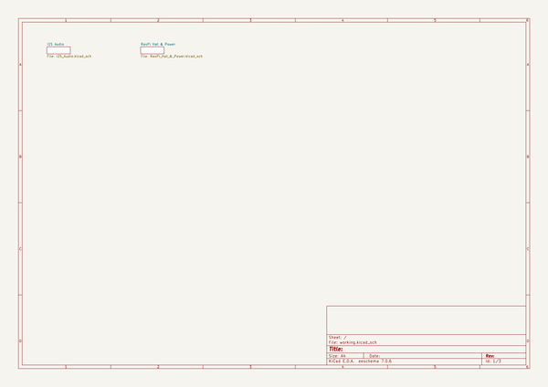
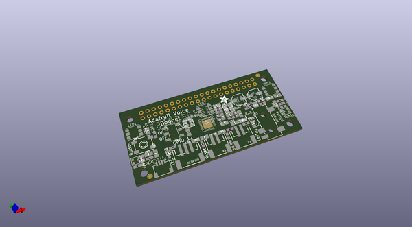
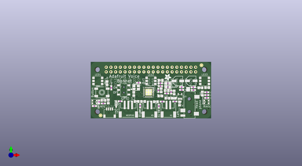
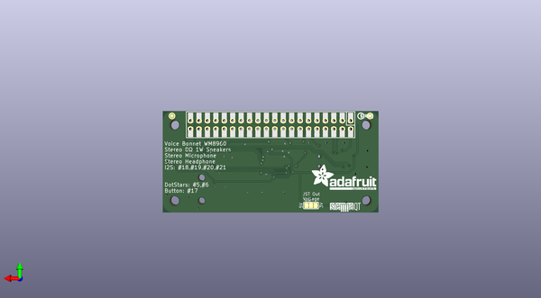

# adafruit_voice_bonnet_pcb
 
## summary 
* id: adafruit_adafruit_voice_bonnet_pcb_adafruit_voice_bonnet
* user: adafruit
* name: adafruit_voice_bonnet_pcb
* board: adafruit_voice_bonnet
* repo: https://github.com/adafruit/Adafruit-Voice-Bonnet-PCB

* src_file_repo_sch: 
* src_file_repo_sch_link: https://github.com/adafruit/Adafruit-Voice-Bonnet-PCB/tree/master/
* full details link: https://github.com/oomlout/oomlout_oomp_project_bot_v_2/tree/main/projects/adafruit_adafruit_voice_bonnet_pcb_adafruit_voice_bonnet/current_version/working  

## schematic  
  
[schematic (pdf)](working_schematic.pdf) 

## pcb  
 
  
  
  
[board (pdf)](working.pdf)  

## working_bom
| Id | Designator | Footprint | Quantity | Designation | Supplier and ref |  | None | 
| --- | --- | --- | --- | --- | --- | --- | --- | 
| 1 | X2 | 4UCONN_19269 | 1 | 3.5mm |  |  | [''] | 
| 2 | C23,C5,C13,C10,C34,C24,C11,C2,C1,C32,C9 | 0805-NO | 11 | 10uF |  |  | [''] | 
| 3 | U3 | SOT23-5 | 1 | AP2112-3.3K |  |  | [''] | 
| 4 | R7 | 0603-NO | 1 | 1K |  |  | [''] | 
| 5 | C8,C14,C7,C18,C3,C12,C25,C16 | 0603-NO | 8 | 0.1uF |  |  | [''] | 
| 6 | C22,C20,C19,C21 | 0603-NO | 4 | 33pF |  |  | [''] | 
| 7 | C31,C30,C29,C28 | 0603-NO | 4 | 100pF |  |  | [''] | 
| 8 | R1,R4 | 0603-NO | 2 | 10K |  |  | [''] | 
| 9 | RIGHTMIC0,LEFTMIC0 | SPW2430HR5H-B | 2 |  |  |  | [''] | 
| 10 | X5,X1 | JSTPH2 | 2 | JSTPH 2P |  |  | [''] | 
| 11 | FID2,FID1 | FIDUCIAL_1MM | 2 | FIDUCIAL_1MM |  |  | [''] | 
| 12 | C6,C4 | PANASONIC_C | 2 | 100uF |  |  | [''] | 
| 13 | R6 | 0603-NO | 1 | 10k |  |  | [''] | 
| 14 | D1 | SOD-323 | 1 | 3.6V |  |  | [''] | 
| 15 | FB1,FB2 | 0805 | 2 | Ferrite |  |  | [''] | 
| 16 | U$15 | ADAFRUIT_3.5MM | 1 |  |  |  | [''] | 
| 17 | NEOPIX0 | JSTPH3 | 1 | JST PH 3 |  |  | [''] | 
| 18 | C27,C26 | 0603-NO | 2 | 220pF |  |  | [''] | 
| 19 | SW6 | EG1390 | 1 | EG1390 |  |  | [''] | 
| 20 | FB9,FB8,FB10,FB7 | 0805-NO | 4 | 120o |  |  | [''] | 
| 21 | OSC1 | OSC_3.2X2.5MM | 1 | ECS-3225MV |  |  | [''] | 
| 22 | LED2,LED1,LED3 | APA102 | 3 | SK6822 |  |  | [''] | 
| 23 | FB4 | 0805-NO | 1 | FERRITE |  |  | [''] | 
| 24 | RPI1 | PI_BONNET_THMSMT | 1 | RASPBERRYPI_BPLUS_BONNET_THMSMT |  |  | [''] | 
| 25 | FB3 | 0805-NO | 1 | Ferrite |  |  | [''] | 
| 26 | CONN3 | JST_SH4 | 1 | STEMMA_I2C_QT |  |  | [''] | 
| 27 | C33 | 0805-NO | 1 | 2.2uF+ |  |  | [''] | 
| 28 | SW1 | EVQ-Q2_SMALLER | 1 | EVQQ |  |  | [''] | 
| 29 | IC3 | QFN32_5MM | 1 | WM8960 |  |  | [''] | 
| 30 | U$12 | STEMMAQT | 1 |  |  |  | [''] | 
| 31 | U$16 | ADAFRUIT_TEXT_20MM | 1 |  |  |  | [''] | 
| 32 | U$79 | BRAINPAD_1IN | 1 |  |  |  | [''] | 
| 33 | SJ1 | SOLDERJUMPER_2WAY_OPEN_NOPASTE | 1 |  |  |  | [''] | 
| 34 | U$11 | PCBFEAT-REV-040 | 1 |  |  |  | [''] | 

## bom_schematic
no data

