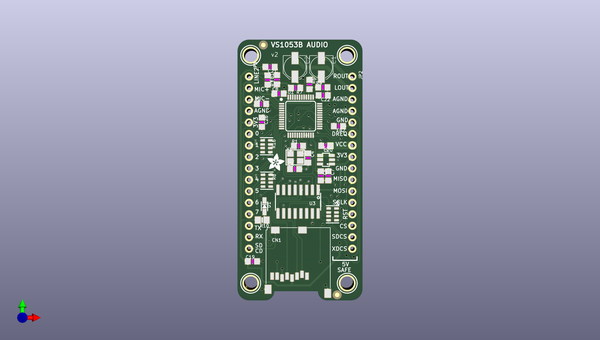
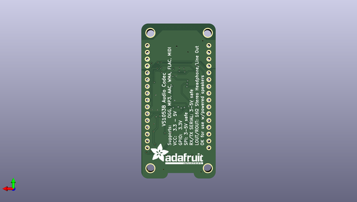

# adafruit_vs1053_breakout_pcb
 
## summary 
* id: adafruit_adafruit_vs1053_breakout_pcb_adafruit_vs1053_breakout
* user: adafruit
* name: adafruit_vs1053_breakout_pcb
* board: adafruit_vs1053_breakout
* repo: https://github.com/adafruit/Adafruit-VS1053-Breakout-PCB

* src_file_repo_sch: 
* src_file_repo_sch_link: https://github.com/adafruit/Adafruit-VS1053-Breakout-PCB/tree/master/
* full details link: https://github.com/oomlout/oomlout_oomp_project_bot_v_2/tree/main/projects/adafruit_adafruit_vs1053_breakout_pcb_adafruit_vs1053_breakout/current_version/working  

## schematic  
  
[schematic (pdf)](working_schematic.pdf) 

## pcb  
 
  
  
  
[board (pdf)](working.pdf)  

## working_bom
| Id | Designator | Footprint | Quantity | Designation | Supplier and ref |  | None | 
| --- | --- | --- | --- | --- | --- | --- | --- | 
| 1 | R1 | _0805MP | 1 | 1M |  |  | [''] | 
| 2 | R2 | _0805MP | 1 | 100K |  |  | [''] | 
| 3 | FB1,FB2 | _0805MP | 2 | FERITTE |  |  | [''] | 
| 4 | CN1 | MICROSD | 1 | 2908-05WB-M6 |  |  | [''] | 
| 5 | U$52,U$53,U$51,U$50 | MOUNTINGHOLE_3.0_PLATEDTHIN | 4 | MOUNTINGHOLE3.0THIN |  |  | [''] | 
| 6 | U2 | SOT23-6 | 1 | AP7312-1833W6-7 |  |  | [''] | 
| 7 | C19,C20,C7,C6 | _0805MP | 4 | 10µF |  |  | [''] | 
| 8 | C5,C4 | _0805MP | 2 | 10pF |  |  | [''] | 
| 9 | C26,C8 | _0805MP | 2 | 0.1µF |  |  | [''] | 
| 10 | JP3,JP2 | 1X16_ROUND | 2 |  |  |  | [''] | 
| 11 | R3,R4 | _0805MP | 2 | 20 |  |  | [''] | 
| 12 | C22,C21 | _0805MP | 2 | 10nF (0.01uF) |  |  | [''] | 
| 13 | FID2,FID1 | FIDUCIAL_1MM | 2 | FIDUCIAL" |  |  | [''] | 
| 14 | U$31 | ADAFRUIT_3.5MM | 1 |  |  |  | [''] | 
| 15 | R6,R7 | _0805MP | 2 | 100 |  |  | [''] | 
| 16 | R16,R8,R9 | RESPACK_4X0603 | 3 | 100K |  |  | [''] | 
| 17 | U1 | LQFP48 | 1 | VS1053B |  |  | [''] | 
| 18 | U3 | SOIC16 | 1 | 74HC4050D |  |  | [''] | 
| 19 | D1 | SOD-323 | 1 | 1N4148 |  |  | [''] | 
| 20 | C2,C1 | PANASONIC_C | 2 | 220uF |  |  | [''] | 
| 21 | R10 | 0805-NO | 1 | 10K |  |  | [''] | 
| 22 | Y1 | CRYSTAL_3.2X2.5 | 1 | ABM8G-12.288MHZ-4Y-T3 |  |  | [''] | 
| 23 | U$55 | ADAFRUIT_TEXT_20MM | 1 |  |  |  | [''] | 

## bom_schematic
| Ref | Qnty | Value | Cmp name | Footprint | Description | Vendor | DNP | 
| --- | --- | --- | --- | --- | --- | --- | --- | 
| C1, C2 | 2 | 220uF | CPOL-USC | working:PANASONIC_C |  |  |  | 
| C4, C5 | 2 | 10pF | CAP_CERAMIC_0805MP | working:_0805MP |  |  |  | 
| C6, C7, C19, C20 | 4 | 10µF | CAP_CERAMIC_0805MP | working:_0805MP |  |  |  | 
| C8, C26 | 2 | 0.1µF | CAP_CERAMIC_0805MP | working:_0805MP |  |  |  | 
| C21, C22 | 2 | 10nF (0.01uF) | CAP_CERAMIC_0805MP | working:_0805MP |  |  |  | 
| CN1 | 1 | 2908-05WB-M6 | MICROSD | working:MICROSD |  |  |  | 
| D1 | 1 | 1N4148 | DIODESOD-323 | working:SOD-323 |  |  |  | 
| FB1, FB2 | 2 | FERITTE | FERRITE_0805MP | working:_0805MP |  |  |  | 
| FID1, FID2 | 2 | FIDUCIAL"" | FIDUCIAL{dblquote}{dblquote} | working:FIDUCIAL_1MM |  |  |  | 
| JP2, JP3 | 2 | HEADER-1X16ROUND | HEADER-1X16ROUND | working:1X16_ROUND |  |  |  | 
| R1 | 1 | 1M | RESISTOR_0805MP | working:_0805MP |  |  |  | 
| R2 | 1 | 100K | RESISTOR_0805MP | working:_0805MP |  |  |  | 
| R3, R4 | 2 | 20 | RESISTOR_0805MP | working:_0805MP |  |  |  | 
| R6, R7 | 2 | 100 | RESISTOR_0805MP | working:_0805MP |  |  |  | 
| R8, R9, R16 | 3 | 100K | RESISTOR_4PACK | working:RESPACK_4X0603 |  |  |  | 
| R10 | 1 | 10K | RESISTOR0805_NOOUTLINE | working:0805-NO |  |  |  | 
| U1 | 1 | VS1053B | VS1053B | working:LQFP48 |  |  |  | 
| U2 | 1 | AP7312-1833W6-7 | VREG_SOT23-6_DUALAP7312 | working:SOT23-6 |  |  |  | 
| U3 | 1 | 74HC4050D | 74HC4050D | working:SOIC16 |  |  |  | 
| U$50, U$51, U$52, U$53 | 4 | MOUNTINGHOLE3.0THIN | MOUNTINGHOLE3.0THIN | working:MOUNTINGHOLE_3.0_PLATEDTHIN |  |  |  | 
| Y1 | 1 | ABM8G-12.288MHZ-4Y-T3 | CRYSTAL3.2X2.5 | working:CRYSTAL_3.2X2.5 |  |  |  | 

## mounting_holes
| x | y | package | value | ref | size | 
| --- | --- | --- | --- | --- | --- | 
| 0.0 | 0.0 | MOUNTINGHOLE_3.0_PLATEDTHIN | MOUNTINGHOLE3.0THIN | U$50 | m3 | 
| 21.34 | 0.0 | MOUNTINGHOLE_3.0_PLATEDTHIN | MOUNTINGHOLE3.0THIN | U$51 | m3 | 
| 21.34 | 50.42 | MOUNTINGHOLE_3.0_PLATEDTHIN | MOUNTINGHOLE3.0THIN | U$52 | m3 | 
| 0.0 | 50.42 | MOUNTINGHOLE_3.0_PLATEDTHIN | MOUNTINGHOLE3.0THIN | U$53 | m3 | 

