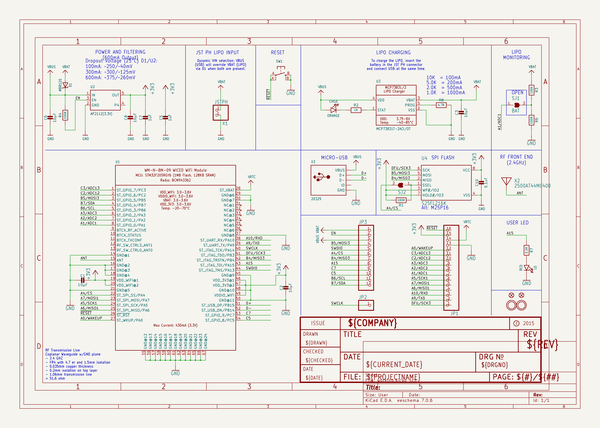
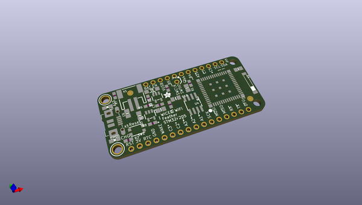
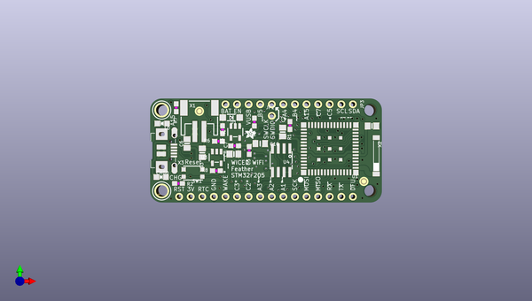
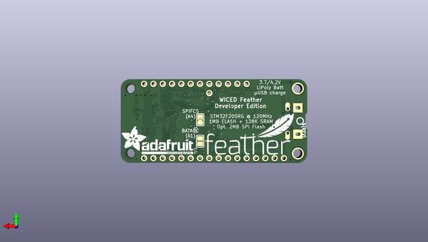

# adafruit_wiced_wifi_feather_pcb
 
## summary 
* id: adafruit_adafruit_wiced_wifi_feather_pcb_adafruit_wiced_wifi_feather
* user: adafruit
* name: adafruit_wiced_wifi_feather_pcb
* board: adafruit_wiced_wifi_feather
* repo: https://github.com/adafruit/Adafruit-WICED-WiFi-Feather-PCB

* src_file_repo_sch: 
* src_file_repo_sch_link: https://github.com/adafruit/Adafruit-WICED-WiFi-Feather-PCB/tree/master/
* full details link: https://github.com/oomlout/oomlout_oomp_project_bot_v_2/tree/main/projects/adafruit_adafruit_wiced_wifi_feather_pcb_adafruit_wiced_wifi_feather/current_version/working  

## schematic  
  
[schematic (pdf)](working_schematic.pdf)  

## pcb  
 
  
  
  
[board (pdf)](working.pdf)  

## working_bom
| Id | Designator | Footprint | Quantity | Designation | Supplier and ref |  | None | 
| --- | --- | --- | --- | --- | --- | --- | --- | 
| 1 | C3,C6,C1,C2,C8 | 0805-NO | 5 | 10µF |  |  | [''] | 
| 2 | C10 | 0805_10MGAP | 1 | 0.1uF |  |  | [''] | 
| 3 | U4 | SOIC8_150MIL | 1 | S25FL216K |  |  | [''] | 
| 4 | R2 | 0603-NO | 1 | 1K |  |  | [''] | 
| 5 | C7,C5 | 0603-NO | 2 | 1uF |  |  | [''] | 
| 6 | U$34,U$35 | FIDUCIAL_1MM | 2 | FIDUCIAL" |  |  | [''] | 
| 7 | SW1 | BTN_KMR2_4.6X2.8 | 1 |  |  |  | [''] | 
| 8 | JP2 | 1X01_ROUND | 1 |  |  |  | [''] | 
| 9 | U1 | USI_WM-N-BM-09 | 1 |  |  |  | [''] | 
| 10 | X3 | 4UCONN_20329_V2 | 1 | 20329 |  |  | [''] | 
| 11 | U$32,U$31 | MOUNTINGHOLE_2.5_PLATED | 2 | MOUNTINGHOLE2.5 |  |  | [''] | 
| 12 | R8 | 0603-NO | 1 | 4.7K |  |  | [''] | 
| 13 | U2 | SOT23-5 | 1 | AP2112(3.3V) |  |  | [''] | 
| 14 | D1 | SOD-123 | 1 | MBR120 |  |  | [''] | 
| 15 | R1,R6,R4 | 0603-NO | 3 | 100K |  |  | [''] | 
| 16 | CHG0 | CHIPLED_0805_NOOUTLINE | 1 | ORANGE |  |  | [''] | 
| 17 | U$8 | ADAFRUIT_2.5MM | 1 |  |  |  | [''] | 
| 18 | R3 | 0603-NO | 1 | 100k |  |  | [''] | 
| 19 | X1 | JSTPH2 | 1 | JSTPH |  |  | [''] | 
| 20 | @HOLE0,@HOLE1 |  | 2 |  |  |  | [''] | 
| 21 | R7 | 0603-NO | 1 | 2.2K |  |  | [''] | 
| 22 | U3 | SOT23-5 | 1 | MCP73831T-2ACI/OT |  |  | [''] | 
| 23 | X2 | ANT_2500AT44M0400 | 1 | 2500AT44M0400 |  |  | [''] | 
| 24 | L0 | CHIPLED_0805_NOOUTLINE | 1 | RED |  |  | [''] | 
| 25 | JP1 | 1X16_ROUND | 1 |  |  |  | [''] | 
| 26 | JP3 | 1X12_ROUND | 1 |  |  |  | [''] | 
| 27 | U$23 | PCBFEAT-REV-040 | 1 |  |  |  | [''] | 
| 28 | SJ1 | SOLDERJUMPER_REFLOW_NOPASTE | 1 | BAT |  |  | [''] | 
| 29 | SJ2 | SOLDERJUMPER_ARROW_NOPASTE | 1 |  |  |  | [''] | 
| 30 | U$10 | ADAFRUIT_TEXT_20MM | 1 |  |  |  | [''] | 
| 31 | U$7 | FEATHERLOGO | 1 |  |  |  | [''] | 

## bom_schematic
| Ref | Qnty | Value | Cmp name | Footprint | Description | Vendor | DNP | 
| --- | --- | --- | --- | --- | --- | --- | --- | 
| C1, C2, C3, C6, C8 | 5 | 10µF | CAP_CERAMIC0805-NOOUTLINE | working:0805-NO |  |  |  | 
| C5, C7 | 2 | 1uF | CAP_CERAMIC0603_NO | working:0603-NO |  |  |  | 
| C10 | 1 | 0.1uF | CAP_CERAMIC0805_10MGAP | working:0805_10MGAP |  |  |  | 
| CHG0 | 1 | ORANGE | LED0805_NOOUTLINE | working:CHIPLED_0805_NOOUTLINE |  |  |  | 
| D1 | 1 | MBR120 | DIODE-SCHOTTKYSOD-123 | working:SOD-123 |  |  |  | 
| JP1 | 1 | HEADER-1X16ROUND | HEADER-1X16ROUND | working:1X16_ROUND |  |  |  | 
| JP2 | 1 | HEADER-1X1ROUND | HEADER-1X1ROUND | working:1X01_ROUND |  |  |  | 
| JP3 | 1 | HEADER-1X12 | HEADER-1X12 | working:1X12_ROUND |  |  |  | 
| L0 | 1 | RED | LED0805_NOOUTLINE | working:CHIPLED_0805_NOOUTLINE |  |  |  | 
| R1, R4, R6 | 3 | 100K | RESISTOR_0603_NOOUT | working:0603-NO |  |  |  | 
| R2 | 1 | 1K | RESISTOR_0603_NOOUT | working:0603-NO |  |  |  | 
| R3 | 1 | 100k | RESISTOR_0603_NOOUT | working:0603-NO |  |  |  | 
| R7 | 1 | 2.2K | RESISTOR_0603_NOOUT | working:0603-NO |  |  |  | 
| R8 | 1 | 4.7K | RESISTOR_0603_NOOUT | working:0603-NO |  |  |  | 
| SJ1 | 1 | BAT | SOLDERJUMPERREFLOW_NOPASTE | working:SOLDERJUMPER_REFLOW_NOPASTE |  |  |  | 
| SJ2 | 1 | SOLDERJUMPER | SOLDERJUMPER | working:SOLDERJUMPER_ARROW_NOPASTE |  |  |  | 
| SW1 | 1 | SWITCH_TACT_SMT4.6X2.8 | SWITCH_TACT_SMT4.6X2.8 | working:BTN_KMR2_4.6X2.8 |  |  |  | 
| U1 | 1 | USI_WM-N-BM-09 | USI_WM-N-BM-09 | working:USI_WM-N-BM-09 |  |  |  | 
| U2 | 1 | AP2112(3.3V) | VREG_SOT23-5 | working:SOT23-5 |  |  |  | 
| U3 | 1 | MCP73831T-2ACI/OT | MCP73831/2 | working:SOT23-5 |  |  |  | 
| U4 | 1 | S25FL216K | SPIFLASH_SOIC8 | working:SOIC8_150MIL |  |  |  | 
| U$31, U$32 | 2 | MOUNTINGHOLE2.5 | MOUNTINGHOLE2.5 | working:MOUNTINGHOLE_2.5_PLATED |  |  |  | 
| U$34, U$35 | 2 | FIDUCIAL"" | FIDUCIAL{dblquote}{dblquote} | working:FIDUCIAL_1MM |  |  |  | 
| X1 | 1 | JSTPH | CON_JST_PH_2PIN | working:JSTPH2 |  |  |  | 
| X2 | 1 | 2500AT44M0400 | ANTENNA_JOHANSON_2500AT44M0400 | working:ANT_2500AT44M0400 |  |  |  | 
| X3 | 1 | 20329 | USB_MICRO_20329_V2 | working:4UCONN_20329_V2 |  |  |  | 

## mounting_holes
| x | y | package | value | ref | size | 
| --- | --- | --- | --- | --- | --- | 
| 0.0 | 17.78 | MOUNTINGHOLE_2.5_PLATED | MOUNTINGHOLE2.5 | U$31 | m3 | 
| 0.0 | 0.0 | MOUNTINGHOLE_2.5_PLATED | MOUNTINGHOLE2.5 | U$32 | m3 | 

