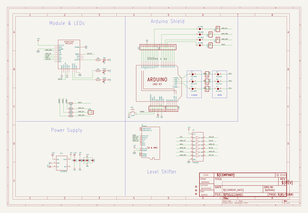

# adafruit_winc1500_shield_pcb
 
## summary 
* id: adafruit_adafruit_winc1500_shield_pcb_adafruit_winc1500_shield
* user: adafruit
* name: adafruit_winc1500_shield_pcb
* board: adafruit_winc1500_shield
* repo: https://github.com/adafruit/Adafruit-WINC1500-Shield-PCB

* src_file_repo_sch: 
* src_file_repo_sch_link: https://github.com/adafruit/Adafruit-WINC1500-Shield-PCB/tree/master/
* full details link: https://github.com/oomlout/oomlout_oomp_project_bot_v_2/tree/main/projects/adafruit_adafruit_winc1500_shield_pcb_adafruit_winc1500_shield/current_version/working  

## schematic  
  
[schematic (pdf)](working_schematic.pdf) 

## pcb  
 
  
  
  
[board (pdf)](working.pdf)  

## working_bom
| Id | Designator | Footprint | Quantity | Designation | Supplier and ref |  | None | 
| --- | --- | --- | --- | --- | --- | --- | --- | 
| 1 | JP8,JP1,JP11,JP12,JP7,JP9,JP6,JP10 | 1X01_ROUND | 8 |  |  |  | [''] | 
| 2 | C1,C4,C3,C2 | 0805-NO | 4 | 10uF |  |  | [''] | 
| 3 | D3 | CHIPLED_0805_NOOUTLINE | 1 | Red |  |  | [''] | 
| 4 | M1 | ARDUINOR3_ICSP_NODIM | 1 | ARDUINO_R3_ICSP_NODIM |  |  | [''] | 
| 5 | JP2,JP3 | 1X08_ROUND_70 | 2 |  |  |  | [''] | 
| 6 | FID1,FID3,FID2 | FIDUCIAL_1MM | 3 | FIDUCIAL_1MM |  |  | [''] | 
| 7 | JP4 | 1X06_ROUND_70 | 1 |  |  |  | [''] | 
| 8 | U$21 | PCBFEAT-REV-040 | 1 |  |  |  | [''] | 
| 9 | U$1 | ATWINC1500_MR210PA | 1 | ATWINC1500_MR210PB |  |  | [''] | 
| 10 | @HOLE0,@HOLE1,@HOLE3,@HOLE2 |  | 4 |  |  |  | [''] | 
| 11 | U$9 | ADAFRUIT_5MM | 1 |  |  |  | [''] | 
| 12 | R5,R4,R2 | 0805-NO | 3 | 1K |  |  | [''] | 
| 13 | D2 | CHIPLED_0805_NOOUTLINE | 1 | Yellow |  |  | [''] | 
| 14 | R3,R8,R7,R1 | 0805-NO | 4 | 100K |  |  | [''] | 
| 15 | X1 | MICROSD | 1 | microSd |  |  | [''] | 
| 16 | JP5 | 1X10_ROUND70 | 1 |  |  |  | [''] | 
| 17 | D1 | CHIPLED_0805_NOOUTLINE | 1 | green |  |  | [''] | 
| 18 | SW2 | EVQ-Q2_SMALLER | 1 | Tactile |  |  | [''] | 
| 19 | C5 | 0805-NO | 1 | 1uF |  |  | [''] | 
| 20 | IC4 | SOT23-5L | 1 | AP2112-3.3 |  |  | [''] | 
| 21 | U2 | SOIC16 | 1 | 74HC4050 |  |  | [''] | 
| 22 | SD_JMP0,CS_JMP0,IRQ_JMP0,RST_JMP0 | SOLDERJUMPER_CLOSEDWIRE | 4 |  |  |  | [''] | 
| 23 | SJ4 | SOLDERJUMPER_CLOSEDWIRE | 1 | ICSP_MOSI |  |  | [''] | 
| 24 | SJ6 | SOLDERJUMPER_REFLOW_NOPASTE | 1 | D13_SCLK |  |  | [''] | 
| 25 | SJ7 | SOLDERJUMPER_REFLOW_NOPASTE | 1 | D11_MOSI |  |  | [''] | 
| 26 | SJ2 | SOLDERJUMPER_CLOSEDWIRE | 1 | ICSP_MISO |  |  | [''] | 
| 27 | SJ5 | SOLDERJUMPER_REFLOW_NOPASTE | 1 | D12_MISO |  |  | [''] | 
| 28 | SJ3 | SOLDERJUMPER_CLOSEDWIRE | 1 | ISCP_SCLK |  |  | [''] | 

## bom_schematic
| Ref | Qnty | Value | Cmp name | Footprint | Description | Vendor | DNP | 
| --- | --- | --- | --- | --- | --- | --- | --- | 
| C1, C2, C3, C4 | 4 | 10uF | CAP_CERAMIC0805-NOOUTLINE | working:0805-NO |  |  |  | 
| C5 | 1 | 1uF | CAP_CERAMIC0805-NOOUTLINE | working:0805-NO |  |  |  | 
| CS_JMP0 | 1 | SOLDERJUMPERCLOSED | SOLDERJUMPERCLOSED | working:SOLDERJUMPER_CLOSEDWIRE |  |  |  | 
| D1 | 1 | green | LED0805_NOOUTLINE | working:CHIPLED_0805_NOOUTLINE |  |  |  | 
| D2 | 1 | Yellow | LED0805_NOOUTLINE | working:CHIPLED_0805_NOOUTLINE |  |  |  | 
| D3 | 1 | Red | LED0805_NOOUTLINE | working:CHIPLED_0805_NOOUTLINE |  |  |  | 
| FID1, FID2, FID3 | 3 | FIDUCIAL_1MM | FIDUCIAL_1MM | working:FIDUCIAL_1MM |  |  |  | 
| IC4 | 1 | LP298XS | LP298XS | working:SOT23-5L |  |  |  | 
| IRQ_JMP0 | 1 | SOLDERJUMPERCLOSED | SOLDERJUMPERCLOSED | working:SOLDERJUMPER_CLOSEDWIRE |  |  |  | 
| JP1, JP6, JP7, JP8, JP9, JP10, JP11, JP12 | 8 | HEADER-1X1ROUND | HEADER-1X1ROUND | working:1X01_ROUND |  |  |  | 
| JP2, JP3 | 2 | HEADER-1X870MIL | HEADER-1X870MIL | working:1X08_ROUND_70 |  |  |  | 
| JP4 | 1 | HEADER-1X670MIL | HEADER-1X670MIL | working:1X06_ROUND_70 |  |  |  | 
| JP5 | 1 | HEADER-1X1070MIL | HEADER-1X1070MIL | working:1X10_ROUND70 |  |  |  | 
| M1 | 1 | ARDUINO_R3_ICSP_NODIM | ARDUINO_R3_ICSP_NODIM | working:ARDUINOR3_ICSP_NODIM |  |  |  | 
| R1, R3, R7, R8 | 4 | 100K | RESISTOR0805_NOOUTLINE | working:0805-NO |  |  |  | 
| R2, R4, R5 | 3 | 1K | RESISTOR0805_NOOUTLINE | working:0805-NO |  |  |  | 
| RST_JMP0 | 1 | SOLDERJUMPERCLOSED | SOLDERJUMPERCLOSED | working:SOLDERJUMPER_CLOSEDWIRE |  |  |  | 
| SD_JMP0 | 1 | SOLDERJUMPERCLOSED | SOLDERJUMPERCLOSED | working:SOLDERJUMPER_CLOSEDWIRE |  |  |  | 
| SJ2 | 1 | ICSP_MISO | SOLDERJUMPERCLOSED | working:SOLDERJUMPER_CLOSEDWIRE |  |  |  | 
| SJ3 | 1 | ISCP_SCLK | SOLDERJUMPERCLOSED | working:SOLDERJUMPER_CLOSEDWIRE |  |  |  | 
| SJ4 | 1 | ICSP_MOSI | SOLDERJUMPERCLOSED | working:SOLDERJUMPER_CLOSEDWIRE |  |  |  | 
| SJ5 | 1 | D12_MISO | SOLDERJUMPERREFLOW_NOPASTE | working:SOLDERJUMPER_REFLOW_NOPASTE |  |  |  | 
| SJ6 | 1 | D13_SCLK | SOLDERJUMPERREFLOW_NOPASTE | working:SOLDERJUMPER_REFLOW_NOPASTE |  |  |  | 
| SJ7 | 1 | D11_MOSI | SOLDERJUMPERREFLOW_NOPASTE | working:SOLDERJUMPER_REFLOW_NOPASTE |  |  |  | 
| SW2 | 1 | Tactile | SWITCH_TACT_SMT_EVQQ2_SMALL | working:EVQ-Q2_SMALLER |  |  |  | 
| U2 | 1 | 74HC4050 | 74HC4050D | working:SOIC16 |  |  |  | 
| U$1 | 1 | ATWINC1500_MR210PA | ATWINC1500_MR210PA | working:ATWINC1500_MR210PA |  |  |  | 
| X1 | 1 | microSd | MICROSD | working:MICROSD |  |  |  | 

