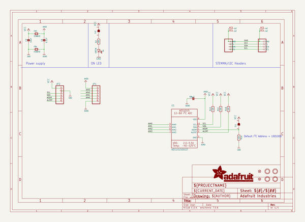

# ads1x15_breakout_board_pcbs
 
## summary 
* id: adafruit_ads1x15_breakout_board_pcbs_adafruit_ads1015_12bit_i2c_adc
* user: adafruit
* name: ads1x15_breakout_board_pcbs
* board: adafruit_ads1015_12bit_i2c_adc
* repo: https://github.com/adafruit/ADS1X15-Breakout-Board-PCBs

* src_file_repo_sch: 
* src_file_repo_sch_link: https://github.com/adafruit/ADS1X15-Breakout-Board-PCBs/tree/master/
* full details link: https://github.com/oomlout/oomlout_oomp_project_bot_v_2/tree/main/projects/adafruit_ads1x15_breakout_board_pcbs_adafruit_ads1015_12bit_i2c_adc/current_version/working  

## schematic  
  
[schematic (pdf)](working_schematic.pdf)  

## pcb  
 
  
  
  
[board (pdf)](working.pdf)  

## working_bom
| Id | Designator | Footprint | Quantity | Designation | Supplier and ref |  | None | 
| --- | --- | --- | --- | --- | --- | --- | --- | 
| 1 | U$25,U$30,U$27,U$29 | MOUNTINGHOLE_2.5_PLATED | 4 | MOUNTINGHOLE2.5 |  |  | [''] | 
| 2 | U1 | MSOP10 | 1 | ADS1015IDGST |  |  | [''] | 
| 3 | CONN4,CONN3 | JST_SH4 | 2 | STEMMA_I2C_QT |  |  | [''] | 
| 4 | JP2,JP1 | 1X06_ROUND_70 | 2 |  |  |  | [''] | 
| 5 | D1 | CHIPLED_0603_NOOUTLINE | 1 | GREEN |  |  | [''] | 
| 6 | C3 | 0805-NO | 1 | 10uF |  |  | [''] | 
| 7 | FB4,FB3 | 0603-NO | 2 | FERRITE |  |  | [''] | 
| 8 | U$32 | ADAFRUIT_3.5MM | 1 |  |  |  | [''] | 
| 9 | FID3,FID4 | FIDUCIAL_1MM | 2 | FIDUCIAL_1MM |  |  | [''] | 
| 10 | C1 | 0805-NO | 1 | 10µF |  |  | [''] | 
| 11 | C5 | 0603-NO | 1 | 0.1uF |  |  | [''] | 
| 12 | R2 | 0603-NO | 1 | 10K |  |  | [''] | 
| 13 | R1 | RESPACK_4X0603 | 1 | 10K |  |  | [''] | 
| 14 | U$34,U$35 | STEMMAQT | 2 |  |  |  | [''] | 
| 15 | U$33 | PCBFEAT-REV-040 | 1 |  |  |  | [''] | 
| 16 | SJ2 | SOLDERJUMPER_CLOSEDWIRE | 1 |  |  |  | [''] | 
| 17 | SJ1 | SOLDERJUMPER_ARROW_NOPASTE | 1 |  |  |  | [''] | 

## bom_schematic
| Ref | Qnty | Value | Cmp name | Footprint | Description | Vendor | DNP | 
| --- | --- | --- | --- | --- | --- | --- | --- | 
| C1 | 1 | 10µF | CAP_CERAMIC0805-NOOUTLINE | working:0805-NO |  |  |  | 
| C3 | 1 | 10uF | CAP_CERAMIC0805-NOOUTLINE | working:0805-NO |  |  |  | 
| C5 | 1 | 0.1uF | CAP_CERAMIC0603_NO | working:0603-NO |  |  |  | 
| CONN3, CONN4 | 2 | STEMMA_I2C_QT | STEMMA_I2C_QT | working:JST_SH4 |  |  |  | 
| D1 | 1 | GREEN | LED0603_NOOUTLINE | working:CHIPLED_0603_NOOUTLINE |  |  |  | 
| FB3, FB4 | 2 | FERRITE | FERRITE-0603NO | working:0603-NO |  |  |  | 
| FID3, FID4 | 2 | FIDUCIAL_1MM | FIDUCIAL_1MM | working:FIDUCIAL_1MM |  |  |  | 
| JP1, JP2 | 2 | HEADER-1X670MIL | HEADER-1X670MIL | working:1X06_ROUND_70 |  |  |  | 
| R1 | 1 | 10K | RESISTOR_4PACK | working:RESPACK_4X0603 |  |  |  | 
| R2 | 1 | 10K | RESISTOR_0603_NOOUT | working:0603-NO |  |  |  | 
| SJ1 | 1 | SOLDERJUMPER | SOLDERJUMPER | working:SOLDERJUMPER_ARROW_NOPASTE |  |  |  | 
| SJ2 | 1 | SOLDERJUMPERCLOSED | SOLDERJUMPERCLOSED | working:SOLDERJUMPER_CLOSEDWIRE |  |  |  | 
| U1 | 1 | ADS1015IDGST | ADC_ADS1015 | working:MSOP10 |  |  |  | 
| U$25, U$27, U$29, U$30 | 4 | MOUNTINGHOLE2.5 | MOUNTINGHOLE2.5 | working:MOUNTINGHOLE_2.5_PLATED |  |  |  | 

## mounting_holes
| x | y | package | value | ref | size | 
| --- | --- | --- | --- | --- | --- | 
| 0.0 | 12.700000000000003 | MOUNTINGHOLE_2.5_PLATED | MOUNTINGHOLE2.5 | U$25 | m3 | 
| 20.319999999999993 | 12.700000000000003 | MOUNTINGHOLE_2.5_PLATED | MOUNTINGHOLE2.5 | U$27 | m3 | 
| 0.0 | 0.0 | MOUNTINGHOLE_2.5_PLATED | MOUNTINGHOLE2.5 | U$29 | m3 | 
| 20.319999999999993 | 0.0 | MOUNTINGHOLE_2.5_PLATED | MOUNTINGHOLE2.5 | U$30 | m3 | 

