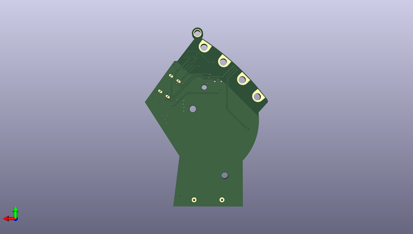

# blm_badge_pcb
 
## summary 
* id: adafruit_blm_badge_pcb_blm_badge_rev_b
* user: adafruit
* name: blm_badge_pcb
* board: blm_badge_rev_b
* repo: https://github.com/adafruit/BLM-Badge-PCB

* src_file_repo_sch: 
* src_file_repo_sch_link: https://github.com/adafruit/BLM-Badge-PCB/tree/master/
* full details link: https://github.com/oomlout/oomlout_oomp_project_bot_v_2/tree/main/projects/adafruit_blm_badge_pcb_blm_badge_rev_b/current_version/working  

## schematic  
  
[schematic (pdf)](working_schematic.pdf) 

## pcb  
 
  
  
  
[board (pdf)](working.pdf)  

## working_bom
| Id | Designator | Footprint | Quantity | Designation | Supplier and ref |  | None | 
| --- | --- | --- | --- | --- | --- | --- | --- | 
| 1 | U$33 | MOUNTINGHOLE_3.0_PLATEDTHIN | 1 | MOUNTINGHOLE3.0THIN |  |  | [''] | 
| 2 | C7,C1,C2,C8,C4,C6,C9,C5 | 0805-NO | 8 | 10uF |  |  | [''] | 
| 3 | FID1,FID2 | FIDUCIAL_1MM | 2 | FIDUCIAL_1MM |  |  | [''] | 
| 4 | SW1 | EG1390 | 1 |  |  |  | [''] | 
| 5 | IC1 | SOT563 | 1 | TPS61023 |  |  | [''] | 
| 6 | L1 | INDUCTOR_5X5MM_TDK_VLC5045 | 1 | 1uH |  |  | [''] | 
| 7 | Q2 | BTN_KMR2_4.6X2.8 | 1 | reset |  |  | [''] | 
| 8 | SWC0,SWD0,RST0 | TP17R | 3 | TPTP17R |  |  | [''] | 
| 9 | IC2 | SPK0415HM4H | 1 | MIC_PDM |  |  | [''] | 
| 10 | TP4,TP3,TP2,TP1 | PCB_ALLI | 4 | SEWTAPPCB_ALLIGATOR |  |  | [''] | 
| 11 | PWR0 | CHIPLED_0603_NOOUTLINE | 1 | green |  |  | [''] | 
| 12 | R7 | 0603-NO | 1 | 100K |  |  | [''] | 
| 13 | CONN1 | JST_SH4 | 1 | STEMMA_I2C_QT |  |  | [''] | 
| 14 | LED7,LED4,LED2,LED5,LED3,LED6 | WS2812B_4020 | 6 | WS2812B_4020 |  |  | [''] | 
| 15 | C3 | 0603-NO | 1 | 1uF |  |  | [''] | 
| 16 | BATT1 | 2XAAA | 1 | BATTERYHOLDER_2XAAA |  |  | [''] | 
| 17 | L0 | CHIPLED_0603_NOOUTLINE | 1 | red |  |  | [''] | 
| 18 | U$40 | PCBFEAT-REV-040 | 1 |  |  |  | [''] | 
| 19 | U2 | ALS-PT26-21C | 1 | ALS-PT26-21C |  |  | [''] | 
| 20 | R5,R6 | 0603-NO | 2 | 5.1K |  |  | [''] | 
| 21 | R3 | 0603-NO | 1 | 450K |  |  | [''] | 
| 22 | IC3 | QFN32_5MM | 1 | ATSAMD21E |  |  | [''] | 
| 23 | U1 | SOT23-5 | 1 | AP2112K-3.3 |  |  | [''] | 
| 24 | X6 | USB_C_CUSB31-CFM2AX-01-X | 1 | USB C |  |  | [''] | 
| 25 | R9 | RESPACK_4X0603 | 1 | 10K |  |  | [''] | 
| 26 | R2,R4 | 0603-NO | 2 | 10K |  |  | [''] | 
| 27 | U$1 | BLM_FRONT | 1 |  |  |  | [''] | 

## bom_schematic
| Ref | Qnty | Value | Cmp name | Footprint | Description | Vendor | DNP | 
| --- | --- | --- | --- | --- | --- | --- | --- | 
| BATT1 | 1 | BATTERYHOLDER_2XAAA | BATTERYHOLDER_2XAAA | working:2XAAA |  |  |  | 
| C1, C2, C4, C5, C6, C7, C8, C9 | 8 | 10uF | CAP_CERAMIC0805-NOOUTLINE | working:0805-NO |  |  |  | 
| C3 | 1 | 1uF | CAP_CERAMIC0603_NO | working:0603-NO |  |  |  | 
| CONN1 | 1 | STEMMA_I2C_QT | STEMMA_I2C_QT | working:JST_SH4 |  |  |  | 
| FID1, FID2 | 2 | FIDUCIAL_1MM | FIDUCIAL_1MM | working:FIDUCIAL_1MM |  |  |  | 
| IC1 | 1 | TPS61023 | TPS61023 | working:SOT563 |  |  |  | 
| IC2 | 1 | MIC_PDM_SPK0415 | MIC_PDM_SPK0415 | working:SPK0415HM4H |  |  |  | 
| IC3 | 1 | ATSAMD21E | ATSAMD21E | working:QFN32_5MM |  |  |  | 
| L0 | 1 | red | LED0603_NOOUTLINE | working:CHIPLED_0603_NOOUTLINE |  |  |  | 
| L1 | 1 | 1uH | INDUCTORTDK_VLC5045 | working:INDUCTOR_5X5MM_TDK_VLC5045 |  |  |  | 
| LED2, LED3, LED4, LED5, LED6, LED7 | 6 | WS2812B_4020 | WS2812B_4020 | working:WS2812B_4020 |  |  |  | 
| PWR0 | 1 | green | LED0603_NOOUTLINE | working:CHIPLED_0603_NOOUTLINE |  |  |  | 
| Q2 | 1 | reset | SWITCH_TACT_SMT4.6X2.8 | working:BTN_KMR2_4.6X2.8 |  |  |  | 
| R2, R4 | 2 | 10K | RESISTOR_0603_NOOUT | working:0603-NO |  |  |  | 
| R3 | 1 | 450K | RESISTOR_0603_NOOUT | working:0603-NO |  |  |  | 
| R5, R6 | 2 | 5.1K | RESISTOR_0603_NOOUT | working:0603-NO |  |  |  | 
| R7 | 1 | 100K | RESISTOR_0603_NOOUT | working:0603-NO |  |  |  | 
| R9 | 1 | 10K | RESISTOR_4PACK | working:RESPACK_4X0603 |  |  |  | 
| RST0 | 1 | TPTP17R | TPTP17R | working:TP17R |  |  |  | 
| SW1 | 1 | SWITCH_DPDTEG1390 | SWITCH_DPDTEG1390 | working:EG1390 |  |  |  | 
| SWC0 | 1 | TPTP17R | TPTP17R | working:TP17R |  |  |  | 
| SWD0 | 1 | TPTP17R | TPTP17R | working:TP17R |  |  |  | 
| TP1, TP2, TP3, TP4 | 4 | SEWTAPPCB_ALLIGATOR | SEWTAPPCB_ALLIGATOR | working:PCB_ALLI |  |  |  | 
| U1 | 1 | AP2112K-3.3 | VREG_SOT23-5 | working:SOT23-5 |  |  |  | 
| U2 | 1 | ALS-PT26-21C | PHOTOTRANSISTOR_PT26-21C | working:ALS-PT26-21C |  |  |  | 
| U$33 | 1 | MOUNTINGHOLE3.0THIN | MOUNTINGHOLE3.0THIN | working:MOUNTINGHOLE_3.0_PLATEDTHIN |  |  |  | 
| X6 | 1 | USB C | USB_C | working:USB_C_CUSB31-CFM2AX-01-X |  |  |  | 

## mounting_holes
| x | y | package | value | ref | size | 
| --- | --- | --- | --- | --- | --- | 
| 0.0 | 0.0 | MOUNTINGHOLE_3.0_PLATEDTHIN | MOUNTINGHOLE3.0THIN | U$33 | m3 | 

