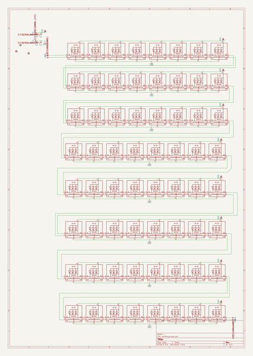
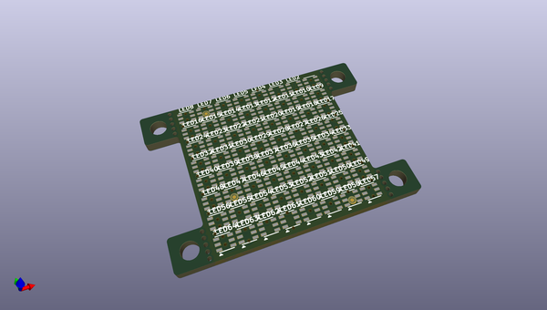
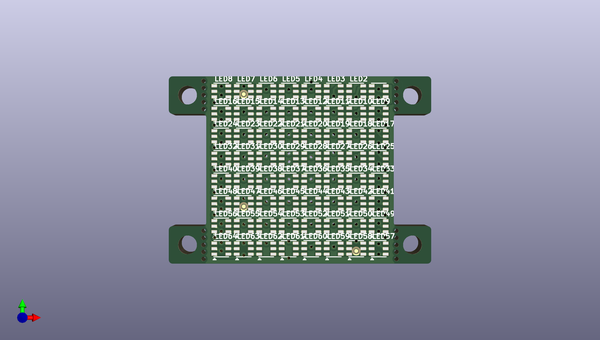
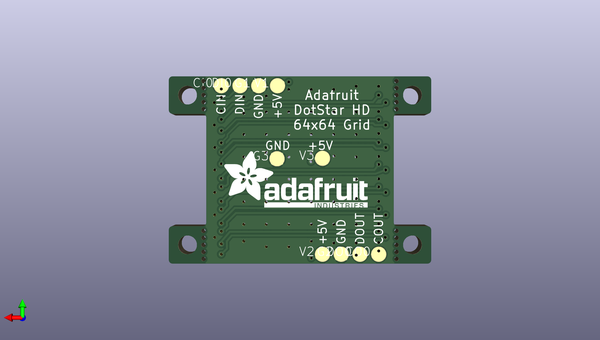

# dotstar_2020_8x8_matrix_pcb
 
## summary 
* id: adafruit_dotstar_2020_8x8_matrix_pcb_adafruit_dotstar_2020_8x8_matrix_
* user: adafruit
* name: dotstar_2020_8x8_matrix_pcb
* board: adafruit_dotstar_2020_8x8_matrix_
* repo: https://github.com/adafruit/DotStar-2020-8x8-Matrix-PCB

* src_file_repo_sch: 
* src_file_repo_sch_link: https://github.com/adafruit/DotStar-2020-8x8-Matrix-PCB/tree/master/
* full details link: https://github.com/oomlout/oomlout_oomp_project_bot_v_2/tree/main/projects/adafruit_dotstar_2020_8x8_matrix_pcb_adafruit_dotstar_2020_8x8_matrix_/current_version/working  

## schematic  
  
[schematic (pdf)](working_schematic.pdf) 

## pcb  
 
  
  
  
[board (pdf)](working.pdf)  

## working_bom
| Id | Designator | Footprint | Quantity | Designation | Supplier and ref |  | None | 
| --- | --- | --- | --- | --- | --- | --- | --- | 
| 1 | LED61,LED15,LED52,LED5,LED2,LED56,LED29,LED42,LED31,LED59,LED53,LED34,LED33,LED37,LED30,LED3,LED13,LED58,LED16,LED47,LED54,LED48,LED6,LED27,LED62,LED21,LED20,LED49,LED10,LED8,LED32,LED22,LED45,LED55,LED40,LED23,LED36,LED35,LED4,LED26,LED7,LED18,LED43,LED12,LED19,LED60,LED63,LED9,LED11,LED46,LED50,LED28,LED38,LED41,LED17,LED39,LED51,LED64,LED24,LED44,LED57,LED14,LED1,LED25 | APA102_2020 | 64 |  |  |  | [''] | 
| 2 | @HOLE10,@HOLE0,@HOLE5,@HOLE3,@HOLE8,@HOLE2,@HOLE18,@HOLE16,@HOLE4,@HOLE6,@HOLE21,@HOLE11,@HOLE19,@HOLE9,@HOLE1,@HOLE15,@HOLE17,@HOLE12,@HOLE23,@HOLE22,@HOLE20,@HOLE13,@HOLE7,@HOLE14 |  | 24 |  |  |  | [''] | 
| 3 | FID2,FID3,FID1 | FIDUCIAL_0.5MM | 3 | FIDUCIAL_0.5MM |  |  | [''] | 
| 4 | CO0,V3,G3,V2,DI0,V1,G2,DO0,CI0,G1 | TP20R | 10 | TPTP20R |  |  | [''] | 
| 5 | U$1 | ADAFRUIT_TEXT_20MM | 1 |  |  |  | [''] | 

## bom_schematic
| Ref | Qnty | Value | Cmp name | Footprint | Description | Vendor | DNP | 
| --- | --- | --- | --- | --- | --- | --- | --- | 
| CI0 | 1 | TPTP20R | TPTP20R | working:TP20R |  |  |  | 
| CO0 | 1 | TPTP20R | TPTP20R | working:TP20R |  |  |  | 
| DI0 | 1 | TPTP20R | TPTP20R | working:TP20R |  |  |  | 
| DO0 | 1 | TPTP20R | TPTP20R | working:TP20R |  |  |  | 
| FID1, FID2, FID3 | 3 | FIDUCIAL_0.5MM | FIDUCIAL_0.5MM | working:FIDUCIAL_0.5MM |  |  |  | 
| G1, G2, G3 | 3 | TPTP20R | TPTP20R | working:TP20R |  |  |  | 
| LED1, LED2, LED3, LED4, LED5, LED6, LED7, LED8, LED9, LED10, LED11, LED12, LED13, LED14, LED15, LED16, LED17, LED18, LED19, LED20, LED21, LED22, LED23, LED24, LED25, LED26, LED27, LED28, LED29, LED30, LED31, LED32, LED33, LED34, LED35, LED36, LED37, LED38, LED39, LED40, LED41, LED42, LED43, LED44, LED45, LED46, LED47, LED48, LED49, LED50, LED51, LED52, LED53, LED54, LED55, LED56, LED57, LED58, LED59, LED60, LED61, LED62, LED63, LED64 | 64 | APA1022020 | APA1022020 | working:APA102_2020 |  |  |  | 
| V1, V2, V3 | 3 | TPTP20R | TPTP20R | working:TP20R |  |  |  | 

