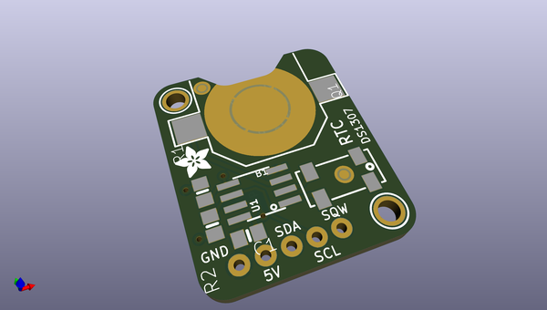

# ds1307_breakout_board
 
## summary 
* id: adafruit_ds1307_breakout_board_ds1307_rev_b
* user: adafruit
* name: ds1307_breakout_board
* board: ds1307_rev_b
* repo: https://github.com/adafruit/DS1307-breakout-board

* src_file_repo_sch: 
* src_file_repo_sch_link: https://github.com/adafruit/DS1307-breakout-board/tree/master/
* full details link: https://github.com/oomlout/oomlout_oomp_project_bot_v_2/tree/main/projects/adafruit_ds1307_breakout_board_ds1307_rev_b/current_version/working  

## schematic  
  
[schematic (pdf)](working_schematic.pdf) 

## pcb  
 
  
  
  
[board (pdf)](working.pdf)  

## working_bom
| Id | Designator | Footprint | Quantity | Designation | Supplier and ref |  | None | 
| --- | --- | --- | --- | --- | --- | --- | --- | 
| 1 | U$1,U$4 | MOUNTINGHOLE_2.0_PLATED | 2 | MOUNTINGHOLE2.0 |  |  | [''] | 
| 2 | U1 | SOIC8_150MIL | 1 | DS1307 |  |  | [''] | 
| 3 | Q1 | CRYSTAL_8X3.8 | 1 | 32.768 |  |  | [''] | 
| 4 | R2,R1 | 0805-NO | 2 | 10K |  |  | [''] | 
| 5 | JP2 | 1X05_ROUND_76 | 1 |  |  |  | [''] | 
| 6 | FID1,FID2 | FIDUCIAL_1MM | 2 | FIDUCIAL" |  |  | [''] | 
| 7 | U$2 | ADAFRUIT_3.5MM | 1 |  |  |  | [''] | 
| 8 | C1 | 0805-NO | 1 | 0.1uF |  |  | [''] | 
| 9 | B1 | CR1220 | 1 | CR1220 |  |  | [''] | 
| 10 | SJ1,SJ2 | SOLDERJUMPER_CLOSEDWIRE | 2 |  |  |  | [''] | 
| 11 | U$3 | PCBFEAT-REV-040 | 1 |  |  |  | [''] | 
| 12 | U$5 | ADAFRUIT_5MM | 1 |  |  |  | [''] | 

## bom_schematic
| Ref | Qnty | Value | Cmp name | Footprint | Description | Vendor | DNP | 
| --- | --- | --- | --- | --- | --- | --- | --- | 
| B1 | 1 | CR1220 | BATTERYCR1220_SMT | working:CR1220 |  |  |  | 
| C1 | 1 | 0.1uF | CAP_CERAMIC0805-NOOUTLINE | working:0805-NO |  |  |  | 
| FID1, FID2 | 2 | FIDUCIAL"" | FIDUCIAL{dblquote}{dblquote} | working:FIDUCIAL_1MM |  |  |  | 
| JP2 | 1 | HEADER-1X576MIL | HEADER-1X576MIL | working:1X05_ROUND_76 |  |  |  | 
| Q1 | 1 | 32.768 | CRYSTAL8.0X3.8 | working:CRYSTAL_8X3.8 |  |  |  | 
| R1, R2 | 2 | 10K | RESISTOR0805_NOOUTLINE | working:0805-NO |  |  |  | 
| SJ1, SJ2 | 2 | SOLDERJUMPER_CLOSED | SOLDERJUMPER_CLOSED | working:SOLDERJUMPER_CLOSEDWIRE |  |  |  | 
| U1 | 1 | DS1307 | RTC_DS1307 | working:SOIC8_150MIL |  |  |  | 
| U$1, U$4 | 2 | MOUNTINGHOLE2.0 | MOUNTINGHOLE2.0 | working:MOUNTINGHOLE_2.0_PLATED |  |  |  | 

## mounting_holes
| x | y | package | value | ref | size | 
| --- | --- | --- | --- | --- | --- | 
| 0.0 | 20.32 | MOUNTINGHOLE_2.0_PLATED | MOUNTINGHOLE2.0 | U$1 | m3 | 
| 16.51 | 0.0 | MOUNTINGHOLE_2.0_PLATED | MOUNTINGHOLE2.0 | U$4 | m3 | 

