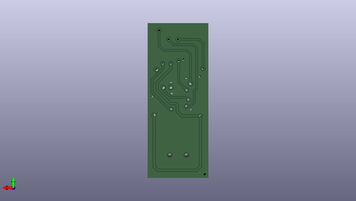

# littlewireisp
 
## summary 
* id: adafruit_littlewireisp_littlewireisp
* user: adafruit
* name: littlewireisp
* board: littlewireisp
* repo: https://github.com/adafruit/LittleWireISP

* src_file_repo_sch: 
* src_file_repo_sch_link: https://github.com/adafruit/LittleWireISP/tree/master/
* full details link: https://github.com/oomlout/oomlout_oomp_project_bot_v_2/tree/main/projects/adafruit_littlewireisp_littlewireisp/current_version/working  

## schematic  
  
[schematic (pdf)](working_schematic.pdf) 

## pcb  
 
  
  
  
[board (pdf)](working.pdf)  

## working_bom
| Id | Designator | Footprint | Quantity | Designation | Supplier and ref |  | None | 
| --- | --- | --- | --- | --- | --- | --- | --- | 
| 1 | U2 | SOIC14 | 1 | 74AHC125-SOIC14 |  |  | [''] | 
| 2 | R2,R1 | 0603-NO | 2 | 68R |  |  | [''] | 
| 3 | R5 | 0603-NO | 1 | 10K |  |  | [''] | 
| 4 | C2,C3 | 0805-NO | 2 | 100n |  |  | [''] | 
| 5 | C1 | 0805-NO | 1 | 4u7 |  |  | [''] | 
| 6 | D4,D5 | CHIPLED_0805_NOOUTLINE | 2 |  |  |  | [''] | 
| 7 | R6,R4 | 0603-NO | 2 | 470R |  |  | [''] | 
| 8 | D2,D1 | SOD-323 | 2 | 3V6 |  |  | [''] | 
| 9 | D3 | SOD-123 | 1 |  |  |  | [''] | 
| 10 | X1 | USB-MINIB_LARGER | 1 |  |  |  | [''] | 
| 11 | R3 | 0603-NO | 1 | 1K5 |  |  | [''] | 
| 12 | R7 | 0603-NO | 1 | 1K |  |  | [''] | 
| 13 | U1 | SO08-EIAJ | 1 | ATTINY45 |  |  | [''] | 
| 14 | X2 | 2X3_SMD | 1 | AVR ISP |  |  | [''] | 

## bom_schematic
| Ref | Qnty | Value | Cmp name | Footprint | Description | Vendor | DNP | 
| --- | --- | --- | --- | --- | --- | --- | --- | 
| C1 | 1 | 4u7 | CAP_CERAMIC0805-NOOUTLINE | working:0805-NO |  |  |  | 
| C2, C3 | 2 | 100n | CAP_CERAMIC0805-NOOUTLINE | working:0805-NO |  |  |  | 
| D1, D2 | 2 | 3V6 | DIODE-ZENERSOD323 | working:SOD-323 |  |  |  | 
| D3 | 1 | DIODESOD-123 | DIODESOD-123 | working:SOD-123 |  |  |  | 
| D4, D5 | 2 | LED0805_NOOUTLINE | LED0805_NOOUTLINE | working:CHIPLED_0805_NOOUTLINE |  |  |  | 
| R1, R2 | 2 | 68R | RESISTOR_0603_NOOUT | working:0603-NO |  |  |  | 
| R3 | 1 | 1K5 | RESISTOR_0603_NOOUT | working:0603-NO |  |  |  | 
| R4, R6 | 2 | 470R | RESISTOR_0603_NOOUT | working:0603-NO |  |  |  | 
| R5 | 1 | 10K | RESISTOR_0603_NOOUT | working:0603-NO |  |  |  | 
| R7 | 1 | 1K | RESISTOR_0603_NOOUT | working:0603-NO |  |  |  | 
| U1 | 1 | ATTINY45 | ATTINY45 | working:SO08-EIAJ |  |  |  | 
| U2 | 1 | 74125-SOIC14 | 74125-SOIC14 | working:SOIC14 |  |  |  | 
| X1 | 1 | USBMINIBLARGE | USBMINIBLARGE | working:USB-MINIB_LARGER |  |  |  | 
| X2 | 1 | AVR_SPI_PRG_6SMD | AVR_SPI_PRG_6SMD | working:2X3_SMD |  |  |  | 

