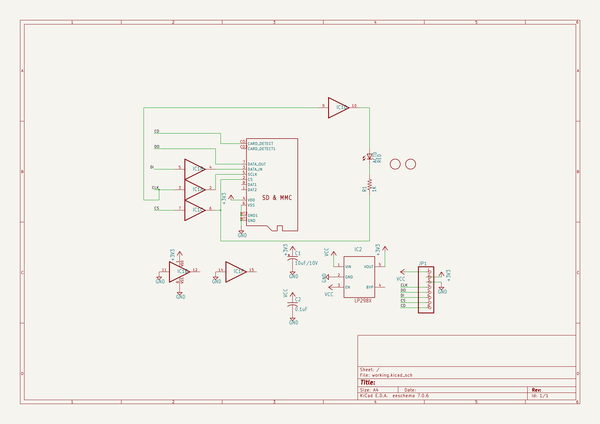
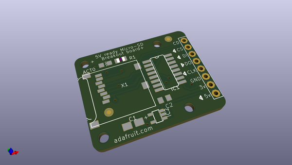
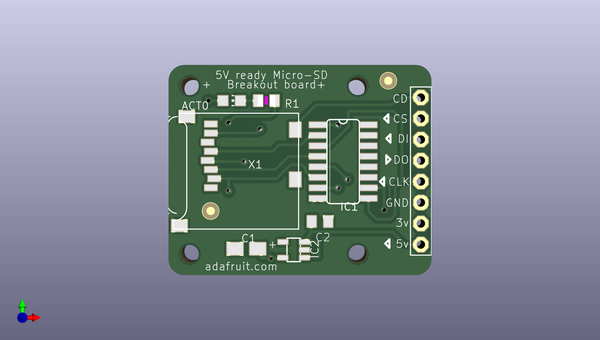
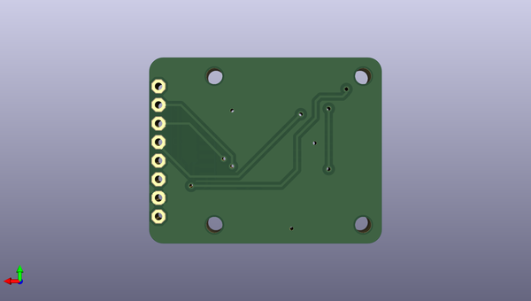

# microsd_breakout_board
 
## summary 
* id: adafruit_microsd_breakout_board_microsd
* user: adafruit
* name: microsd_breakout_board
* board: microsd
* repo: https://github.com/adafruit/MicroSD-breakout-board

* src_file_repo_sch: 
* src_file_repo_sch_link: https://github.com/adafruit/MicroSD-breakout-board/tree/master/
* full details link: https://github.com/oomlout/oomlout_oomp_project_bot_v_2/tree/main/projects/adafruit_microsd_breakout_board_microsd/current_version/working  

## schematic  
  
[schematic (pdf)](working_schematic.pdf) 

## pcb  
 
  
  
  
[board (pdf)](working.pdf)  

## working_bom
| Id | Designator | Footprint | Quantity | Designation | Supplier and ref |  | None | 
| --- | --- | --- | --- | --- | --- | --- | --- | 
| 1 | @HOLE2,@HOLE1,@HOLE3,@HOLE0 |  | 4 |  |  |  | [''] | 
| 2 | IC1 | SO16 | 1 | 4050D |  |  | [''] | 
| 3 | C1 | A_3216-18R | 1 | 10uF/10V |  |  | [''] | 
| 4 | U$2,U$1 | FIDUCIAL_1MM | 2 | FIDUCIAL |  |  | [''] | 
| 5 | IC2 | SOT23-5L | 1 | LP298XS |  |  | [''] | 
| 6 | R1 | R0805 | 1 | 1K |  |  | [''] | 
| 7 | ACT0 | CHIP-LED0805 | 1 | RED |  |  | [''] | 
| 8 | JP1 | 1X08-BIG | 1 |  |  |  | [''] | 
| 9 | X1 | MICROSD | 1 | MICROSD |  |  | [''] | 
| 10 | C2 | C0805K | 1 | 0.1uF |  |  | [''] | 

## bom_schematic
| Ref | Qnty | Value | Cmp name | Footprint | Description | Vendor | DNP | 
| --- | --- | --- | --- | --- | --- | --- | --- | 
| ACT0 | 1 | RED | LEDCHIP-LED0805 | working:CHIP-LED0805 |  |  |  | 
| C1 | 1 | 10uF/10V | CPOL-USA/3216-18R | working:A_3216-18R |  |  |  | 
| C2 | 1 | 0.1uF | C-USC0805K | working:C0805K |  |  |  | 
| IC1 | 1 | 4050D | 4050D | working:SO16 |  |  |  | 
| IC2 | 1 | LP298XS | LP298XS | working:SOT23-5L |  |  |  | 
| JP1 | 1 | PINHD-1X8BIG | PINHD-1X8BIG | working:1X08-BIG |  |  |  | 
| R1 | 1 | 1K | R-US_R0805 | working:R0805 |  |  |  | 
| U$1, U$2 | 2 | FIDUCIAL | FIDUCIAL | working:FIDUCIAL_1MM |  |  |  | 
| X1 | 1 | MICROSD | MICROSD | working:MICROSD |  |  |  | 

