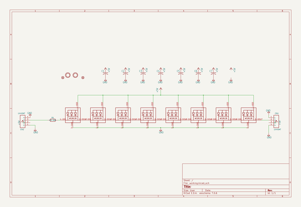
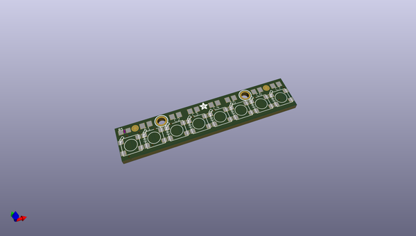
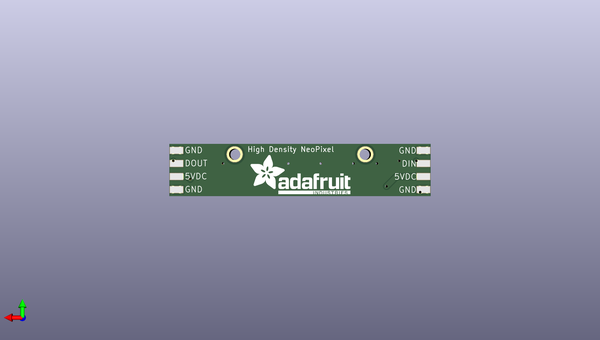

# neopixel_sticks
 
## summary 
* id: adafruit_neopixel_sticks_adafruit_neopixel_8_stick
* user: adafruit
* name: neopixel_sticks
* board: adafruit_neopixel_8_stick
* repo: https://github.com/adafruit/NeoPixel-Sticks

* src_file_repo_sch: 
* src_file_repo_sch_link: https://github.com/adafruit/NeoPixel-Sticks/tree/master/
* full details link: https://github.com/oomlout/oomlout_oomp_project_bot_v_2/tree/main/projects/adafruit_neopixel_sticks_adafruit_neopixel_8_stick/current_version/working  

## schematic  
  
[schematic (pdf)](working_schematic.pdf)  

## pcb  
 
  
  
  
[board (pdf)](working.pdf)  

## working_bom
| Id | Designator | Footprint | Quantity | Designation | Supplier and ref |  | None | 
| --- | --- | --- | --- | --- | --- | --- | --- | 
| 1 | C7,C4,C1,C5,C3,C2,C6 | C0805K | 7 |  |  |  | [''] | 
| 2 | LED2,LED1,LED7,LED4,LED8,LED5,LED6,LED3 | WS2812B-NARROW | 8 | WS2812B5050 |  |  | [''] | 
| 3 | FID1,FID3 | FIDUCIAL_1MM | 2 | FIDUCIAL" |  |  | [''] | 
| 4 | U$2,U$3 | MOUNTINGHOLE_2.0_PLATED | 2 | MOUNTINGHOLE2.0 |  |  | [''] | 
| 5 | R1 | _0805MP | 1 | 470 OHM, |  |  | [''] | 
| 6 | U$4 | ADAFRUIT_2.5MM | 1 |  |  |  | [''] | 
| 7 | U$1 | ADAFRUIT_TEXT_20MM | 1 |  |  |  | [''] | 
| 8 | CN2,CN1 | 1X4-SMT | 2 | 1X4SMT |  |  | [''] | 

## bom_schematic
| Ref | Qnty | Value | Cmp name | Footprint | Description | Vendor | DNP | 
| --- | --- | --- | --- | --- | --- | --- | --- | 
| C1, C2, C3, C4, C5, C6, C7 | 7 | C-USC0805K | C-USC0805K | working:C0805K |  |  |  | 
| CN1, CN2 | 2 | 1X4SMT | 1X4SMT | working:1X4-SMT |  |  |  | 
| FID1, FID3 | 2 | FIDUCIAL"" | FIDUCIAL{dblquote}{dblquote} | working:FIDUCIAL_1MM |  |  |  | 
| LED1, LED2, LED3, LED4, LED5, LED6, LED7, LED8 | 8 | WS2812B5050 | WS2812B5050 | working:WS2812B |  |  |  | 
| R1 | 1 | 470 OHM, | RESISTOR_0805MP | working:_0805MP |  |  |  | 
| U$2, U$3 | 2 | MOUNTINGHOLE2.0 | MOUNTINGHOLE2.0 | working:MOUNTINGHOLE_2.0_PLATED |  |  |  | 

## mounting_holes
| x | y | package | value | ref | size | 
| --- | --- | --- | --- | --- | --- | 
| 0.0 | 0.0 | MOUNTINGHOLE_2.0_PLATED | MOUNTINGHOLE2.0 | U$2 | m3 | 
| 25.400000000000006 | 0.0 | MOUNTINGHOLE_2.0_PLATED | MOUNTINGHOLE2.0 | U$3 | m3 | 

