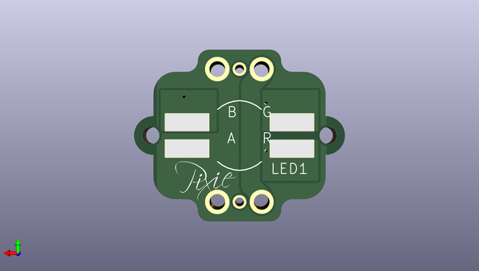

# pixie_3w_smart_led_pcb
 
## summary 
* id: adafruit_pixie_3w_smart_led_pcb_pixie
* user: adafruit
* name: pixie_3w_smart_led_pcb
* board: pixie
* repo: https://github.com/adafruit/Pixie-3W-Smart-LED-PCB

* src_file_repo_sch: 
* src_file_repo_sch_link: https://github.com/adafruit/Pixie-3W-Smart-LED-PCB/tree/master/
* full details link: https://github.com/oomlout/oomlout_oomp_project_bot_v_2/tree/main/projects/adafruit_pixie_3w_smart_led_pcb_pixie/current_version/working  

## schematic  
  
[schematic (pdf)](working_schematic.pdf)  

## pcb  
 
  
  
  
[board (pdf)](working.pdf)  

## working_bom
| Id | Designator | Footprint | Quantity | Designation | Supplier and ref |  | None | 
| --- | --- | --- | --- | --- | --- | --- | --- | 
| 1 | R9 | _0603MP | 1 | 100 |  |  | [''] | 
| 2 | !MCLR0,PGC0,PGD0 | PAD.03X.04 | 3 | TEST-POINT3X4 |  |  | [''] | 
| 3 | U$4,U$3,U$1,U$2 | ALIGN_CROSS | 4 | ALIGN_CROSS |  |  | [''] | 
| 4 | R4,R6,R2 | 0603-RES | 3 | 47k |  |  | [''] | 
| 5 | Q3,Q5,Q1 | SOT23-3 | 3 | IRLML2060TRPBF |  |  | [''] | 
| 6 | R5,R3,R1 | 1206 | 3 | 1.74 0.25W |  |  | [''] | 
| 7 | IN0,OUT0 | 1X03-0.1PWR+SIG | 2 |  |  |  | [''] | 
| 8 | R8 | 0603-RES | 1 | 33 |  |  | [''] | 
| 9 | U$6,U$7 | FIDUCIAL_1MM | 2 | FIDUCIAL" |  |  | [''] | 
| 10 | @HOLE0,@HOLE1 |  | 2 |  |  |  | [''] | 
| 11 | C2,C1 | _0805MP | 2 | 22uF,6.3V |  |  | [''] | 
| 12 | IC1 | MSOP-8 | 1 | PIC12(L)F157X |  |  | [''] | 
| 13 | R7 | 0603-RES | 1 | 100 |  |  | [''] | 
| 14 | Q2,Q6,Q4 | SOT23-3 | 3 | MMBT2222A |  |  | [''] | 
| 15 | U$8 | PCBFEAT-REV-040 | 1 |  |  |  | [''] | 
| 16 | LED1 | RGBLED3W4PIN | 1 | RGBLED_CA |  |  | [''] | 
| 17 | U$5 | PIXIE-LOGO | 1 | PIXIE-LOGO |  |  | [''] | 

## bom_schematic
| Ref | Qnty | Value | Cmp name | Footprint | Description | Vendor | DNP | 
| --- | --- | --- | --- | --- | --- | --- | --- | 
| !MCLR0 | 1 | TEST-POINT3X4 | TEST-POINT3X4 | working:PAD.03X.04 |  |  |  | 
| C1, C2 | 2 | 22uF,6.3V | CAP_CERAMIC_0805MP | working:_0805MP |  |  |  | 
| IC1 | 1 | PIC12(L)F157X | PIC12(L)F157X | working:MSOP-8 |  |  |  | 
| IN0 | 1 | M030.1PWR+SIG | M030.1PWR+SIG | working:1X03-0.1PWR+SIG |  |  |  | 
| LED1 | 1 | RGBLED_CA | RGBLED_CA | working:RGBLED3W4PIN |  |  |  | 
| OUT0 | 1 | M030.1PWR+SIG | M030.1PWR+SIG | working:1X03-0.1PWR+SIG |  |  |  | 
| PGC0 | 1 | TEST-POINT3X4 | TEST-POINT3X4 | working:PAD.03X.04 |  |  |  | 
| PGD0 | 1 | TEST-POINT3X4 | TEST-POINT3X4 | working:PAD.03X.04 |  |  |  | 
| Q1, Q3, Q5 | 3 | IRLML2060TRPBF | IRLML2060TRPBF | working:SOT23-3 |  |  |  | 
| Q2, Q4, Q6 | 3 | MMBT2222A | MMBT2222A | working:SOT23-3 |  |  |  | 
| R1, R3, R5 | 3 | 1.74 0.25W | RESISTOR1206 | working:1206 |  |  |  | 
| R2, R4, R6 | 3 | 47k | RGBLED_RESISTOR0603 | working:0603-RES |  |  |  | 
| R7 | 1 | 100 | RGBLED_RESISTOR0603 | working:0603-RES |  |  |  | 
| R8 | 1 | 33 | RGBLED_RESISTOR0603 | working:0603-RES |  |  |  | 
| R9 | 1 | 100 | RESISTOR_0603MP | working:_0603MP |  |  |  | 
| U$1, U$2, U$3, U$4 | 4 | ALIGN_CROSS | ALIGN_CROSS | working:ALIGN_CROSS |  |  |  | 
| U$5 | 1 | PIXIE-LOGO | PIXIE-LOGO | working:PIXIE-LOGO |  |  |  | 
| U$6, U$7 | 2 | FIDUCIAL"" | FIDUCIAL{dblquote}{dblquote} | working:FIDUCIAL_1MM |  |  |  | 

