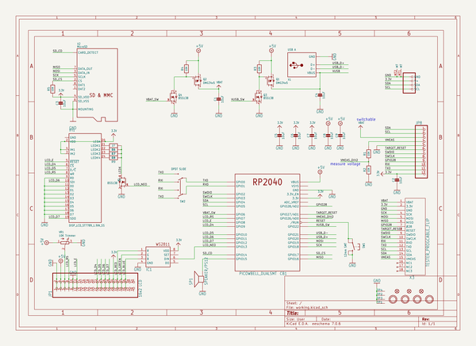
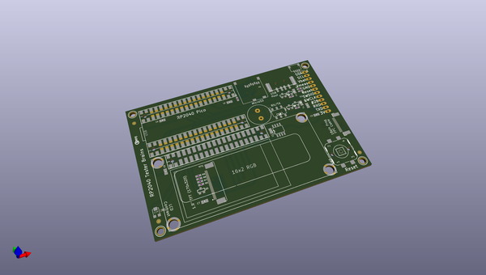
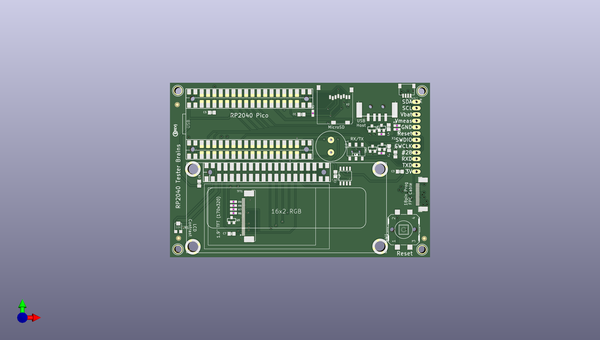
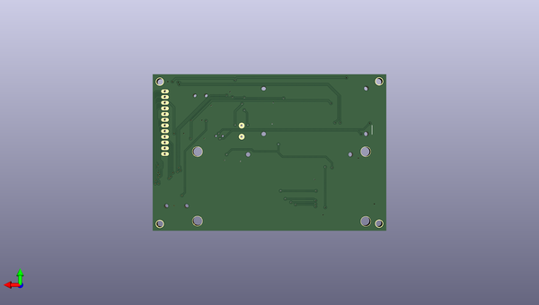

# rp2040_based_tester_brains_pcb
 
## summary 
* id: adafruit_rp2040_based_tester_brains_pcb_adafruit_rp2040_tester_brains_rev_a
* user: adafruit
* name: rp2040_based_tester_brains_pcb
* board: adafruit_rp2040_tester_brains_rev_a
* repo: https://github.com/adafruit/RP2040-Based-Tester-Brains-PCB

* src_file_repo_sch: 
* src_file_repo_sch_link: https://github.com/adafruit/RP2040-Based-Tester-Brains-PCB/tree/main/
* full details link: https://github.com/oomlout/oomlout_oomp_project_bot_v_2/tree/main/projects/adafruit_rp2040_based_tester_brains_pcb_adafruit_rp2040_tester_brains_rev_a/current_version/working  

## schematic  
  
[schematic (pdf)](working_schematic.pdf) 

## pcb  
 
  
  
  
[board (pdf)](working.pdf)  

## working_bom
| Id | Designator | Footprint | Quantity | Designation | Supplier and ref |  | None | 
| --- | --- | --- | --- | --- | --- | --- | --- | 
| 1 | C3,C9,C7,C5,C1,C4,C8,C6,C2 | 0805-NO | 9 | 10uF |  |  | [''] | 
| 2 | CB1 | PICOWBELL_DUALSMT | 1 | PICOWBELL_DUALSMT |  |  | [''] | 
| 3 | U$8,U$10,U$9,U$7 | MOUNTINGHOLE_3.0_PLATEDTHIN | 4 | MOUNTINGHOLE3.0THIN |  |  | [''] | 
| 4 | CONN1 | JST_SH4 | 1 | STEMMA_I2C_QT |  |  | [''] | 
| 5 | FID2,FID3,FID1 | FIDUCIAL_1MM | 3 | FIDUCIAL_1MM |  |  | [''] | 
| 6 | SP1 | PS12 | 1 | SPEAKER/PS12 |  |  | [''] | 
| 7 | JP1 | 2X20_SMT_MALE | 1 | 16x2 LCD |  |  | [''] | 
| 8 | R5,R1,R2,R3,R4 | 0603-NO | 5 | 10K |  |  | [''] | 
| 9 | TP2,TP4,TP3,TP1 | SMT_NUT_3MM | 4 | SEWTAP_SMTNUTM3 |  |  | [''] | 
| 10 | R6,R8,R7,R9 | 0603-NO | 4 | 27 |  |  | [''] | 
| 11 | TFT1 | TFT_1.9IN_170X320_30P_SS | 1 | DISP_LCD_ST7789_1.9IN_SS |  |  | [''] | 
| 12 | SW1 | B3F-40XX-SMT | 1 | 12mm SMT |  |  | [''] | 
| 13 | IC1 | SO08-SKINNYPADS | 1 | WS2811-SOP8 |  |  | [''] | 
| 14 | Q3,Q5,Q4 | SOT23-WIDE | 3 | BSS138 |  |  | [''] | 
| 15 | X1 | USB_HOST-SMT | 1 | USB A |  |  | [''] | 
| 16 | X3 | FPC_0.5MM_18PIN | 1 | TESTER_PROGCABLE_FLIP |  |  | [''] | 
| 17 | VR1 | TRIMPOT_BOURNS_TC33X-2 | 1 | 10K Trimmer |  |  | [''] | 
| 18 | Q2,Q1 | SOT23-WIDE | 2 | DMG34x5 |  |  | [''] | 
| 19 | X2 | MICROSD | 1 | MicroSD |  |  | [''] | 
| 20 | U$13 | PCBFEAT-REV-040 | 1 |  |  |  | [''] | 
| 21 | JP8 | 1X12_OVAL | 1 |  |  |  | [''] | 
| 22 | SW2 | EG1390 | 1 | DPDT SLIDE |  |  | [''] | 

## bom_schematic
| Ref | Qnty | Value | Cmp name | Footprint | Description | Vendor | DNP | 
| --- | --- | --- | --- | --- | --- | --- | --- | 
| C1, C2, C3, C4, C5, C6, C7, C8, C9 | 9 | 10uF | CAP_CERAMIC0805-NOOUTLINE | working:0805-NO |  |  |  | 
| CB1 | 1 | PICOWBELL_DUALSMT | PICOWBELL_DUALSMT | working:PICOWBELL_DUALSMT |  |  |  | 
| CONN1 | 1 | STEMMA_I2C_QT | STEMMA_I2C_QT | working:JST_SH4 |  |  |  | 
| FID1, FID2, FID3 | 3 | FIDUCIAL_1MM | FIDUCIAL_1MM | working:FIDUCIAL_1MM |  |  |  | 
| IC1 | 1 | WS2811-SOP8 | WS2811-SOP8 | working:SO08-SKINNYPADS |  |  |  | 
| JP1 | 1 | 16x2 LCD | PINHD-2X20_SMT | working:2X20_SMT_MALE |  |  |  | 
| JP8 | 1 | HEADER-1X12OVAL | HEADER-1X12OVAL | working:1X12_OVAL |  |  |  | 
| Q1, Q2 | 2 | DMG34x5 | MOSFET-PWIDE | working:SOT23-WIDE |  |  |  | 
| Q3, Q4, Q5 | 3 | BSS138 | MOSFET-NWIDE | working:SOT23-WIDE |  |  |  | 
| R1, R2, R3, R4, R5 | 5 | 10K | RESISTOR_0603_NOOUT | working:0603-NO |  |  |  | 
| R6, R7, R8, R9 | 4 | 27 | RESISTOR_0603_NOOUT | working:0603-NO |  |  |  | 
| SP1 | 1 | SPEAKER/PS12 | SPEAKER/PS12 | working:PS12 |  |  |  | 
| SW1 | 1 | 12mm SMT | SWITCH_TACT_SMT_12MM | working:B3F-40XX-SMT |  |  |  | 
| SW2 | 1 | DPDT SLIDE | SWITCH_DPDTEG1390 | working:EG1390 |  |  |  | 
| TFT1 | 1 | DISP_LCD_ST7789_1.9IN_SS | DISP_LCD_ST7789_1.9IN_SS | working:TFT_1.9IN_170X320_30P_SS |  |  |  | 
| TP1, TP2, TP3, TP4 | 4 | SEWTAP_SMTNUTM3 | SEWTAP_SMTNUTM3 | working:SMT_NUT_3MM |  |  |  | 
| U$7, U$8, U$9, U$10 | 4 | MOUNTINGHOLE3.0THIN | MOUNTINGHOLE3.0THIN | working:MOUNTINGHOLE_3.0_PLATEDTHIN |  |  |  | 
| VR1 | 1 | 10K Trimmer | TRIMPOTTC33X-2 | working:TRIMPOT_BOURNS_TC33X-2 |  |  |  | 
| X1 | 1 | USB A | USB_TYPEA_SMT | working:USB_HOST-SMT |  |  |  | 
| X2 | 1 | MicroSD | MICROSD | working:MICROSD |  |  |  | 
| X3 | 1 | TESTER_PROGCABLE_FLIP | TESTER_PROGCABLE_FLIP | working:FPC_0.5MM_18PIN |  |  |  | 

## mounting_holes
| x | y | package | value | ref | size | 
| --- | --- | --- | --- | --- | --- | 
| 97.66 | 63.5 | MOUNTINGHOLE_3.0_PLATEDTHIN | MOUNTINGHOLE3.0THIN | U$7 | m3 | 
| 0.0 | 63.63 | MOUNTINGHOLE_3.0_PLATEDTHIN | MOUNTINGHOLE3.0THIN | U$8 | m3 | 
| 0.0 | 0.13 | MOUNTINGHOLE_3.0_PLATEDTHIN | MOUNTINGHOLE3.0THIN | U$9 | m3 | 
| 97.66 | 0.0 | MOUNTINGHOLE_3.0_PLATEDTHIN | MOUNTINGHOLE3.0THIN | U$10 | m3 | 

