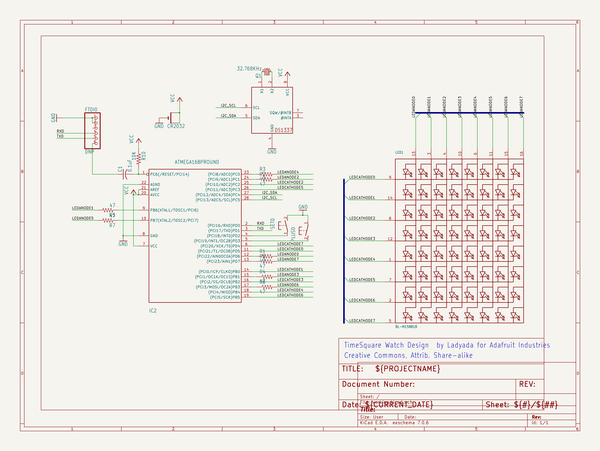

# timesquare_diy_watch_kit
 
## summary 
* id: adafruit_timesquare_diy_watch_kit_adafruit_timesquare
* user: adafruit
* name: timesquare_diy_watch_kit
* board: adafruit_timesquare
* repo: https://github.com/adafruit/TIMESQUARE-DIY-Watch-Kit

* src_file_repo_sch: 
* src_file_repo_sch_link: https://github.com/adafruit/TIMESQUARE-DIY-Watch-Kit/tree/master/
* full details link: https://github.com/oomlout/oomlout_oomp_project_bot_v_2/tree/main/projects/adafruit_timesquare_diy_watch_kit_adafruit_timesquare/current_version/working  

## schematic  
  
[schematic (pdf)](working_schematic.pdf)  

## pcb  
 
  
  
  
[board (pdf)](working.pdf)  

## working_bom
| Id | Designator | Footprint | Quantity | Designation | Supplier and ref |  | None | 
| --- | --- | --- | --- | --- | --- | --- | --- | 
| 1 | FTDI0 | 1X06-CLEAN | 1 | DNP |  |  | [''] | 
| 2 | R1,R2,R5,R3,R6,R4,R8,R7 | 0204_7 | 8 | 47 |  |  | [''] | 
| 3 | IC2 | DIL28-3-ROUND | 1 | ATMEGA168PROUND |  |  | [''] | 
| 4 | C1 | C025-025X050 | 1 | 0.1uF |  |  | [''] | 
| 5 | IC1 | DIL08-ROUND | 1 | DS1337 |  |  | [''] | 
| 6 | R10 | 0204_7 | 1 | 10K |  |  | [''] | 
| 7 | BATT0 | CR2032-THRU | 1 | CR2032 |  |  | [''] | 
| 8 | SET0,PLUS0 | B3F-31XX-SKINNIER | 2 |  |  |  | [''] | 
| 9 | Q1 | TC38H | 1 | 32.768KHz |  |  | [''] | 
| 10 | U$1 | ADAFRUIT_5MM | 1 |  |  |  | [''] | 
| 11 | U$2 | ADAFRUIT_9MM | 1 |  |  |  | [''] | 
| 12 | LED1 | SEGMENT_BL-M15A881 | 1 | BL-M15881B |  |  | [''] | 

## bom_schematic
| Ref | Qnty | Value | Cmp name | Footprint | Description | Vendor | DNP | 
| --- | --- | --- | --- | --- | --- | --- | --- | 
| BATT0 | 1 | CR2032 | CR2032THM | working:CR2032-THRU |  |  |  | 
| C1 | 1 | 0.1uF | C-US025-025X050 | working:C025-025X050 |  |  |  | 
| FTDI0 | 1 | DNP | PINHD-1X6CLEAN | working:1X06-CLEAN |  |  |  | 
| IC1 | 1 | DS1337 | DS1337 | working:DIL08-ROUND |  |  |  | 
| IC2 | 1 | ATMEGA168PROUND | ATMEGA168PROUND | working:DIL28-3-ROUND |  |  |  | 
| LED1 | 1 | BL-M15881B | SEGMENT_8X8_ROWCATHODEBL-M15 | working:SEGMENT_BL-M15A881 |  |  |  | 
| PLUS0 | 1 | 31-XXSKINNY | 31-XXSKINNY | working:B3F-31XX-SKINNIER |  |  |  | 
| Q1 | 1 | 32.768KHz | CRYSTALTC38H | working:TC38H |  |  |  | 
| R1, R2, R3, R4, R5, R6, R7, R8 | 8 | 47 | R-US_0204/7 | working:0204_7 |  |  |  | 
| R10 | 1 | 10K | R-US_0204/7 | working:0204_7 |  |  |  | 
| SET0 | 1 | 31-XXSKINNY | 31-XXSKINNY | working:B3F-31XX-SKINNIER |  |  |  | 

