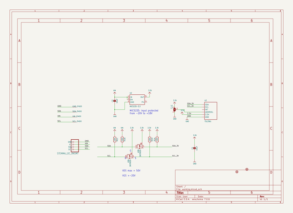
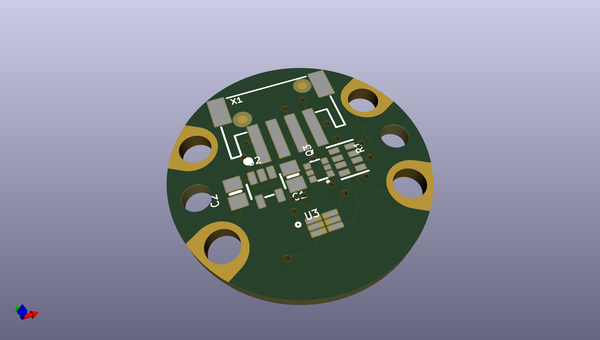
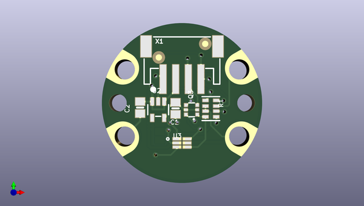
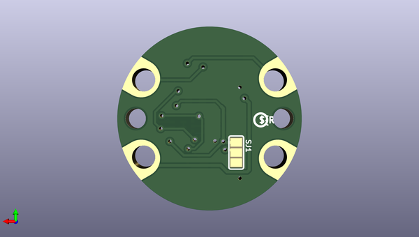

# tsl2561_breakout_board_pcb
 
## summary 
* id: adafruit_tsl2561_breakout_board_pcb_tsl2561_5v_rev_a
* user: adafruit
* name: tsl2561_breakout_board_pcb
* board: tsl2561_5v_rev_a
* repo: https://github.com/adafruit/TSL2561-breakout-board-PCB

* src_file_repo_sch: 
* src_file_repo_sch_link: https://github.com/adafruit/TSL2561-breakout-board-PCB/tree/master/
* full details link: https://github.com/oomlout/oomlout_oomp_project_bot_v_2/tree/main/projects/adafruit_tsl2561_breakout_board_pcb_tsl2561_5v_rev_a/current_version/working  

## schematic  
  
[schematic (pdf)](working_schematic.pdf) 

## pcb  
 
  
  
  
[board (pdf)](working.pdf)  

## working_bom
| Id | Designator | Footprint | Quantity | Designation | Supplier and ref |  | None | 
| --- | --- | --- | --- | --- | --- | --- | --- | 
| 1 | @HOLE1,@HOLE0 |  | 2 |  |  |  | [''] | 
| 2 | U$4 | STEMMA_TSL2561_B_FRONT | 1 |  |  |  | [''] | 
| 3 | U3 | TSL2561_FN | 1 | TSL2561 |  |  | [''] | 
| 4 | U2 | SOT23-5 | 1 | MIC5225-3.3 |  |  | [''] | 
| 5 | FID2,FID1 | FIDUCIAL_1MM | 2 | FIDUCIAL_1MM |  |  | [''] | 
| 6 | SCL_PAD0,GND_PAD0,SDA_PAD0,VIN_PAD0 | SEWALLI | 4 | SEWTAP-ALLIGATOR |  |  | [''] | 
| 7 | Q3 | SOT363 | 1 | 2N7002D |  |  | [''] | 
| 8 | X1 | JSTPH4 | 1 | STEMMA_I2C_RASMT |  |  | [''] | 
| 9 | R1 | RESPACK_4X0603 | 1 | 10K |  |  | [''] | 
| 10 | C2,C1 | 0805-NO | 2 | 10uF |  |  | [''] | 
| 11 | U$8 | PCBFEAT-REV-040 | 1 |  |  |  | [''] | 
| 12 | SJ1 | SOLDERJUMPER_2WAY_OPEN_NOPASTE | 1 |  |  |  | [''] | 
| 13 | U$7 | STEMMA_TSL2561_B_BACK | 1 |  |  |  | [''] | 

## bom_schematic
| Ref | Qnty | Value | Cmp name | Footprint | Description | Vendor | DNP | 
| --- | --- | --- | --- | --- | --- | --- | --- | 
| C1, C2 | 2 | 10uF | CAP_CERAMIC0805-NOOUTLINE | working:0805-NO |  |  |  | 
| FID1, FID2 | 2 | FIDUCIAL_1MM | FIDUCIAL_1MM | working:FIDUCIAL_1MM |  |  |  | 
| GND_PAD0 | 1 | SEWTAP-ALLIGATOR | SEWTAP-ALLIGATOR | working:SEWALLI |  |  |  | 
| Q3 | 1 | 2N7002D | MOSFET-N_DUAL | working:SOT363 |  |  |  | 
| R1 | 1 | 10K | RESISTOR_4PACK | working:RESPACK_4X0603 |  |  |  | 
| SCL_PAD0 | 1 | SEWTAP-ALLIGATOR | SEWTAP-ALLIGATOR | working:SEWALLI |  |  |  | 
| SDA_PAD0 | 1 | SEWTAP-ALLIGATOR | SEWTAP-ALLIGATOR | working:SEWALLI |  |  |  | 
| SJ1 | 1 | SOLDERJUMPER_2WAY | SOLDERJUMPER_2WAY | working:SOLDERJUMPER_2WAY_OPEN_NOPASTE |  |  |  | 
| U2 | 1 | MIC5225-3.3 | VREG_SOT23-5 | working:SOT23-5 |  |  |  | 
| U3 | 1 | TSL2561 | LIGHT_TSL2561 | working:TSL2561_FN |  |  |  | 
| VIN_PAD0 | 1 | SEWTAP-ALLIGATOR | SEWTAP-ALLIGATOR | working:SEWALLI |  |  |  | 
| X1 | 1 | STEMMA_I2C_RASMT | STEMMA_I2C_RASMT | working:JSTPH4 |  |  |  | 

