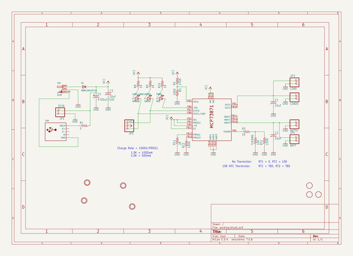

# usb_dc_solar_lithium_ion_polymer_charger
 
## summary 
* id: adafruit_usb_dc_solar_lithium_ion_polymer_charger_mcp73871_solar
* user: adafruit
* name: usb_dc_solar_lithium_ion_polymer_charger
* board: mcp73871_solar
* repo: https://github.com/adafruit/USB-DC-Solar-Lithium-Ion-Polymer-charger

* src_file_repo_sch: 
* src_file_repo_sch_link: https://github.com/adafruit/USB-DC-Solar-Lithium-Ion-Polymer-charger/tree/master/
* full details link: https://github.com/oomlout/oomlout_oomp_project_bot_v_2/tree/main/projects/adafruit_usb_dc_solar_lithium_ion_polymer_charger_mcp73871_solar/current_version/working  

## schematic  
  
[schematic (pdf)](working_schematic.pdf)  

## pcb  
 
  
  
  
[board (pdf)](working.pdf)  

## working_bom
| Id | Designator | Footprint | Quantity | Designation | Supplier and ref |  | None | 
| --- | --- | --- | --- | --- | --- | --- | --- | 
| 1 | U$4,U$7,U$6,U$5 | MOUNTINGHOLE_2.5_PLATED | 4 | MOUNTINGHOLE2.5 |  |  | [''] | 
| 2 | JP1 | 1X02_OVAL | 1 | DCIN |  |  | [''] | 
| 3 | JP4 | 1X02_ROUND | 1 | BATT |  |  | [''] | 
| 4 | CHRG/LBO0 | CHIPLED_0805_NOOUTLINE | 1 | ORANGE |  |  | [''] | 
| 5 | RT2 | M0805 | 1 | 150K |  |  | [''] | 
| 6 | R11 | 0805-THM | 1 | 2K |  |  | [''] | 
| 7 | BATT0,LOAD0 | JST-PH-2-SMT-RA | 2 |  |  |  | [''] | 
| 8 | R5 | M0805 | 1 | 1K |  |  | [''] | 
| 9 | U$2,U$8,U$3 | FIDUCIAL_1MM | 3 | FIDUCIAL |  |  | [''] | 
| 10 | C1,C3,C2 | C0805K | 3 | 10uF |  |  | [''] | 
| 11 | R3,R12 | R0805 | 2 | 100K |  |  | [''] | 
| 12 | C4 | E5-13 | 1 | 4700uF/10V |  |  | [''] | 
| 13 | IC1 | QFN20_4MM | 1 | MCP73871 |  |  | [''] | 
| 14 | R1 | R0805 | 1 | 0 |  |  | [''] | 
| 15 | PWR0 | CHIPLED_0805_NOOUTLINE | 1 | RED |  |  | [''] | 
| 16 | R9,R10,R8 | R0805 | 3 | 1K |  |  | [''] | 
| 17 | CN4 | USB-MINIB_LARGER | 1 |  |  |  | [''] | 
| 18 | JP3 | 1X02_ROUND | 1 | LOAD |  |  | [''] | 
| 19 | JP5 | 1X03-CLEANBIG | 1 |  |  |  | [''] | 
| 20 | CN1 | DCJACK_2MM_SMT | 1 | DCIN |  |  | [''] | 
| 21 | R2 | R0805 | 1 | 270K |  |  | [''] | 
| 22 | D1 | SOD-123 | 1 | MBR120VLSFT1G |  |  | [''] | 
| 23 | DONE0 | CHIPLED_0805_NOOUTLINE | 1 | GREEN |  |  | [''] | 
| 24 | THERM0 | 0805-THM | 1 | 10K |  |  | [''] | 
| 25 | U$1 | ADAFRUIT_TEXT_20MM | 1 |  |  |  | [''] | 

## bom_schematic
| Ref | Qnty | Value | Cmp name | Footprint | Description | Vendor | DNP | 
| --- | --- | --- | --- | --- | --- | --- | --- | 
| BATT0 | 1 | JST_2PIN-SMT-RA | JST_2PIN-SMT-RA | working:JST-PH-2-SMT-RA |  |  |  | 
| C1, C2, C3 | 3 | 10uF | C-USC0805K | working:C0805K |  |  |  | 
| C4 | 1 | 4700uF/10V | CPOL-USE5-13 | working:E5-13 |  |  |  | 
| CHRG/LBO0 | 1 | ORANGE | LED0805_NOOUTLINE | working:CHIPLED_0805_NOOUTLINE |  |  |  | 
| CN1 | 1 | DCIN | DCBARRELSMT | working:DCJACK_2MM_SMT |  |  |  | 
| CN4 | 1 | USBMINIBLARGE | USBMINIBLARGE | working:USB-MINIB_LARGER |  |  |  | 
| D1 | 1 | MBR120VLSFT1G | DIODESOD-123 | working:SOD-123 |  |  |  | 
| DONE0 | 1 | GREEN | LED0805_NOOUTLINE | working:CHIPLED_0805_NOOUTLINE |  |  |  | 
| IC1 | 1 | MCP73871 | MCP73871 | working:QFN20_4MM |  |  |  | 
| JP1 | 1 | DCIN | HEADER-1X2 | working:1X02_OVAL |  |  |  | 
| JP3 | 1 | LOAD | HEADER-1X2ROUND | working:1X02_ROUND |  |  |  | 
| JP4 | 1 | BATT | HEADER-1X2ROUND | working:1X02_ROUND |  |  |  | 
| JP5 | 1 | PINHD-1X3CB | PINHD-1X3CB | working:1X03-CLEANBIG |  |  |  | 
| LOAD0 | 1 | JST_2PIN-SMT-RA | JST_2PIN-SMT-RA | working:JST-PH-2-SMT-RA |  |  |  | 
| PWR0 | 1 | RED | LED0805_NOOUTLINE | working:CHIPLED_0805_NOOUTLINE |  |  |  | 
| R1 | 1 | 0 | R-US_R0805 | working:R0805 |  |  |  | 
| R2 | 1 | 270K | R-US_R0805 | working:R0805 |  |  |  | 
| R3, R12 | 2 | 100K | R-US_R0805 | working:R0805 |  |  |  | 
| R5 | 1 | 1K | R-US_M0805 | working:M0805 |  |  |  | 
| R8, R9, R10 | 3 | 1K | R-US_R0805 | working:R0805 |  |  |  | 
| R11 | 1 | 2K | R-US_FLIPFLOP | working:0805-THM |  |  |  | 
| RT2 | 1 | 150K | R-US_M0805 | working:M0805 |  |  |  | 
| THERM0 | 1 | 10K | R-US_FLIPFLOP | working:0805-THM |  |  |  | 
| U$2, U$3, U$8 | 3 | FIDUCIAL | FIDUCIAL | working:FIDUCIAL_1MM |  |  |  | 
| U$4, U$5, U$6, U$7 | 4 | MOUNTINGHOLE2.5 | MOUNTINGHOLE2.5 | working:MOUNTINGHOLE_2.5_PLATED |  |  |  | 

## mounting_holes
| x | y | package | value | ref | size | 
| --- | --- | --- | --- | --- | --- | 
| 0.0 | 0.0 | MOUNTINGHOLE_2.5_PLATED | MOUNTINGHOLE2.5 | U$4 | m3 | 
| 35.56 | 0.0 | MOUNTINGHOLE_2.5_PLATED | MOUNTINGHOLE2.5 | U$5 | m3 | 
| 0.0 | 25.39999999999999 | MOUNTINGHOLE_2.5_PLATED | MOUNTINGHOLE2.5 | U$6 | m3 | 
| 35.56 | 25.39999999999999 | MOUNTINGHOLE_2.5_PLATED | MOUNTINGHOLE2.5 | U$7 | m3 | 

