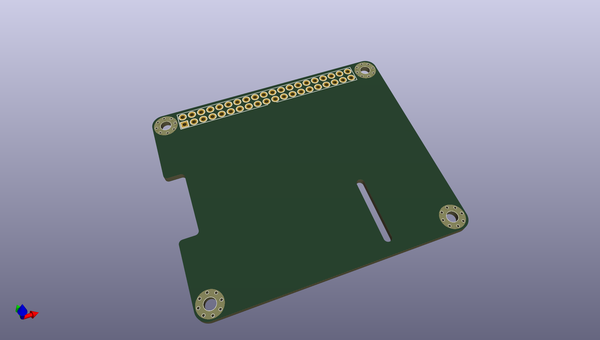
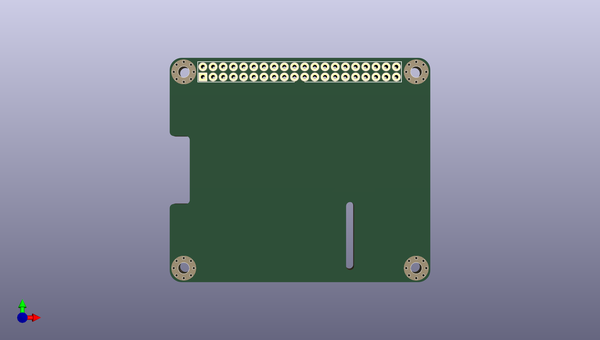
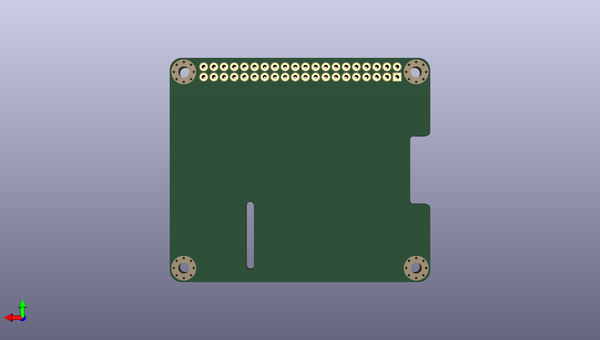

# agg_kicad
 
## summary 
* id: adamgreig_agg_kicad_pi_hat
* user: adamgreig
* name: agg_kicad
* board: pi_hat
* repo: https://github.com/adamgreig/agg-kicad
* src_file_repo_kicad_pcb: templates/pi-hat.kicad_pcb
* src_file_repo_kicad_pcb_link: https://github.com/adamgreig/agg-kicad/tree/master/templates/pi-hat.kicad_pcb

* src_file_repo_sch: 
* src_file_repo_sch_link: https://github.com/adamgreig/agg-kicad/tree/master/
* full details link: https://github.com/oomlout/oomlout_oomp_project_bot_v_2/tree/main/projects/adamgreig_agg_kicad_pi_hat/current_version/working  

## pcb  
 
  
  
  
[board (pdf)](working.pdf)  

## working_bom
| Id | Designator | Footprint | Quantity | Designation | Supplier and ref |  | None | 
| --- | --- | --- | --- | --- | --- | --- | --- | 
| 1 | REF**,REF**,REF**,REF** | M2.5_MOUNT | 4 | M2.5_MOUNT |  |  | [''] | 
| 2 | REF** | DIL-254P-40 | 1 | DIL-254P-40 |  |  | [''] | 

