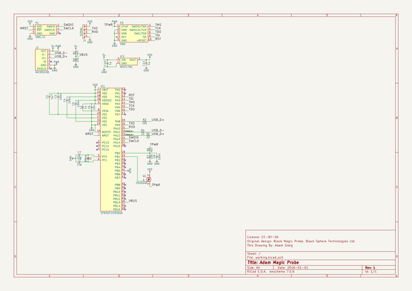

# amp
 
## summary 
* id: adamgreig_amp_amp
* user: adamgreig
* name: amp
* board: amp
* repo: https://github.com/adamgreig/amp
* src_file_repo_kicad_pcb: amp.kicad_pcb
* src_file_repo_kicad_pcb_link: https://github.com/adamgreig/amp/tree/master/amp.kicad_pcb

* src_file_repo_sch: amp.sch
* src_file_repo_sch_link: https://github.com/adamgreig/amp/tree/master/amp.sch
* full details link: https://github.com/oomlout/oomlout_oomp_project_bot_v_2/tree/main/projects/adamgreig_amp_amp/current_version/working  

## schematic  
  
[schematic (pdf)](working_schematic.pdf) 

## pcb  
 
  
  
  
[board (pdf)](working.pdf)  

## working_bom
| Id | Designator | Footprint | Quantity | Designation | Supplier and ref |  | None | 
| --- | --- | --- | --- | --- | --- | --- | --- | 
| 1 | C1 | 0603 | 1 | 4µ7 |  |  | [''] | 
| 2 | C2,C10,C11 | 0603 | 3 | 1µ |  |  | [''] | 
| 3 | C3,C4,C5,C8 | 0402 | 4 | 100n |  |  | [''] | 
| 4 | C6 | 0402 | 1 | 10n |  |  | [''] | 
| 5 | C7,C9 | 0402 | 2 | 15p |  |  | [''] | 
| 6 | IC1 | QFN-48-EP-ST | 1 | STM32F103CBU6 |  |  | [''] | 
| 7 | IC2 | SOT-23 | 1 | MCP1700 |  |  | [''] | 
| 8 | J2 | MICROUSB_MOLEX_47589-0001 | 1 | MICROUSB |  |  | [''] | 
| 9 | P1 | TC2030-NL | 1 | SWD_TC |  |  | [''] | 
| 10 | Q1 | SOT-23 | 1 | FDV304P |  |  | [''] | 
| 11 | R1,R6 | 0402 | 2 | 4k7 |  |  | [''] | 
| 12 | R2,R7 | 0402 | 2 | 10k |  |  | [''] | 
| 13 | R3 | 0402 | 1 | 1k5 |  |  | [''] | 
| 14 | R4,R5 | 0402 | 2 | 22 |  |  | [''] | 
| 15 | Y1 | XTAL-50x32 | 1 | 8MHz |  |  | [''] | 
| 16 | P2 | FTSH-105-01-L-DV-K | 1 | SWD |  |  | [''] | 
| 17 | J1 | SM04B-PASS | 1 | SERIAL |  |  | [''] | 

## bom_schematic
| Ref | Qnty | Value | Cmp name | Footprint | Description | Vendor | DNP | 
| --- | --- | --- | --- | --- | --- | --- | --- | 
| C1 | 1 | 4µ7 | C | agg:0603 |  |  |  | 
| C2, C10, C11 | 3 | 1µ | C | agg:0603 |  |  |  | 
| C3, C4, C5, C8 | 4 | 100n | C | agg:0402 |  |  |  | 
| C6 | 1 | 10n | C | agg:0402 |  |  |  | 
| C7, C9 | 2 | 33p | C | agg:0402 |  |  |  | 
| IC1 | 1 | STM32F103CBU6 | STM32F1xxCxUx | agg:QFN-48-EP-ST |  |  |  | 
| IC2 | 1 | MCP1700 | MCP1700 | agg:SOT-23 |  |  |  | 
| J1 | 1 | SERIAL | CONN_01x04 | agg:SM04B-PASS |  |  |  | 
| J2 | 1 | MICROUSB | MICROUSB | agg:MICROUSB_MOLEX_47589-0001 |  |  |  | 
| P1 | 1 | SWD_TC | SWD_TC | agg:TC2030-NL |  |  |  | 
| P2 | 1 | SWD | SWD | agg:FTSH-105-01-L-DV-K |  |  |  | 
| Q1 | 1 | FDV304P | PFET | agg:SOT-23 |  |  |  | 
| R1, R6 | 2 | 4k7 | R | agg:0402 |  |  |  | 
| R2, R7 | 2 | 10k | R | agg:0402 |  |  |  | 
| R3 | 1 | 1k5 | R | agg:0402 |  |  |  | 
| R4, R5 | 2 | 22 | R | agg:0402 |  |  |  | 
| Y1 | 1 | 8MHz | XTAL | agg:XTAL-50x32 |  |  |  | 

