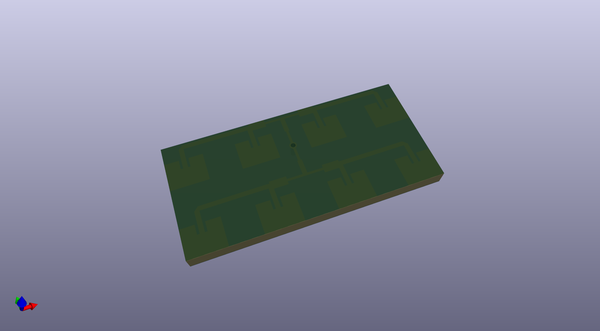
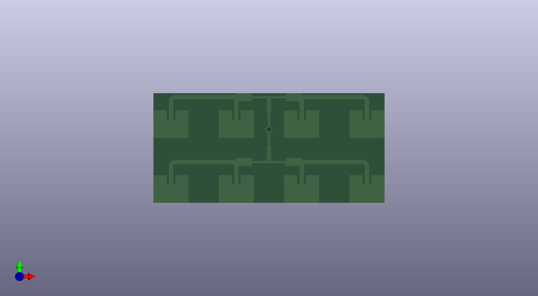

# bikedar
 
## summary 
* id: adamgreig_bikedar_antenna_centrefed
* user: adamgreig
* name: bikedar
* board: antenna_centrefed
* repo: https://github.com/adamgreig/bikedar
* src_file_repo_kicad_pcb: antenna/antenna.kicad_pcb
* src_file_repo_kicad_pcb_link: https://github.com/adamgreig/bikedar/tree/master/antenna/antenna.kicad_pcb

* src_file_repo_sch: 
* src_file_repo_sch_link: https://github.com/adamgreig/bikedar/tree/master/
* full details link: https://github.com/oomlout/oomlout_oomp_project_bot_v_2/tree/main/projects/adamgreig_bikedar_antenna_centrefed/current_version/working  

## pcb  
 
  
  
  
[board (pdf)](working.pdf)  

## working_bom
| Id | Designator | Footprint | Quantity | Designation | Supplier and ref |  | None | 
| --- | --- | --- | --- | --- | --- | --- | --- | 
| 1 |  | X0 | 1 |  |  |  | [''] | 

