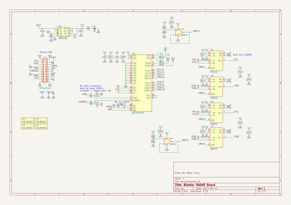

# bikedar
 
## summary 
* id: adamgreig_bikedar_bikedar
* user: adamgreig
* name: bikedar
* board: bikedar
* repo: https://github.com/adamgreig/bikedar
* src_file_repo_kicad_pcb: pcb/bikedar.kicad_pcb
* src_file_repo_kicad_pcb_link: https://github.com/adamgreig/bikedar/tree/master/pcb/bikedar.kicad_pcb

* src_file_repo_sch: pcb/bikedar.sch
* src_file_repo_sch_link: https://github.com/adamgreig/bikedar/tree/master/pcb/bikedar.sch
* full details link: https://github.com/oomlout/oomlout_oomp_project_bot_v_2/tree/main/projects/adamgreig_bikedar_bikedar/current_version/working  

## schematic  
  
[schematic (pdf)](working_schematic.pdf) 

## pcb  
 
  
  
  
[board (pdf)](working.pdf)  

## working_bom
| Id | Designator | Footprint | Quantity | Designation | Supplier and ref |  | None | 
| --- | --- | --- | --- | --- | --- | --- | --- | 
| 1 | IC3,IC8 | SC-70-5 | 2 | AD8541 |  |  | [''] | 
| 2 | IC2 | QFN-32-BGT24MTR | 1 | BGT24MTR12 |  |  | [''] | 
| 3 | IC1 | MSOP-8 | 1 | ADP3335 |  |  | [''] | 
| 4 | IC4,IC5,IC6,IC7 | MSOP-8 | 4 | AD8226 |  |  | [''] | 
| 5 | C12,C11,C10,C8,C13,C14,C16,C17 | 0603 | 8 | 100n |  |  | [''] | 
| 6 | C7,C3,C1,C18 | 0603 | 4 | 1µ |  |  | [''] | 
| 7 | C4,C15,C19,C20 | 0603 | 4 | 10µ |  |  | [''] | 
| 8 | C2 | 0603 | 1 | 1n |  |  | [''] | 
| 9 | R5,R4,R10,R11,R12 | 0603 | 5 | 10k |  |  | [''] | 
| 10 | C9 | 0402 | 1 | 1n |  |  | [''] | 
| 11 | R3 | 0402 | 1 | 50 |  |  | [''] | 
| 12 | J1 | DIL-254P-20 | 1 | CONN_02x10 |  |  | [''] | 
| 13 | R9,R6,R7,R8 | 0402 | 4 | 5k49 |  |  | [''] | 
| 14 | X2,X1,X4,X3 | M3_MOUNT | 4 | M3_MOUNT |  |  | [''] | 
| 15 | TP2 | SIL-254P-01 | 1 | TESTPAD |  |  | [''] | 
| 16 | TP1 | TESTPAD | 1 | TESTPAD |  |  | [''] | 
| 17 | R14 | 0603 | 1 | 1k |  |  | [''] | 
| 18 | D1 | 0603-LED | 1 | LED |  |  | [''] | 
| 19 | R13,R2,R1 | 0402 | 3 | 100 |  |  | [''] | 
| 20 | C5,C6 | 0402 | 2 | 100n |  |  | [''] | 
| 21 | AE2,AE3 | X0 | 2 |  |  |  | [''] | 

## bom_schematic
| Ref | Qnty | Value | Cmp name | Footprint | Description | Vendor | DNP | 
| --- | --- | --- | --- | --- | --- | --- | --- | 
| AE1, AE2, AE3 | 3 | ANT | ANT |  |  |  |  | 
| C1, C3, C7, C18 | 4 | 1µ | C | agg:0603 |  |  |  | 
| C2 | 1 | 1n | C | agg:0603 |  |  |  | 
| C4, C15, C19, C20 | 4 | 10µ | C | agg:0603 |  |  |  | 
| C5, C6 | 2 | 100n | C | agg:0402 |  |  |  | 
| C8, C10, C11, C12, C13, C14, C16, C17 | 8 | 100n | C | agg:0603 |  |  |  | 
| C9 | 1 | 1n | C | agg:0402 |  |  |  | 
| D1 | 1 | LED | LED | agg:0603-LED |  |  |  | 
| IC1 | 1 | ADP3335 | ADP3335 | agg:MSOP-8 |  |  |  | 
| IC2 | 1 | BGT24MTR12 | BGT24MTR12 | agg:QFN-32-BGT24MTR |  |  |  | 
| IC3, IC8 | 2 | AD8541 | AD8541 | agg:SC-70-5 |  |  |  | 
| IC4, IC5, IC6, IC7 | 4 | AD8226 | AD8226 | agg:MSOP-8 |  |  |  | 
| J1 | 1 | CONN_02x10 | CONN_02x10 | agg:DIL-254P-20 |  |  |  | 
| R1, R2, R13 | 3 | 100 | R | agg:0402 |  |  |  | 
| R3 | 1 | 50 | R | agg:0402 |  |  |  | 
| R4, R5, R10, R11, R12 | 5 | 10k | R | agg:0603 |  |  |  | 
| R6, R7, R8, R9 | 4 | 5k49 | R | agg:0402 |  |  |  | 
| R14 | 1 | 1k | R | agg:0603 |  |  |  | 
| TP1 | 1 | TESTPAD | TESTPAD | agg:TESTPAD |  |  |  | 
| TP2 | 1 | TESTPAD | TESTPAD | agg:SIL-254P-01 |  |  |  | 
| X1, X2, X3, X4 | 4 | M3_MOUNT | PART | agg:M3_MOUNT |  |  |  | 

