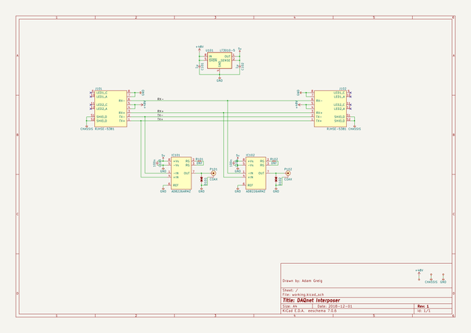
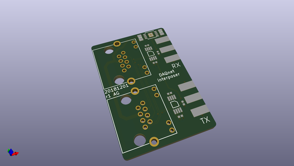
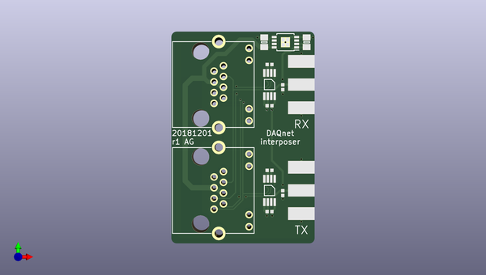
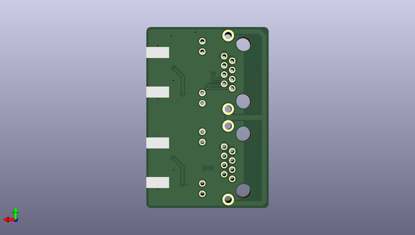

# daqnet
 
## summary 
* id: adamgreig_daqnet_interposer
* user: adamgreig
* name: daqnet
* board: interposer
* repo: https://github.com/adamgreig/daqnet
* src_file_repo_kicad_pcb: hardware/interposer/interposer.kicad_pcb
* src_file_repo_kicad_pcb_link: https://github.com/adamgreig/daqnet/tree/master/hardware/interposer/interposer.kicad_pcb

* src_file_repo_sch: hardware/interposer/interposer.sch
* src_file_repo_sch_link: https://github.com/adamgreig/daqnet/tree/master/hardware/interposer/interposer.sch
* full details link: https://github.com/oomlout/oomlout_oomp_project_bot_v_2/tree/main/projects/adamgreig_daqnet_interposer/current_version/working  

## schematic  
  
[schematic (pdf)](working_schematic.pdf)  

## pcb  
 
  
  
  
[board (pdf)](working.pdf)  

## working_bom
| Id | Designator | Footprint | Quantity | Designation | Supplier and ref |  | None | 
| --- | --- | --- | --- | --- | --- | --- | --- | 
| 1 | C101,C102 | 0805 | 2 | 1µ |  |  | [''] | 
| 2 | D101,D102 | 0402 | 2 | ESD_DIODE |  |  | [''] | 
| 3 | IC101,IC102 | MSOP-8 | 2 | AD8226ARMZ |  |  | [''] | 
| 4 | J101,J102 | RJHSE-538X | 2 | RJHSE-5381 |  |  | [''] | 
| 5 | P101,P102 | SMA-EDGE | 2 | COAX |  |  | [''] | 
| 6 | U101 | MSOP-8-1EP_3x3mm_P0.65mm_EP1.68x1.88mm | 1 | LT3010-5 |  |  | [''] | 
| 7 | C103,C104 | 0402 | 2 | 100n |  |  | [''] | 
| 8 | R101,R102 | 0402 | 2 | DNF |  |  | [''] | 

## bom_schematic
| Ref | Qnty | Value | Cmp name | Footprint | Description | Vendor | DNP | 
| --- | --- | --- | --- | --- | --- | --- | --- | 
| C101, C102 | 2 | 1µ | C-agg | agg:0805 |  |  |  | 
| C103, C104 | 2 | 100n | C-agg | agg:0402 |  |  |  | 
| D101, D102 | 2 | ESD_DIODE | ESD_DIODE-agg | agg:0402 |  |  |  | 
| IC101, IC102 | 2 | AD8226ARMZ | AD8226-agg | agg:MSOP-8 |  |  |  | 
| J101, J102 | 2 | RJHSE-5381 | RJHSE-538x-agg | agg:RJHSE-538X |  |  |  | 
| P101, P102 | 2 | COAX | COAX-agg | agg:SMA-EDGE |  |  |  | 
| R101, R102 | 2 | DNF | R-agg | agg:0402 |  |  |  | 
| U101 | 1 | LT3010-5 | LT3010-5-Regulator_Linear | Package_SO:MSOP-8-1EP_3x3mm_P0.65mm_EP1.68x1.88mm |  |  |  | 

