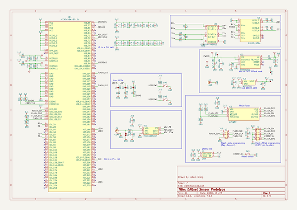
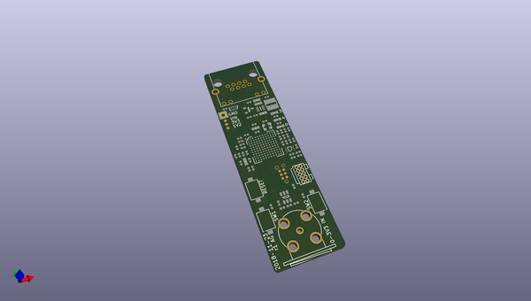
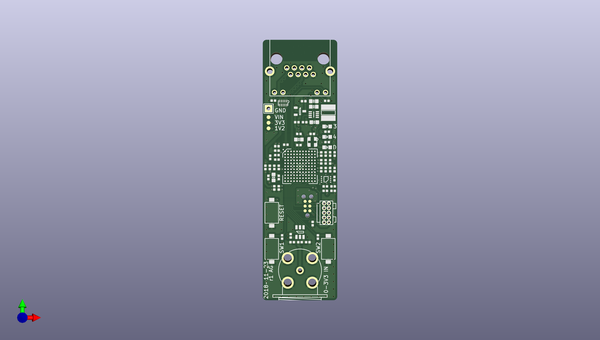
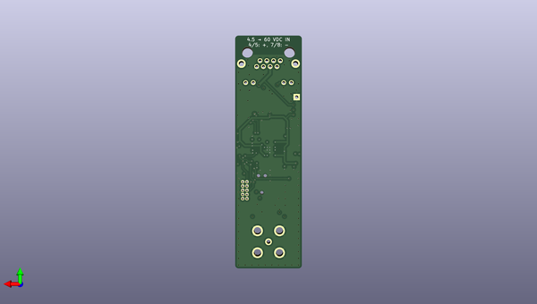

# daqnet
 
## summary 
* id: adamgreig_daqnet_proto_sensor
* user: adamgreig
* name: daqnet
* board: proto_sensor
* repo: https://github.com/adamgreig/daqnet
* src_file_repo_kicad_pcb: hardware/proto-sensor/proto-sensor.kicad_pcb
* src_file_repo_kicad_pcb_link: https://github.com/adamgreig/daqnet/tree/master/hardware/proto-sensor/proto-sensor.kicad_pcb

* src_file_repo_sch: hardware/proto-sensor/proto-sensor.sch
* src_file_repo_sch_link: https://github.com/adamgreig/daqnet/tree/master/hardware/proto-sensor/proto-sensor.sch
* full details link: https://github.com/oomlout/oomlout_oomp_project_bot_v_2/tree/main/projects/adamgreig_daqnet_proto_sensor/current_version/working  

## schematic  
  
[schematic (pdf)](working_schematic.pdf) 

## pcb  
 
  
  
  
[board (pdf)](working.pdf)  

## working_bom
| Id | Designator | Footprint | Quantity | Designation | Supplier and ref |  | None | 
| --- | --- | --- | --- | --- | --- | --- | --- | 
| 1 | IC4 | Lattice-BG121 | 1 | iCE40HX8K-BG121 |  |  | [''] | 
| 2 | IC1 | RJHSE-538X | 1 | RJHSE-538x |  |  | [''] | 
| 3 | P1 | BNC_PCB_RA_5-1634556-0 | 1 | COAX |  |  | [''] | 
| 4 | R4,R6,R5 | 0402 | 3 | 140 |  |  | [''] | 
| 5 | R2,R7,R8,R19 | 0402 | 4 | 100 |  |  | [''] | 
| 6 | R1,R3,R9,R10,R11 | 0402 | 5 | 1k |  |  | [''] | 
| 7 | C13,C19,C15 | 0603 | 3 | 10µ |  |  | [''] | 
| 8 | C14,C20,C1,C5,C7,C2,C8,C9,C23,C28,C26,C21,C25,C24,C30 | 0402 | 15 | 100n |  |  | [''] | 
| 9 | R16,R12,R13,R14,R15,R20,R21 | 0402 | 7 | 10k |  |  | [''] | 
| 10 | C6,C3,C4,C10,C11,C12,C27,C29 | 0402 | 8 | 10n |  |  | [''] | 
| 11 | C17 | 0603 | 1 | 100n 48V |  |  | [''] | 
| 12 | IC5 | UFDFN-8 | 1 | W25Q80 |  |  | [''] | 
| 13 | D2,D1,D3 | 0603-LED | 3 | LED |  |  | [''] | 
| 14 | R18,R17 | 0402 | 2 | DNF |  |  | [''] | 
| 15 | C22,C18 | 0402 | 2 | 1µ |  |  | [''] | 
| 16 | IC3 | SOT-23 | 1 | MCP1700 |  |  | [''] | 
| 17 | C16 | 0603 | 1 | 1µ 48V |  |  | [''] | 
| 18 | D4 | 0402 | 1 | ESD_DIODE |  |  | [''] | 
| 19 | IC2 | TDFN-8 | 1 | MAX15062 |  |  | [''] | 
| 20 | IC6 | SOT-23-6 | 1 | MAX11665AUT |  |  | [''] | 
| 21 | J2 | TC2030-NL | 1 | ~ |  |  | [''] | 
| 22 | SW1,SW3,SW2 | KSR232G | 3 | ~ |  |  | [''] | 
| 23 | J1 | FTSH-105-01-F-D-K | 1 | ~ |  |  | [''] | 
| 24 | Y1 | XTAL-25x20 | 1 | 25M |  |  | [''] | 
| 25 | L1 | LPS4018 | 1 | 33µ |  |  | [''] | 
| 26 | J3 | SIL-254P-01 | 1 | GND |  |  | [''] | 
| 27 | TP1,TP2,TP3 | TESTPAD | 3 | TESTPAD |  |  | [''] | 
| 28 | IC7 | uQFN-10L | 1 | ECMF04-4HSM10 |  |  | [''] | 

## bom_schematic
| Ref | Qnty | Value | Cmp name | Footprint | Description | Vendor | DNP | 
| --- | --- | --- | --- | --- | --- | --- | --- | 
| C1, C2, C5, C7, C8, C9, C14, C20, C21, C23, C24, C25, C26, C28, C30 | 15 | 100n | C-agg | agg:0402 |  |  |  | 
| C3, C4, C6, C10, C11, C12, C27, C29 | 8 | 10n | C-agg | agg:0402 |  |  |  | 
| C13, C15, C19 | 3 | 10µ | C-agg | agg:0603 |  |  |  | 
| C16 | 1 | 0µ47 48V | C-agg | agg:0603 |  |  |  | 
| C17 | 1 | 100n 48V | C-agg | agg:0603 |  |  |  | 
| C18, C22 | 2 | 1µ | C-agg | agg:0402 |  |  |  | 
| D1, D2, D3 | 3 | LED | LED-agg | agg:0603-LED |  |  |  | 
| D4 | 1 | ESD_DIODE | ESD_DIODE-agg | agg:0402 |  |  |  | 
| IC1 | 1 | RJHSE-538x | RJHSE-538x-agg | agg:RJHSE-538X |  |  |  | 
| IC2 | 1 | MAX15062 | MAX15062-agg | agg:TDFN-8 |  |  |  | 
| IC3 | 1 | MCP1700 | MCP1700-agg | agg:SOT-23 |  |  |  | 
| IC4 | 1 | iCE40HX8K-BG121 | iCE40HX8K-BG121-agg | agg:Lattice-BG121 |  |  |  | 
| IC5 | 1 | W25Q80 | W25Q80-agg | agg:UFDFN-8 |  |  |  | 
| IC6 | 1 | MAX11665AUT | MAX11665AUT-agg | agg:SOT-23-6 |  |  |  | 
| IC7 | 1 | ECMF04-4HSM10 | ECMF04-4HSM10-agg | agg:uQFN-10L |  |  |  | 
| J1 | 1 | ~ | CONN_02x05-agg | agg:FTSH-105-01-F-D-K |  |  |  | 
| J2 | 1 | ~ | CONN_02x03-agg | agg:TC2030-NL |  |  |  | 
| J3 | 1 | GND | CONN_01x01-agg | agg:SIL-254P-01 |  |  |  | 
| L1 | 1 | 33µ | L-agg | agg:LPS4018 |  |  |  | 
| P1 | 1 | COAX | COAX-agg | agg:BNC_PCB_RA_5-1634556-0 |  |  |  | 
| R1, R3, R9, R10, R11 | 5 | 1k | R-agg | agg:0402 |  |  |  | 
| R2, R7, R8, R19 | 4 | 100 | R-agg | agg:0402 |  |  |  | 
| R4, R5, R6 | 3 | 140 | R-agg | agg:0402 |  |  |  | 
| R12, R13, R14, R15, R16, R20, R21 | 7 | 10k | R-agg | agg:0402 |  |  |  | 
| R17, R18 | 2 | DNF | R-agg | agg:0402 |  |  |  | 
| SW1, SW2, SW3 | 3 | ~ | SWITCH_SPST-agg | agg:KSR232G |  |  |  | 
| TP1, TP2, TP3 | 3 | TESTPAD | TESTPAD-agg | agg:TESTPAD |  |  |  | 
| Y1 | 1 | 25M | TCXO_ST-agg | agg:XTAL-25x20 |  |  |  | 

