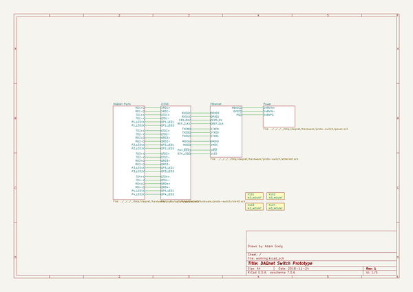

# daqnet
 
## summary 
* id: adamgreig_daqnet_proto_switch
* user: adamgreig
* name: daqnet
* board: proto_switch
* repo: https://github.com/adamgreig/daqnet
* src_file_repo_kicad_pcb: hardware/proto-switch/proto-switch.kicad_pcb
* src_file_repo_kicad_pcb_link: https://github.com/adamgreig/daqnet/tree/master/hardware/proto-switch/proto-switch.kicad_pcb

* src_file_repo_sch: hardware/proto-sensor/proto-sensor.sch
* src_file_repo_sch_link: https://github.com/adamgreig/daqnet/tree/master/hardware/proto-sensor/proto-sensor.sch
* full details link: https://github.com/oomlout/oomlout_oomp_project_bot_v_2/tree/main/projects/adamgreig_daqnet_proto_switch/current_version/working  

## schematic  
  
[schematic (pdf)](working_schematic.pdf)  

## pcb  
 
  
  
  
[board (pdf)](working.pdf)  

## working_bom
| Id | Designator | Footprint | Quantity | Designation | Supplier and ref |  | None | 
| --- | --- | --- | --- | --- | --- | --- | --- | 
| 1 | C501,C502,C218,C505,C221,C223,C224 | 0603 | 7 | 10µ |  |  | [''] | 
| 2 | C503,C209,C306,C304,C302,C222,C220,C219,C217,C212,C211,C203,C205,C202,C201,C314,C210,C204 | 0402 | 18 | 100n |  |  | [''] | 
| 3 | C504 | 0402 | 1 | 1µ |  |  | [''] | 
| 4 | IC301 | QFN-24-EP-MICREL | 1 | KSZ8081RNA |  |  | [''] | 
| 5 | IC401,IC402,IC403,IC404 | uQFN-10L | 4 | ECMF04-4HSM10 |  |  | [''] | 
| 6 | IC501 | SIP-8-DCDC | 1 | TEC 2-4810 |  |  | [''] | 
| 7 | IC502 | SOT-23 | 1 | MCP1700 |  |  | [''] | 
| 8 | IC503 | SIP-8-DCDC | 1 | TEC 2-4815 |  |  | [''] | 
| 9 | J501 | SIL-254P-01 | 1 | GND |  |  | [''] | 
| 10 | R417,R418,R419,R420,R421,R422,R423,R424,R502,R210,R208,R310,R308,R212,R213,R318,R209,R501,R503 | 0402 | 19 | 1k |  |  | [''] | 
| 11 | R401,R409,R402,R403,R411,R404,R405,R413,R406,R407,R415,R408 | 0402 | 12 | 140 |  |  | [''] | 
| 12 | R410,R412,R414,R416,R205,R204 | 0402 | 6 | 100 |  |  | [''] | 
| 13 | T301 | 749010012A | 1 | 749013011A |  |  | [''] | 
| 14 | TP501,TP502,TP503,TP504,TP505 | TESTPAD | 5 | TESTPAD |  |  | [''] | 
| 15 | J202 | SM04B-PASS | 1 | UART |  |  | [''] | 
| 16 | Y201,Y301 | XTAL-25x20 | 2 | 25M |  |  | [''] | 
| 17 | R304,R303,R302,R301,R307,R306,R305 | 0402 | 7 | 33 |  |  | [''] | 
| 18 | R211,R207,R206,R202,R201,R311 | 0402 | 6 | 10k |  |  | [''] | 
| 19 | L302,L301 | 0603 | 2 | FB |  |  | [''] | 
| 20 | R309 | 0402 | 1 | 6k49 |  |  | [''] | 
| 21 | IC303 | DFN-10-EP-MAX | 1 | MAX5969x |  |  | [''] | 
| 22 | R317 | 0402 | 1 | 619 |  |  | [''] | 
| 23 | R316 | 0402 | 1 | 24k9 |  |  | [''] | 
| 24 | IC202 | Lattice-BG121 | 1 | iCE40HX8K-BG121 |  |  | [''] | 
| 25 | D303,D302 | TO-269AA | 2 | MB2S |  |  | [''] | 
| 26 | D301 | DO-214AC-SMA | 1 | SMAJ58A |  |  | [''] | 
| 27 | D203,D202,D201,D501 | 0603-LED | 4 | LED |  |  | [''] | 
| 28 | C308,C307 | 0603 | 2 | 100n |  |  | [''] | 
| 29 | C216,C215,C214,C213,C208,C206,C207 | 0402 | 7 | 10n |  |  | [''] | 
| 30 | C313 | 0805 | 1 | 100n 60V |  |  | [''] | 
| 31 | X101,X102,X104,X103 | M3_MOUNT | 4 | M3_MOUNT |  |  | [''] | 
| 32 | D204,D205 | 0402 | 2 | ESD_DIODE |  |  | [''] | 
| 33 | C305 | 0603 | 1 | 2µ2 |  |  | [''] | 
| 34 | J401 | RJHSE-538X-04 | 1 | RJHSE-538x-04 |  |  | [''] | 
| 35 | J302 | RJHSE-538X | 1 | RJHSE-538x |  |  | [''] | 
| 36 | C303,C301 | 1206 | 2 | 22µ |  |  | [''] | 
| 37 | R315,R314,R313,R312 | 0603 | 4 | DNF |  |  | [''] | 
| 38 | C312,C311,C310,C309 | 0805 | 4 | DNF |  |  | [''] | 
| 39 | SW201 | KSR232G | 1 | ~ |  |  | [''] | 
| 40 | IC201 | UFDFN-8 | 1 | W25Q80 |  |  | [''] | 
| 41 | J201 | FTSH-105-01-F-D-K | 1 | ~ |  |  | [''] | 

## bom_schematic
| Ref | Qnty | Value | Cmp name | Footprint | Description | Vendor | DNP | 
| --- | --- | --- | --- | --- | --- | --- | --- | 
| X101, X102, X103, X104 | 4 | M3_MOUNT | PART-agg | agg:M3_MOUNT |  |  |  | 

