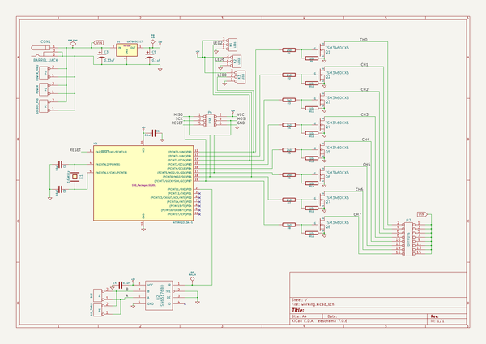
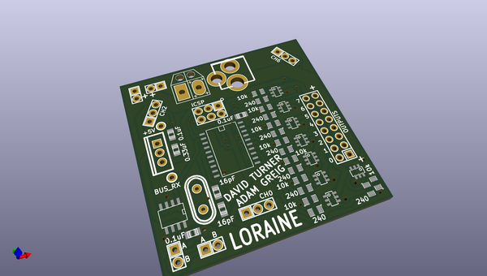
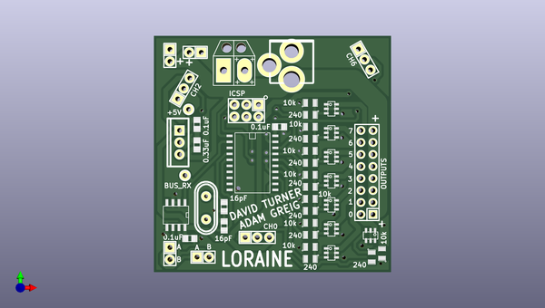
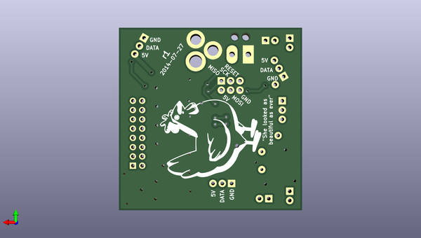

# drhouse
 
## summary 
* id: adamgreig_drhouse_loraine_node
* user: adamgreig
* name: drhouse
* board: loraine_node
* repo: https://github.com/adamgreig/drhouse
* src_file_repo_kicad_pcb: loraine/hardware/node/loraine_node.kicad_pcb
* src_file_repo_kicad_pcb_link: https://github.com/adamgreig/drhouse/tree/master/loraine/hardware/node/loraine_node.kicad_pcb

* src_file_repo_sch: loraine/hardware/node/loraine_node.sch
* src_file_repo_sch_link: https://github.com/adamgreig/drhouse/tree/master/loraine/hardware/node/loraine_node.sch
* full details link: https://github.com/oomlout/oomlout_oomp_project_bot_v_2/tree/main/projects/adamgreig_drhouse_loraine_node/current_version/working  

## schematic  
  
[schematic (pdf)](working_schematic.pdf) 

## pcb  
 
  
  
  
[board (pdf)](working.pdf)  

## working_bom
| Id | Designator | Footprint | Quantity | Designation | Supplier and ref |  | None | 
| --- | --- | --- | --- | --- | --- | --- | --- | 
| 1 | CON1 | BARREL_JACK | 1 | BARREL_JACK |  |  | [''] | 
| 2 | K1 | Pin_Header_Straight_1x03 | 1 | LED1 |  |  | [''] | 
| 3 | K3 | Pin_Header_Straight_1x03 | 1 | LED3 |  |  | [''] | 
| 4 | P3 | SIL-2 | 1 | SOLDER_PAD |  |  | [''] | 
| 5 | P6 | Pin_Header_Straight_2x03 | 1 | ICSP |  |  | [''] | 
| 6 | Q1,Q3,Q4,Q5,Q8,Q2,Q7,Q6 | sot26 | 8 | TSM3460CX6 |  |  | [''] | 
| 7 | R1,R3,R4,R7,R5,R8,R2,R6 | SM0805 | 8 | 240 |  |  | [''] | 
| 8 | R11,R15,R14,R13,R12,R9,R16,R10 | SM0805 | 8 | 10k |  |  | [''] | 
| 9 | U2 | SO8E | 1 | SN65176BD |  |  | [''] | 
| 10 | C5,C4,C6 | c_0805 | 3 | 0.1uF |  |  | [''] | 
| 11 | C3 | c_0805 | 1 | 0.33uF |  |  | [''] | 
| 12 | K2 | Pin_Header_Straight_1x03 | 1 | LED2 |  |  | [''] | 
| 13 | IC1 | SO20L | 1 | ATTINY2313A-S |  |  | [''] | 
| 14 | C2,C1 | c_0805 | 2 | 16pF |  |  | [''] | 
| 15 | X1 | Crystal_HC49-U_Vertical | 1 | 16MHz |  |  | [''] | 
| 16 | U1 | TO220_VERT | 1 | UA7805CKCT |  |  | [''] | 
| 17 | P1 | Pin_Header_Straight_1x02 | 1 | POWER_THRU |  |  | [''] | 
| 18 | P2 | Pin_Header_Straight_1x02 | 1 | POWER |  |  | [''] | 
| 19 | P4 | Pin_Header_Straight_1x02 | 1 | BUS |  |  | [''] | 
| 20 | P5 | Pin_Header_Straight_1x02 | 1 | BUS_THRU |  |  | [''] | 
| 21 | P7 | Pin_Header_Straight_2x08 | 1 | OUTPUTS |  |  | [''] | 
| 22 | P8 | TESTPOINT | 1 | +5V |  |  | [''] | 
| 23 | P9 | TESTPOINT | 1 | BUS_RX |  |  | [''] | 
| 24 | G*** | lorraine | 1 | LOGO |  |  | [''] | 

## bom_schematic
| Ref | Qnty | Value | Cmp name | Footprint | Description | Vendor | DNP | 
| --- | --- | --- | --- | --- | --- | --- | --- | 
| C1, C2 | 2 | 16pF | C | Capacitors_SMD:c_0805 |  |  |  | 
| C3 | 1 | 0.33uF | CP1 | Capacitors_SMD:c_0805 |  |  |  | 
| C4, C5, C6 | 3 | 0.1uF | C | Capacitors_SMD:c_0805 |  |  |  | 
| CON1 | 1 | BARREL_JACK | BARREL_JACK | Connect:BARREL_JACK |  |  |  | 
| IC1 | 1 | ATTINY2313A-S | ATTINY2313A-S | SMD_Packages:SO20L |  |  |  | 
| K1 | 1 | LED1 | CONN_3 | Connect:SIL-3 |  |  |  | 
| K2 | 1 | LED2 | CONN_3 | Connect:SIL-3 |  |  |  | 
| K3 | 1 | LED3 | CONN_3 | Connect:SIL-3 |  |  |  | 
| P1 | 1 | POWER_THRU | CONN_2 | molex-22-23-2021:SIL-2 |  |  |  | 
| P2 | 1 | POWER | CONN_2 | molex-22-23-2021:SIL-2 |  |  |  | 
| P3 | 1 | SOLDER_PAD | CONN_2 | solder_pad:SIL-2 |  |  |  | 
| P4 | 1 | BUS | CONN_2 | Pin_Headers:Pin_Header_Straight_2x03 |  |  |  | 
| P5 | 1 | BUS_THRU | CONN_2 | Pin_Headers:Pin_Header_Straight_2x08 |  |  |  | 
| P6 | 1 | ICSP | CONN_3X2 | molex-22-23-2021:SIL-2 |  |  |  | 
| P7 | 1 | OUTPUTS | CONN_8X2 | molex-22-23-2021:SIL-2 |  |  |  | 
| P8 | 1 | +5V | TST |  |  |  |  | 
| P9 | 1 | BUS_RX | TST |  |  |  |  | 
| Q1, Q2, Q3, Q4, Q5, Q6, Q7, Q8 | 8 | TSM3460CX6 | MOS_N | to126:TO126 |  |  |  | 
| R1, R2, R3, R4, R5, R6, R7, R8 | 8 | 240 | R | SMD_Packages:SM0805 |  |  |  | 
| R9, R10, R11, R12, R13, R14, R15, R16 | 8 | 10k | R | SMD_Packages:SM0805 |  |  |  | 
| U1 | 1 | UA7805CKCT | UA7805CKCT | TO-220 |  |  |  | 
| U2 | 1 | SN65176BD | SN65176BD | SMD_Packages:SO8E |  |  |  | 
| X1 | 1 | 16MHz | CRYSTAL | Crystals:Crystal_HC49-SD_SMD |  |  |  | 

