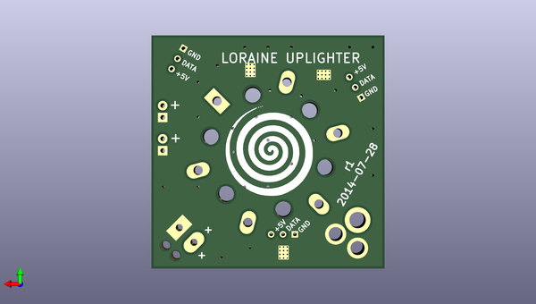

# drhouse
 
## summary 
* id: adamgreig_drhouse_uplighter
* user: adamgreig
* name: drhouse
* board: uplighter
* repo: https://github.com/adamgreig/drhouse
* src_file_repo_kicad_pcb: loraine/hardware/uplighter/uplighter.kicad_pcb
* src_file_repo_kicad_pcb_link: https://github.com/adamgreig/drhouse/tree/master/loraine/hardware/uplighter/uplighter.kicad_pcb

* src_file_repo_sch: loraine/hardware/uplighter/uplighter.sch
* src_file_repo_sch_link: https://github.com/adamgreig/drhouse/tree/master/loraine/hardware/uplighter/uplighter.sch
* full details link: https://github.com/oomlout/oomlout_oomp_project_bot_v_2/tree/main/projects/adamgreig_drhouse_uplighter/current_version/working  

## schematic  
  
[schematic (pdf)](working_schematic.pdf) 

## pcb  
 
  
  
  
[board (pdf)](working.pdf)  

## working_bom
| Id | Designator | Footprint | Quantity | Designation | Supplier and ref |  | None | 
| --- | --- | --- | --- | --- | --- | --- | --- | 
| 1 | K1,K2,K3 | SIL-3 | 3 | CONN_3 |  |  | [''] | 
| 2 | C1,C2,C3 | c_0805 | 3 | 100n |  |  | [''] | 
| 3 | CON1 | BARREL_JACK | 1 | BARREL_JACK |  |  | [''] | 
| 4 | P1 | Pin_Header_Straight_1x02 | 1 | POWER_THRU |  |  | [''] | 
| 5 | P2 | Pin_Header_Straight_1x02 | 1 | POWER |  |  | [''] | 
| 6 | P3 | SIL-2 | 1 | SOLDER_PAD |  |  | [''] | 
| 7 | R1,R2,R3 | SM0805 | 3 | 1R2 |  |  | [''] | 
| 8 | U1,U2,U3 | 8-SON | 3 | TL4242 |  |  | [''] | 
| 9 | D1 | heatsunk_star_led_board | 1 | STAR_LED |  |  | [''] | 
| 10 | G*** | hypnospiral_lessbig | 1 | LOGO |  |  | [''] | 

## bom_schematic
| Ref | Qnty | Value | Cmp name | Footprint | Description | Vendor | DNP | 
| --- | --- | --- | --- | --- | --- | --- | --- | 
| C1, C2, C3 | 3 | 100n | C |  |  |  |  | 
| CON1 | 1 | BARREL_JACK | BARREL_JACK |  |  |  |  | 
| D1 | 1 | STAR_LED | STAR_LED |  |  |  |  | 
| K1, K2, K3 | 3 | CONN_3 | CONN_3 |  |  |  |  | 
| P1 | 1 | POWER_THRU | CONN_2 |  |  |  |  | 
| P2 | 1 | POWER | CONN_2 |  |  |  |  | 
| P3 | 1 | SOLDER_PAD | CONN_2 |  |  |  |  | 
| R1, R2, R3 | 3 | 1R2 | R |  |  |  |  | 
| U1, U2, U3 | 3 | TL4242 | TL4242 |  |  |  |  | 

