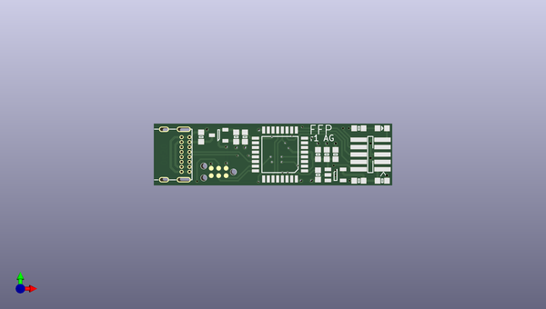

# ffp
 
## summary 
* id: adamgreig_ffp_ffp
* user: adamgreig
* name: ffp
* board: ffp
* repo: https://github.com/adamgreig/ffp
* src_file_repo_kicad_pcb: hardware/ffp.kicad_pcb
* src_file_repo_kicad_pcb_link: https://github.com/adamgreig/ffp/tree/master/hardware/ffp.kicad_pcb

* src_file_repo_sch: hardware/ffp.sch
* src_file_repo_sch_link: https://github.com/adamgreig/ffp/tree/master/hardware/ffp.sch
* full details link: https://github.com/oomlout/oomlout_oomp_project_bot_v_2/tree/main/projects/adamgreig_ffp_ffp/current_version/working  

## schematic  
  
[schematic (pdf)](working_schematic.pdf) 

## pcb  
 
  
  
  
[board (pdf)](working.pdf)  

## working_bom
| Id | Designator | Footprint | Quantity | Designation | Supplier and ref |  | None | 
| --- | --- | --- | --- | --- | --- | --- | --- | 
| 1 | C1,C2,C3,C4,C7 | 0603 | 5 | 100n |  |  | [''] | 
| 2 | C5,C6 | 0603 | 2 | 1µ |  |  | [''] | 
| 3 | IC1 | LQFP-32 | 1 | STM32F042K6T7 |  |  | [''] | 
| 4 | IC2 | SOT-23 | 1 | MCP1700 |  |  | [''] | 
| 5 | IC3 | SOT-23-5 | 1 | MIC2004-0_5YM5 |  |  | [''] | 
| 6 | J2 | USB4085 | 1 | USB4085 |  |  | [''] | 
| 7 | J3 | FTSH-105-01-L-DV-K | 1 | PROG |  |  | [''] | 
| 8 | P1 | TC2030-NL | 1 | SWD_TC |  |  | [''] | 
| 9 | R1,R2,R3 | 0603 | 3 | 10k |  |  | [''] | 
| 10 | D1 | 0603-LED | 1 | LED |  |  | [''] | 

## bom_schematic
| Ref | Qnty | Value | Cmp name | Footprint | Description | Vendor | DNP | 
| --- | --- | --- | --- | --- | --- | --- | --- | 
| C1, C2, C3, C4, C7 | 5 | 100n | C-agg | agg:0603 |  |  |  | 
| C5, C6 | 2 | 1µ | C-agg | agg:0603 |  |  |  | 
| D1 | 1 | LED | LED-agg | agg:0603-LED |  |  |  | 
| IC1 | 1 | STM32F042K6T7 | STM32F0xxKxTx-agg | agg:LQFP-32 |  |  |  | 
| IC2 | 1 | MCP1700 | MCP1700-agg | agg:SOT-23 |  |  |  | 
| IC3 | 1 | MIC2004-0_5YM5 | MIC2004-0_5YM5-agg | agg:SOT-23-5 |  |  |  | 
| J2 | 1 | USB4085 | USB4085-agg | agg:USB4085 |  |  |  | 
| J3 | 1 | PROG | CONN_02x05-agg | agg:FTSH-105-01-L-DV-K |  |  |  | 
| P1 | 1 | SWD_TC | SWD_TC-agg | agg:TC2030-NL |  |  |  | 
| R1, R2, R3 | 3 | 10k | R-agg | agg:0603 |  |  |  | 

