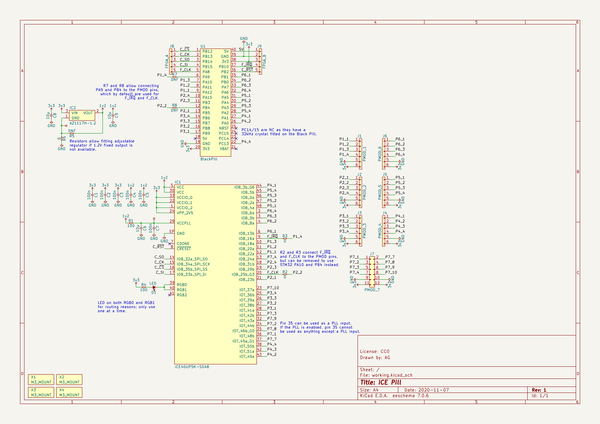

# icepill
 
## summary 
* id: adamgreig_icepill_icepill
* user: adamgreig
* name: icepill
* board: icepill
* repo: https://github.com/adamgreig/icepill
* src_file_repo_kicad_pcb: icepill.kicad_pcb
* src_file_repo_kicad_pcb_link: https://github.com/adamgreig/icepill/tree/master/icepill.kicad_pcb

* src_file_repo_sch: icepill.sch
* src_file_repo_sch_link: https://github.com/adamgreig/icepill/tree/master/icepill.sch
* full details link: https://github.com/oomlout/oomlout_oomp_project_bot_v_2/tree/main/projects/adamgreig_icepill_icepill/current_version/working  

## schematic  
  
[schematic (pdf)](working_schematic.pdf)  

## pcb  
 
  
  
  
[board (pdf)](working.pdf)  

## working_bom
| Id | Designator | Footprint | Quantity | Designation | Supplier and ref |  | None | 
| --- | --- | --- | --- | --- | --- | --- | --- | 
| 1 | C2,C3,C5,C7,C1,C4 | 0603 | 6 | 100n |  |  | [''] | 
| 2 | C6,C8,C9 | 0805 | 3 | 10µ |  |  | [''] | 
| 3 | IC1 | Lattice-SG48 | 1 | iCE40UP5K-SG48 |  |  | [''] | 
| 4 | J8 | SIL-254P-05 | 1 | FPGA_A |  |  | [''] | 
| 5 | J9 | SIL-254P-05 | 1 | FPGA_B |  |  | [''] | 
| 6 | R1,R4 | 0603 | 2 | 100 |  |  | [''] | 
| 7 | X1,X2,X3,X4 | M3_MOUNT | 4 | M3_MOUNT |  |  | [''] | 
| 8 | J7 | DIL-254P-12 | 1 | PMOD_7 |  |  | [''] | 
| 9 | J1 | SIL-254P-06 | 1 | PMOD_1 |  |  | [''] | 
| 10 | J2 | SIL-254P-06 | 1 | PMOD_2 |  |  | [''] | 
| 11 | J3 | SIL-254P-06 | 1 | PMOD_3 |  |  | [''] | 
| 12 | J4 | SIL-254P-06 | 1 | PMOD_4 |  |  | [''] | 
| 13 | J5 | SIL-254P-06 | 1 | PMOD_5 |  |  | [''] | 
| 14 | J6 | SIL-254P-06 | 1 | PMOD_6 |  |  | [''] | 
| 15 | U1 | BlackPill | 1 | BlackPill |  |  | [''] | 
| 16 | R8,R7,R5 | 0603 | 3 | DNF |  |  | [''] | 
| 17 | R2,R3,R6 | 0603 | 3 | 0 |  |  | [''] | 
| 18 | D1 | 0603-LED | 1 | LED |  |  | [''] | 
| 19 | IC2 | SOT223 | 1 | AZ1117H-1.2 |  |  | [''] | 

## bom_schematic
| Ref | Qnty | Value | Cmp name | Footprint | Description | Vendor | DNP | 
| --- | --- | --- | --- | --- | --- | --- | --- | 
| C1, C2, C3, C4, C5, C7 | 6 | 100n | C | icepill:0603 |  |  |  | 
| C6, C8, C9 | 3 | 10µ | C | icepill:0805 |  |  |  | 
| D1 | 1 | LED | LED | icepill:0603-LED |  |  |  | 
| IC1 | 1 | iCE40UP5K-SG48 | iCE40UP5K-SG48 | icepill:Lattice-SG48 | iCE40 UP5K FPGA |  |  | 
| IC2 | 1 | AZ1117H-1.2 | MCP1700 | icepill:SOT223 | LDO Voltage Regulator |  |  | 
| J1 | 1 | PMOD_1 | CONN_01x06 | icepill:SIL-254P-06 |  |  |  | 
| J2 | 1 | PMOD_2 | CONN_01x06 | icepill:SIL-254P-06 |  |  |  | 
| J3 | 1 | PMOD_3 | CONN_01x06 | icepill:SIL-254P-06 |  |  |  | 
| J4 | 1 | PMOD_4 | CONN_01x06 | icepill:SIL-254P-06 |  |  |  | 
| J5 | 1 | PMOD_5 | CONN_01x06 | icepill:SIL-254P-06 |  |  |  | 
| J6 | 1 | PMOD_6 | CONN_01x06 | icepill:SIL-254P-06 |  |  |  | 
| J7 | 1 | PMOD_7 | CONN_02x06 | icepill:DIL-254P-12 |  |  |  | 
| J8 | 1 | FPGA_A | CONN_01x05 | icepill:SIL-254P-05 |  |  |  | 
| J9 | 1 | FPGA_B | CONN_01x05 | icepill:SIL-254P-05 |  |  |  | 
| R1, R4 | 2 | 100 | R | icepill:0603 |  |  |  | 
| R2, R3, R6 | 3 | 0 | R | icepill:0603 |  |  |  | 
| R5, R7, R8 | 3 | DNF | R | icepill:0603 |  |  |  | 
| U1 | 1 | BlackPill | BlackPill | icepill:BlackPill | WeAct USB-C Black Pill with STM32F411 |  |  | 
| X1, X2, X3, X4 | 4 | M3_MOUNT | PART | icepill:M3_MOUNT |  |  |  | 

