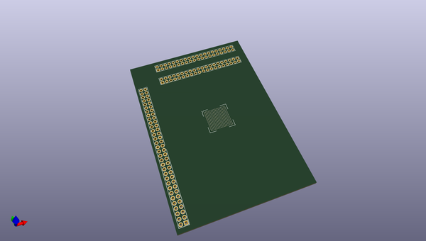
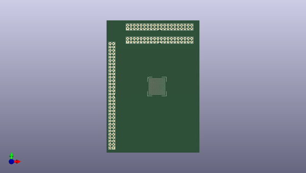
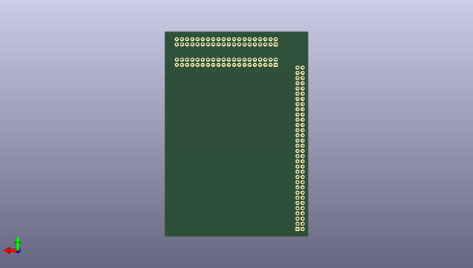

# iggie
 
## summary 
* id: adamgreig_iggie_driver
* user: adamgreig
* name: iggie
* board: driver
* repo: https://github.com/adamgreig/iggie
* src_file_repo_kicad_pcb: driver2/driver.kicad_pcb
* src_file_repo_kicad_pcb_link: https://github.com/adamgreig/iggie/tree/master/driver2/driver.kicad_pcb

* src_file_repo_sch: driver2/driver.sch
* src_file_repo_sch_link: https://github.com/adamgreig/iggie/tree/master/driver2/driver.sch
* full details link: https://github.com/oomlout/oomlout_oomp_project_bot_v_2/tree/main/projects/adamgreig_iggie_driver/current_version/working  

## pcb  
 
  
  
  
[board (pdf)](working.pdf)  

## working_bom
| Id | Designator | Footprint | Quantity | Designation | Supplier and ref |  | None | 
| --- | --- | --- | --- | --- | --- | --- | --- | 
| 1 | IC201 | Lattice-BG256 | 1 | LFE5U-25F-xBG256 |  |  | [''] | 
| 2 | J301 | DIL-254P-64 | 1 | CONN_02x32 |  |  | [''] | 
| 3 | J401,J402 | DIL-254P-40 | 2 | CONN_02x20 |  |  | [''] | 

## bom_schematic
| Ref | Qnty | Value | Cmp name | Footprint | Description | Vendor | DNP | 
| --- | --- | --- | --- | --- | --- | --- | --- | 
| X1, X2, X3, X4 | 4 | M3 MOUNT | PART-agg-kicad | agg:M3_MOUNT |  |  |  | 

