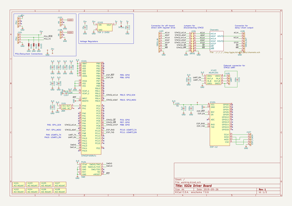

# iggie
 
## summary 
* id: adamgreig_iggie_iggie_driver
* user: adamgreig
* name: iggie
* board: iggie_driver
* repo: https://github.com/adamgreig/iggie
* src_file_repo_kicad_pcb: driver0/pcb/iggie-driver.kicad_pcb
* src_file_repo_kicad_pcb_link: https://github.com/adamgreig/iggie/tree/master/driver0/pcb/iggie-driver.kicad_pcb

* src_file_repo_sch: 
* src_file_repo_sch_link: https://github.com/adamgreig/iggie/tree/master/
* full details link: https://github.com/oomlout/oomlout_oomp_project_bot_v_2/tree/main/projects/adamgreig_iggie_iggie_driver/current_version/working  

## schematic  
  
[schematic (pdf)](working_schematic.pdf)  

## pcb  
 
  
  
  
[board (pdf)](working.pdf)  

## working_bom
| Id | Designator | Footprint | Quantity | Designation | Supplier and ref |  | None | 
| --- | --- | --- | --- | --- | --- | --- | --- | 
| 1 | C101,C103,C104,C106,C108,C113,C114,C115,C701,C702,C703,C704,C705,C706,C707,C708 | 0603 | 16 | 100n |  |  | [''] | 
| 2 | C102,C105,C107,C109,C112 | 0603 | 5 | 2µ2 |  |  | [''] | 
| 3 | C110,C111 | 1210 | 2 | 10µ |  |  | [''] | 
| 4 | D101,D102,D103 | 0603 | 3 | ESD_DIODE |  |  | [''] | 
| 5 | IC101 | LQFP-64 | 1 | STM32F405RxTx |  |  | [''] | 
| 6 | IC102 | TSR1 | 1 | TSR 1-2450 |  |  | [''] | 
| 7 | IC103 | SOIC-8 | 1 | ADuM1201 |  |  | [''] | 
| 8 | IC104 | ESP-12 | 1 | ESP-12 |  |  | [''] | 
| 9 | IC701,IC702,IC703,IC704,IC705,IC706,IC708,IC707 | TSSOP-16 | 8 | 74HC595 |  |  | [''] | 
| 10 | J101,J109 | MOLEX-KK-254P-04 | 2 | PSU |  |  | [''] | 
| 11 | J102,J108 | MOLEX-KK-254P-03 | 2 | HV |  |  | [''] | 
| 12 | J103 | MOLEX-PICOBLADE-53398-0871 | 1 | SREG_IN |  |  | [''] | 
| 13 | J104 | DIL-254P-16 | 1 | DRIVE |  |  | [''] | 
| 14 | J105 | MOLEX-PICOBLADE-53398-0471 | 1 | UART |  |  | [''] | 
| 15 | J106 | MOLEX-PICOBLADE-53398-0871 | 1 | SREG_OUT |  |  | [''] | 
| 16 | J107 | SIL-254P-05 | 1 | ESP_FLASH |  |  | [''] | 
| 17 | L101 | 0603 | 1 | FB |  |  | [''] | 
| 18 | P101 | FTSH-105-01-F-D-K | 1 | SWD |  |  | [''] | 
| 19 | Q304,Q306,Q310,Q312,Q316,Q318,Q322,Q324,Q404,Q406,Q410,Q412,Q416,Q418,Q422,Q424,Q504,Q506,Q510,Q512,Q516,Q518,Q522,Q524,Q604,Q606,Q610,Q612,Q616,Q618,Q622,Q624,Q601,Q301,Q302,Q307,Q308,Q313,Q319,Q320,Q401,Q402,Q407,Q408,Q413,Q414,Q419,Q420,Q501,Q502,Q507,Q508,Q513,Q514,Q519,Q520,Q602,Q607,Q608,Q613,Q614,Q619,Q620,Q314 | SOT-23 | 64 | DMN60H080DS-7 |  |  | [''] | 
| 20 | TP101 | TESTPAD | 1 | TESTPAD |  |  | [''] | 
| 21 | X101,X102,X103,X104,X105,X106,X107,X108 | M3_MOUNT | 8 | M3 MOUNT |  |  | [''] | 
| 22 | Y101 | XTAL-25x20 | 1 | 26M |  |  | [''] | 
| 23 | R620,R619,R501,R502,R504,R507,R508,R509,R510,R513,R514,R515,R301,R302,R303,R304,R307,R308,R309,R310,R313,R314,R315,R316,R319,R320,R321,R322,R401,R402,R403,R404,R407,R408,R409,R410,R413,R414,R415,R416,R419,R420,R421,R422,R610,R520,R603,R602,R604,R608,R519,R516,R522,R621,R616,R613,R503,R607,R622,R615,R521,R601,R609,R614 | 1206 | 64 | 10k |  |  | [''] | 
| 24 | R612,R424,R505,R506,R511,R512,R305,R311,R312,R317,R318,R323,R324,R405,R406,R411,R412,R417,R418,R423,R617,R517,R524,R518,R624,R618,R306,R605,R611,R606,R623,R523 | 1206 | 32 | 93k1 |  |  | [''] | 
| 25 | Q303,Q305,Q309,Q311,Q315,Q317,Q321,Q323,Q403,Q405,Q409,Q411,Q415,Q417,Q421,Q423,Q503,Q505,Q509,Q511,Q515,Q517,Q521,Q523,Q603,Q605,Q609,Q611,Q615,Q617,Q621,Q623 | SOT-23 | 32 | PBHV9050T,215 |  |  | [''] | 
| 26 | J201 | IPL1-116-02-L-SH | 1 | A_1_16 |  |  | [''] | 
| 27 | J202 | IPL1-116-02-L-SH | 1 | A_17_32 |  |  | [''] | 
| 28 | J203,J204 | IPL1-116-02-L-SH | 2 | K_1_16 |  |  | [''] | 

## bom_schematic
| Ref | Qnty | Value | Cmp name | Footprint | Description | Vendor | DNP | 
| --- | --- | --- | --- | --- | --- | --- | --- | 
| C101, C103, C104, C106, C108, C113, C114, C115 | 8 | 100n | C-agg-kicad | agg:0603 |  |  |  | 
| C102, C105, C107, C109, C112 | 5 | 2µ2 | C-agg-kicad | agg:0603 |  |  |  | 
| C110, C111 | 2 | 10µ | C-agg-kicad | agg:1210 |  |  |  | 
| D101, D102, D103 | 3 | ESD_DIODE | ESD_DIODE-agg-kicad | agg:0603 |  |  |  | 
| IC101 | 1 | STM32F405RxTx | STM32F405RxTx-agg-kicad | agg:LQFP-64 |  |  |  | 
| IC102 | 1 | TSR 1-2450 | TSR1-agg-kicad | agg:TSR1 |  |  |  | 
| IC103 | 1 | ADuM1201 | ADuM1201-agg-kicad | agg:SOIC-8 |  |  |  | 
| IC104 | 1 | ESP-12 | ESP-12-agg-kicad | agg:ESP-12 |  |  |  | 
| J101, J109 | 2 | PSU | CONN_01x04-agg-kicad | agg:MOLEX-KK-254P-04 |  |  |  | 
| J102, J108 | 2 | HV | CONN_01x03-agg-kicad | agg:MOLEX-KK-254P-03 |  |  |  | 
| J103 | 1 | SREG_IN | CONN_01x08-agg-kicad | agg:MOLEX-PICOBLADE-53398-0871 |  |  |  | 
| J104 | 1 | DRIVE | CONN_02x08-agg-kicad | agg:DIL-254P-16 |  |  |  | 
| J105 | 1 | UART | CONN_01x04-agg-kicad | agg:MOLEX-PICOBLADE-53398-0471 |  |  |  | 
| J106 | 1 | SREG_OUT | CONN_01x08-agg-kicad | agg:MOLEX-PICOBLADE-53398-0871 |  |  |  | 
| J107 | 1 | ESP_FLASH | CONN_01x05-agg-kicad | agg:SIL-254P-05 |  |  |  | 
| L101 | 1 | FB | L-agg-kicad | agg:0603 |  |  |  | 
| P101 | 1 | SWD | SWD-agg-kicad | agg:FTSH-105-01-F-D-K |  |  |  | 
| TP101 | 1 | TESTPAD | TESTPAD-agg-kicad | agg:TESTPAD |  |  |  | 
| X101, X102, X103, X104, X105, X106, X107, X108 | 8 | M3 MOUNT | PART-agg-kicad | agg:M3_MOUNT |  |  |  | 
| Y101 | 1 | 26M | TCXO-agg-kicad | agg:XTAL-25x20 |  |  |  | 

