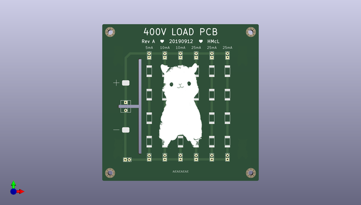

# iggie
 
## summary 
* id: adamgreig_iggie_load
* user: adamgreig
* name: iggie
* board: load
* repo: https://github.com/adamgreig/iggie
* src_file_repo_kicad_pcb: load/load.kicad_pcb
* src_file_repo_kicad_pcb_link: https://github.com/adamgreig/iggie/tree/master/load/load.kicad_pcb

* src_file_repo_sch: load/load.sch
* src_file_repo_sch_link: https://github.com/adamgreig/iggie/tree/master/load/load.sch
* full details link: https://github.com/oomlout/oomlout_oomp_project_bot_v_2/tree/main/projects/adamgreig_iggie_load/current_version/working  

## schematic  
  
[schematic (pdf)](working_schematic.pdf) 

## pcb  
 
  
  
  
[board (pdf)](working.pdf)  

## working_bom
| Id | Designator | Footprint | Quantity | Designation | Supplier and ref |  | None | 
| --- | --- | --- | --- | --- | --- | --- | --- | 
| 1 | J1 | MOLEX-KK-254P-03 | 1 | PWR_IN |  |  | [''] | 
| 2 | J3,J5,J6,J7,J8,J9,J10,J12,J13,J14,J11,J4,J2 | SIL-254P-02 | 13 | CONN_01x02 |  |  | [''] | 
| 3 | R1,R2,R3,R4 | 2512 | 4 | 20k |  |  | [''] | 
| 4 | R7,R8,R9,R11,R12,R5,R6,R10 | 2512 | 8 | 10k |  |  | [''] | 
| 5 | R13,R14,R15,R16,R18,R19,R20,R23,R22,R21,R24,R17 | 2512 | 12 | 3k9 |  |  | [''] | 
| 6 | TP2,TP1 | KEYSTONE5016 | 2 | TESTPAD |  |  | [''] | 
| 7 | REF**,REF**,REF**,REF** | M3_MOUNT | 4 | M3_MOUNT |  |  | [''] | 
| 8 | G***,G*** | heart | 2 | LOGO |  |  | [''] | 
| 9 | G***,G*** | alpacasso | 2 | LOGO |  |  | [''] | 
| 10 | G***,G***,G***,G*** | alpacasso_small | 4 | LOGO |  |  | [''] | 

## bom_schematic
| Ref | Qnty | Value | Cmp name | Footprint | Description | Vendor | DNP | 
| --- | --- | --- | --- | --- | --- | --- | --- | 
| J1 | 1 | PWR_IN | CONN_01x03-agg-kicad | agg:MOLEX-KK-254P-03 |  |  |  | 
| J2, J3, J4, J5, J6, J7, J8, J9, J10, J11, J12, J13, J14 | 13 | CONN_01x02 | CONN_01x02-agg-kicad | agg:SIL-254P-02 |  |  |  | 
| R1, R2, R3, R4 | 4 | 20k | R-agg-kicad | agg:2512 |  |  |  | 
| R5, R6, R7, R8, R9, R10, R11, R12 | 8 | 10k | R-agg-kicad | agg:2512 |  |  |  | 
| R13, R14, R15, R16, R17, R18, R19, R20, R21, R22, R23, R24 | 12 | 3k9 | R-agg-kicad | agg:2512 |  |  |  | 
| TP1, TP2 | 2 | TESTPAD | TESTPAD-agg-kicad | agg:KEYSTONE5016 |  |  |  | 

