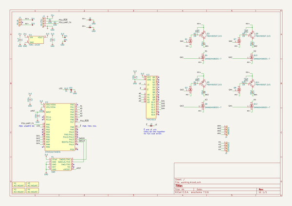
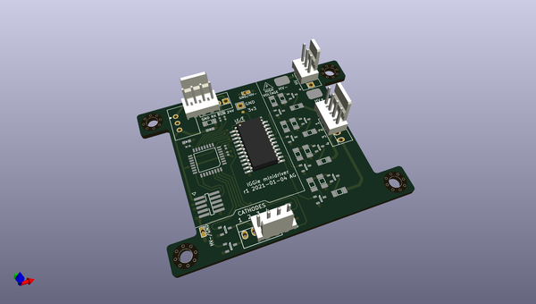
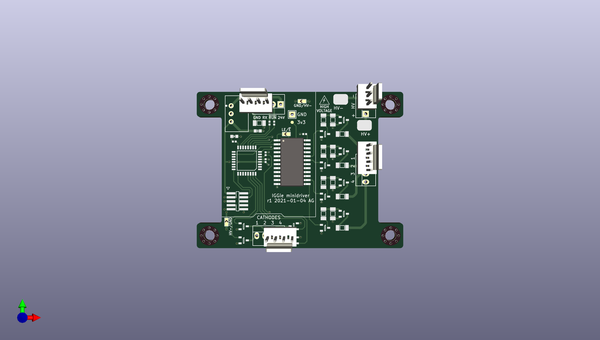
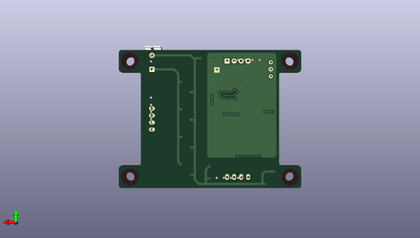

# iggie
 
## summary 
* id: adamgreig_iggie_minidriver
* user: adamgreig
* name: iggie
* board: minidriver
* repo: https://github.com/adamgreig/iggie
* src_file_repo_kicad_pcb: minidriver/pcb/minidriver.kicad_pcb
* src_file_repo_kicad_pcb_link: https://github.com/adamgreig/iggie/tree/master/minidriver/pcb/minidriver.kicad_pcb
* src_file_repo_kicad_sch: minidriver/pcb/minidriver.kicad_sch
* src_file_repo_kicad_sch_link: https://github.com/adamgreig/iggie/tree/master/minidriver/pcb/minidriver.kicad_sch

* src_file_repo_sch: load/load.sch
* src_file_repo_sch_link: https://github.com/adamgreig/iggie/tree/master/load/load.sch
* full details link: https://github.com/oomlout/oomlout_oomp_project_bot_v_2/tree/main/projects/adamgreig_iggie_minidriver/current_version/working  

## schematic  
  
[schematic (pdf)](working_schematic.pdf)  

## pcb  
 
  
  
  
[board (pdf)](working.pdf)  

## bom_schematic
| Ref | Qnty | Value | Cmp name | Footprint | Description | Vendor | DNP | 
| --- | --- | --- | --- | --- | --- | --- | --- | 
| C1 | 1 | 4µ7 | C | agg:1206 |  |  |  | 
| C2, C4, C5 | 3 | 100n | C | agg:0402 |  |  |  | 
| C3 | 1 | 10µ | C | agg:0603 |  |  |  | 
| D1 | 1 | LED | LED | agg:0603-LED |  |  |  | 
| IC1 | 1 | TSR1-2433 | TSR1 | agg:TSR1 | TSR1 Switch Mode Regulators |  |  | 
| IC2 | 1 | STM32G070KBT6 | STM32G0xxKx | agg:LQFP-32 | STM32G0 32 pin LQFP package |  |  | 
| IC3 | 1 | 74HC4514 | 74HC4514 | agg:SOIC-24-W | 4-to-16 line decoder/demultiplexer with input latches |  |  | 
| J1 | 1 | HV_IN | CONN_01x03 | agg:MOLEX-KK-254P-03 |  |  |  | 
| J2 | 1 | HV_PSU | CONN_01x04 | agg:MOLEX-KK-254P-04 |  |  |  | 
| J3, J6, J7 | 3 | SJ2 | SJ2 | agg:SJ2 |  |  |  | 
| J4 | 1 | ANODES | CONN_01x04 | agg:MOLEX-KK-254P-04 |  |  |  | 
| J5 | 1 | CATHODES | CONN_01x04 | agg:MOLEX-KK-254P-04 |  |  |  | 
| P1 | 1 | SWD | SWD | agg:FTSH-105-01-L-DV-K | Serial Wire Debug Port |  |  | 
| Q1, Q2, Q4, Q6, Q7, Q8, Q10, Q12 | 8 | DMN60H080DS-7 | NFET | agg:SOT-23 | Generic N-channel FET |  |  | 
| Q3, Q5, Q9, Q11 | 4 | PBHV9050T,215 | PNP | agg:SOT-23 | PNP BJT Transistor |  |  | 
| R1, R2 | 2 | 100 | R | agg:0402 |  |  |  | 
| R3, R4, R9, R10 | 4 | 1M | R | agg:1206 |  |  |  | 
| R5, R6, R11, R12 | 4 | 10k | R | agg:1206 |  |  |  | 
| R7, R8, R13, R14 | 4 | 93k1 | R | agg:1206 |  |  |  | 
| R15 | 1 | 1k | R | agg:0402 |  |  |  | 
| TP1, TP2 | 2 | TESTPAD | TESTPAD | agg:KEYSTONE5016 | Test pad |  |  | 
| TP3 | 1 | TESTPAD | TESTPAD | agg:TESTPAD | Test pad |  |  | 
| TP4 | 1 | TESTPAD | TESTPAD | agg:SIL-254P-01 | Test pad |  |  | 
| X1, X2, X3, X4 | 4 | M3 MOUNT | PART | agg:M3_MOUNT | Generic placeholder part |  |  | 

