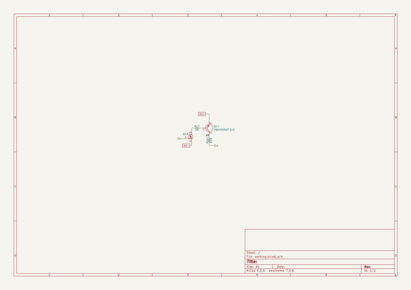

# iggie
 
## summary 
* id: adamgreig_iggie_pmod_hss
* user: adamgreig
* name: iggie
* board: pmod_hss
* repo: https://github.com/adamgreig/iggie
* src_file_repo_kicad_pcb: pmod_hss/pmod_hss.kicad_pcb
* src_file_repo_kicad_pcb_link: https://github.com/adamgreig/iggie/tree/master/pmod_hss/pmod_hss.kicad_pcb
* src_file_repo_kicad_sch: pmod_hss/hss.kicad_sch
* src_file_repo_kicad_sch_link: https://github.com/adamgreig/iggie/tree/master/pmod_hss/hss.kicad_sch

* src_file_repo_sch: load/load.sch
* src_file_repo_sch_link: https://github.com/adamgreig/iggie/tree/master/load/load.sch
* full details link: https://github.com/oomlout/oomlout_oomp_project_bot_v_2/tree/main/projects/adamgreig_iggie_pmod_hss/current_version/working  

## schematic  
  
[schematic (pdf)](working_schematic.pdf) 

## pcb  
 
  
  
  
[board (pdf)](working.pdf)  

## working_bom
| Id | Designator | Footprint | Quantity | Designation | Supplier and ref |  | None | 
| --- | --- | --- | --- | --- | --- | --- | --- | 
| 1 | R31,R7,R19,R23,R17,R5,R29,R21,R13,R15,R3,R1,R11,R27,R25,R9 | 1206 | 16 | 1M |  |  | [''] | 
| 2 | J4 | DIL-254P-16 | 1 | ANODES |  |  | [''] | 
| 3 | Q6,Q16,Q12,Q22,Q10,Q26,Q18,Q4,Q14,Q2,Q30,Q32,Q20,Q24,Q8,Q28 | SOT-23 | 16 | DMN60H080DS-7 |  |  | [''] | 
| 4 | C1,C3,C2 | 0603 | 3 | 100n |  |  | [''] | 
| 5 | Q1,Q25,Q29,Q17,Q3,Q7,Q31,Q11,Q13,Q23,Q5,Q19,Q9,Q27,Q15,Q21 | SOT-23 | 16 | PBHV9050T,215 |  |  | [''] | 
| 6 | R18,R32,R2,R4,R30,R22,R24,R28,R20,R8,R12,R6,R16,R14,R10,R26 | 1206 | 16 | 93k1 |  |  | [''] | 
| 7 | IC1,IC2 | TSSOP-16 | 2 | 74HC595 |  |  | [''] | 
| 8 | J1,J2 | MOLEX-KK-254P-03 | 2 | HV |  |  | [''] | 
| 9 | J3 | DIL-254P-12 | 1 | PMOD |  |  | [''] | 

## bom_schematic
| Ref | Qnty | Value | Cmp name | Footprint | Description | Vendor | DNP | 
| --- | --- | --- | --- | --- | --- | --- | --- | 
| Q17 | 1 | PBHV9050T,215 | PNP | agg:SOT-23 | PNP BJT Transistor |  |  | 
| Q18 | 1 | DMN60H080DS-7 | NFET | agg:SOT-23 | Generic N-channel FET |  |  | 
| R17 | 1 | 1M | R | agg:1206 |  |  |  | 
| R18 | 1 | 93k1 | R | agg:1206 |  |  |  | 

