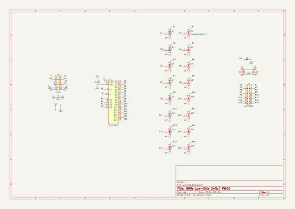
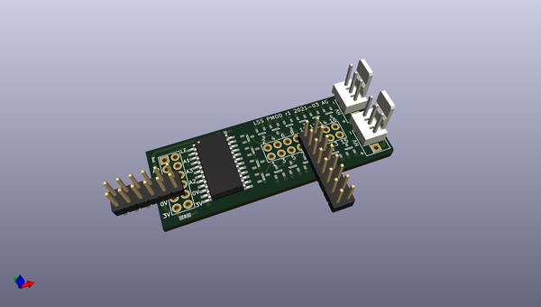
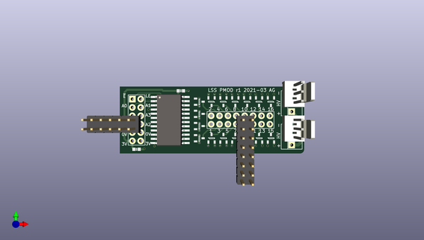
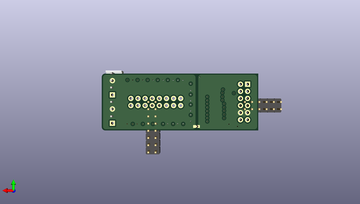

# iggie
 
## summary 
* id: adamgreig_iggie_pmod_lss
* user: adamgreig
* name: iggie
* board: pmod_lss
* repo: https://github.com/adamgreig/iggie
* src_file_repo_kicad_pcb: pmod_lss/pmod_lss.kicad_pcb
* src_file_repo_kicad_pcb_link: https://github.com/adamgreig/iggie/tree/master/pmod_lss/pmod_lss.kicad_pcb
* src_file_repo_kicad_sch: pmod_lss/pmod_lss.kicad_sch
* src_file_repo_kicad_sch_link: https://github.com/adamgreig/iggie/tree/master/pmod_lss/pmod_lss.kicad_sch

* src_file_repo_sch: load/load.sch
* src_file_repo_sch_link: https://github.com/adamgreig/iggie/tree/master/load/load.sch
* full details link: https://github.com/oomlout/oomlout_oomp_project_bot_v_2/tree/main/projects/adamgreig_iggie_pmod_lss/current_version/working  

## schematic  
  
[schematic (pdf)](working_schematic.pdf) 

## pcb  
 
  
  
  
[board (pdf)](working.pdf)  

## working_bom
| Id | Designator | Footprint | Quantity | Designation | Supplier and ref |  | None | 
| --- | --- | --- | --- | --- | --- | --- | --- | 
| 1 | J3 | DIL-254P-12 | 1 | PMOD |  |  | [''] | 
| 2 | J2,J1 | MOLEX-KK-254P-03 | 2 | HV |  |  | [''] | 
| 3 | Q9,Q15,Q4,Q10,Q1,Q2,Q13,Q16,Q3,Q7,Q5,Q6,Q12,Q11,Q8,Q14 | SOT-23 | 16 | DMN60H080DS-7 |  |  | [''] | 
| 4 | J4 | DIL-254P-16 | 1 | CATHODES |  |  | [''] | 
| 5 | C2,C1 | 0603 | 2 | 100n |  |  | [''] | 
| 6 | IC1 | SOIC-24-W | 1 | 74HC4514 |  |  | [''] | 
| 7 | J5 | SJ2 | 1 | SJ2 |  |  | [''] | 

## bom_schematic
| Ref | Qnty | Value | Cmp name | Footprint | Description | Vendor | DNP | 
| --- | --- | --- | --- | --- | --- | --- | --- | 
| C1, C2 | 2 | 100n | C | agg:0603 |  |  |  | 
| IC1 | 1 | 74HC4514 | 74HC4514 | agg:SOIC-24-W | 4-to-16 line decoder/demultiplexer with input latches |  |  | 
| J1, J2 | 2 | HV | CONN_01x03 | agg:MOLEX-KK-254P-03 |  |  |  | 
| J3 | 1 | PMOD | CONN_02x06 | agg:DIL-254P-12 |  |  |  | 
| J4 | 1 | CATHODES | CONN_02x08 | agg:DIL-254P-16 |  |  |  | 
| J5 | 1 | SJ2 | SJ2 | agg:SJ2 |  |  |  | 
| Q1, Q2, Q3, Q4, Q5, Q6, Q7, Q8, Q9, Q10, Q11, Q12, Q13, Q14, Q15, Q16 | 16 | DMN60H080DS-7 | NFET | agg:SOT-23 | Generic N-channel FET |  |  | 

