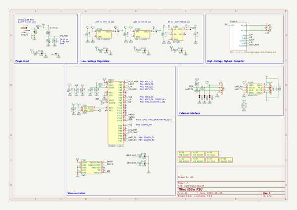

# iggie
 
## summary 
* id: adamgreig_iggie_psu
* user: adamgreig
* name: iggie
* board: psu
* repo: https://github.com/adamgreig/iggie
* src_file_repo_kicad_pcb: psu/pcb/psu.kicad_pcb
* src_file_repo_kicad_pcb_link: https://github.com/adamgreig/iggie/tree/master/psu/pcb/psu.kicad_pcb
* src_file_repo_kicad_sch: pmod_lss/pmod_lss.kicad_sch
* src_file_repo_kicad_sch_link: https://github.com/adamgreig/iggie/tree/master/pmod_lss/pmod_lss.kicad_sch

* src_file_repo_sch: load/load.sch
* src_file_repo_sch_link: https://github.com/adamgreig/iggie/tree/master/load/load.sch
* full details link: https://github.com/oomlout/oomlout_oomp_project_bot_v_2/tree/main/projects/adamgreig_iggie_psu/current_version/working  

## schematic  
  
[schematic (pdf)](working_schematic.pdf)  

## pcb  
 
  
  
  
[board (pdf)](working.pdf)  

## working_bom
| Id | Designator | Footprint | Quantity | Designation | Supplier and ref |  | None | 
| --- | --- | --- | --- | --- | --- | --- | --- | 
| 1 | C101,C222 | 0603 | 2 | 100p |  |  | [''] | 
| 2 | C102,C106,C109,C110,C209,C208 | 1210 | 6 | 10µ |  |  | [''] | 
| 3 | C103,C104,C105,C108,C202,C215,C224,C225,C203,C213,C228,C113,C112 | 0603 | 13 | 100n |  |  | [''] | 
| 4 | C107,C111,C204,C218,C223,C226,C229 | 0603 | 7 | 1µ |  |  | [''] | 
| 5 | C205,C227 | 0805 | 2 | 10n |  |  | [''] | 
| 6 | D101 | DO-214AC-SMA | 1 | SMAJ58A |  |  | [''] | 
| 7 | D104,D105,D108,D103,D107 | 0603-LED | 5 | GRN |  |  | [''] | 
| 8 | D109,D110,D111 | 0603 | 3 | ESD_DIODE |  |  | [''] | 
| 9 | D201,D202 | SOD-123 | 2 | NTS245SFT1G |  |  | [''] | 
| 10 | IC101 | TSR1 | 1 | TSR 1-24150 |  |  | [''] | 
| 11 | IC103 | TSR1 | 1 | TSR 1-2450 |  |  | [''] | 
| 12 | IC104 | SOT-23-5 | 1 | NCP161 |  |  | [''] | 
| 13 | IC202,IC206,IC207 | SOT-23-5 | 3 | AD8605 |  |  | [''] | 
| 14 | J102 | MOLEX-KK-254P-04 | 1 | CTRL |  |  | [''] | 
| 15 | P101 | FTSH-105-01-L-DV-K | 1 | SWD |  |  | [''] | 
| 16 | R101,R103,R104,R109,R206,R207,R217 | 0603 | 7 | 10k |  |  | [''] | 
| 17 | R102,R211,R226,R202,R203,R212,R227 | 0603 | 7 | 100k |  |  | [''] | 
| 18 | R105,R106,R107,R108,R110,R111,R208,R209,R210 | 0603 | 9 | 1k |  |  | [''] | 
| 19 | TP101,TP103,TP104,TP105,TP204,TP205,TP201 | TESTPAD | 7 | TESTPAD |  |  | [''] | 
| 20 | X101,X102,X103,X104 | M3_MOUNT | 4 | M3 MOUNT |  |  | [''] | 
| 21 | Q202 | SOT-23 | 1 | PBHV9050T |  |  | [''] | 
| 22 | IC204 | SOT-23-5 | 1 | AD8065 |  |  | [''] | 
| 23 | C201,C211,C210,C212 | 1206 | 4 | 1µ |  |  | [''] | 
| 24 | IC201,IC205 | SOT-23-5 | 2 | INA139 |  |  | [''] | 
| 25 | TP206,TP203,TP102,TP202,TP207 | KEYSTONE5016 | 5 | TESTPAD |  |  | [''] | 
| 26 | J101 | BARRELJACK | 1 | PWR_IN |  |  | [''] | 
| 27 | Y101 | XTAL-25x20 | 1 | 25M |  |  | [''] | 
| 28 | J103 | MOLEX-KK-254P-03 | 1 | HV_OUT |  |  | [''] | 
| 29 | R221,R220,R218,R219 | 1206 | 4 | 100k |  |  | [''] | 
| 30 | R222,R224,R225,R215,R214,R223,R216,R213 | 1206 | 8 | 499k |  |  | [''] | 
| 31 | C207,C206 | PANASONIC-SMDCAP-G | 2 | 100µ |  |  | [''] | 
| 32 | C219,C220,C221 | 2220 | 3 | 1µ |  |  | [''] | 
| 33 | R228 | 1206 | 1 | 500m |  |  | [''] | 
| 34 | D204,D205 | SOT-23 | 2 | ADR5045 |  |  | [''] | 
| 35 | C214 | 1206 | 1 | 10n |  |  | [''] | 
| 36 | R204 | 1206 | 1 | 4R7 |  |  | [''] | 
| 37 | C217,C216 | PANASONIC-SMDCAP-K | 2 | 68µ |  |  | [''] | 
| 38 | IC203 | SOT-23-5 | 1 | MCP1416 |  |  | [''] | 
| 39 | T201 | GA3459-BL | 1 | GA3459-BL |  |  | [''] | 
| 40 | D203 | DPAK_DIODE | 1 | STTH512B |  |  | [''] | 
| 41 | R201,R205 | 1206 | 2 | 10m |  |  | [''] | 
| 42 | Q201 | D2PAK_GDS | 1 | STB45N60DM2AG |  |  | [''] | 
| 43 | X106,X107 | hv | 2 | HV SIGN |  |  | [''] | 
| 44 | D102 | DO-214AB-SMC | 1 | VSSC520S-M3/9AT |  |  | [''] | 
| 45 | J104 | MOLEX-PICOBLADE-53398-0471 | 1 | UART |  |  | [''] | 
| 46 | IC105 | SOIC-8 | 1 | ADuM1201 |  |  | [''] | 
| 47 | IC102 | LQFP-32 | 1 | STM32F334K8T6 |  |  | [''] | 
| 48 | D106 | 0603-LED | 1 | RED |  |  | [''] | 
| 49 | L101 | 0603 | 1 | FB |  |  | [''] | 

## bom_schematic
| Ref | Qnty | Value | Cmp name | Footprint | Description | Vendor | DNP | 
| --- | --- | --- | --- | --- | --- | --- | --- | 
| C101 | 1 | 100p | C-agg | agg:0603 |  |  |  | 
| C102, C106, C109, C110 | 4 | 10µ | C-agg | agg:1210 |  |  |  | 
| C103, C104, C105, C108, C112, C113 | 6 | 100n | C-agg | agg:0603 |  |  |  | 
| C107, C111 | 2 | 1µ | C-agg | agg:0603 |  |  |  | 
| D101 | 1 | SMAJ58A | SCHOTTKY-agg | agg:DO-214AC-SMA |  |  |  | 
| D102 | 1 | VSSC520S-M3/9AT | SCHOTTKY-agg | agg:DO-214AB-SMC |  |  |  | 
| D103, D104, D105, D107, D108 | 5 | GRN | LED-agg | agg:0603-LED |  |  |  | 
| D106 | 1 | RED | LED-agg | agg:0603-LED |  |  |  | 
| D109, D110, D111 | 3 | ESD_DIODE | ESD_DIODE-agg | agg:0603 |  |  |  | 
| IC101 | 1 | TSR 1-24150 | TSR1-agg | agg:TSR1 |  |  |  | 
| IC102 | 1 | STM32F334K8T6 | STM32F3xxKxTx-agg | agg:LQFP-32 |  |  |  | 
| IC103 | 1 | TSR 1-2450 | TSR1-agg | agg:TSR1 |  |  |  | 
| IC104 | 1 | NCP161 | NCP161-agg | agg:SOT-23-5 |  |  |  | 
| IC105 | 1 | ADuM1201 | ADuM1201-agg | agg:SOIC-8 |  |  |  | 
| J101 | 1 | PWR_IN | BarrelJack-agg | agg:BARRELJACK |  |  |  | 
| J102 | 1 | CTRL | CONN_01x04-agg | agg:MOLEX-KK-254P-04 |  |  |  | 
| J103 | 1 | HV_OUT | CONN_01x03-agg | agg:MOLEX-KK-254P-03 |  |  |  | 
| J104 | 1 | UART | CONN_01x04-agg | agg:MOLEX-PICOBLADE-53398-0471 |  |  |  | 
| L101 | 1 | FB | L-agg | agg:0603 |  |  |  | 
| P101 | 1 | SWD | SWD-agg | agg:FTSH-105-01-L-DV-K |  |  |  | 
| R101, R103, R104, R109 | 4 | 10k | R-agg | agg:0603 |  |  |  | 
| R102 | 1 | 100k | R-agg | agg:0603 |  |  |  | 
| R105, R106, R107, R108, R110, R111 | 6 | 1k | R-agg | agg:0603 |  |  |  | 
| TP101, TP103, TP104, TP105 | 4 | TESTPAD | TESTPAD-agg | agg:TESTPAD |  |  |  | 
| TP102 | 1 | TESTPAD | TESTPAD-agg | agg:KEYSTONE5016 |  |  |  | 
| X101, X102, X103, X104 | 4 | M3 MOUNT | PART-agg | agg:M3_MOUNT |  |  |  | 
| X105 | 1 | MAINS PSU | PART-agg |  |  |  |  | 
| X106, X107 | 2 | HV SIGN | PART-agg | psu:hv |  |  |  | 
| Y101 | 1 | 25M | TCXO_ST-agg | agg:XTAL-25x20 |  |  |  | 

