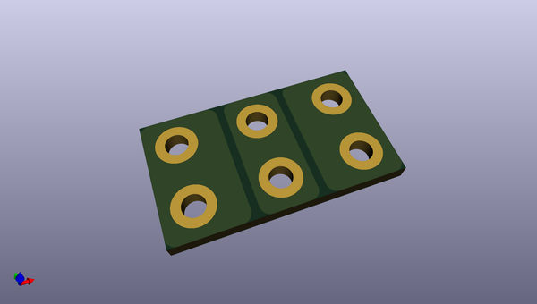

# ledeaf
 
## summary 
* id: adamgreig_ledeaf_bridge
* user: adamgreig
* name: ledeaf
* board: bridge
* repo: https://github.com/adamgreig/ledeaf
* src_file_repo_kicad_pcb: bridge/bridge.kicad_pcb
* src_file_repo_kicad_pcb_link: https://github.com/adamgreig/ledeaf/tree/master/bridge/bridge.kicad_pcb
* src_file_repo_kicad_sch: bridge/bridge.kicad_sch
* src_file_repo_kicad_sch_link: https://github.com/adamgreig/ledeaf/tree/master/bridge/bridge.kicad_sch

* src_file_repo_sch: 
* src_file_repo_sch_link: https://github.com/adamgreig/ledeaf/tree/master/
* full details link: https://github.com/oomlout/oomlout_oomp_project_bot_v_2/tree/main/projects/adamgreig_ledeaf_bridge/current_version/working  

## schematic  
  
[schematic (pdf)](working_schematic.pdf) 

## pcb  
 
  
  
  
[board (pdf)](working.pdf)  

## working_bom
| Id | Designator | Footprint | Quantity | Designation | Supplier and ref |  | None | 
| --- | --- | --- | --- | --- | --- | --- | --- | 
| 1 | J104 | M2_PTH | 1 | DOUT |  |  | [''] | 
| 2 | J103 | M2_PTH | 1 | DIN |  |  | [''] | 
| 3 | J105,J106 | M2_PTH | 2 | 0V |  |  | [''] | 
| 4 | J102,J101 | M2_PTH | 2 | 5V |  |  | [''] | 

## bom_schematic
| Ref | Qnty | Value | Cmp name | Footprint | Description | Vendor | DNP | 
| --- | --- | --- | --- | --- | --- | --- | --- | 
| J101, J102 | 2 | 5V | CONN_01x01 | agg:M2_PTH |  |  |  | 
| J103 | 1 | DIN | CONN_01x01 | agg:M2_PTH |  |  |  | 
| J104 | 1 | DOUT | CONN_01x01 | agg:M2_PTH |  |  |  | 
| J105, J106 | 2 | 0V | CONN_01x01 | agg:M2_PTH |  |  |  | 

