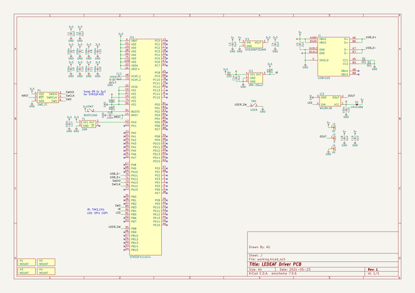

# ledeaf
 
## summary 
* id: adamgreig_ledeaf_driver
* user: adamgreig
* name: ledeaf
* board: driver
* repo: https://github.com/adamgreig/ledeaf
* src_file_repo_kicad_pcb: driver/driver.kicad_pcb
* src_file_repo_kicad_pcb_link: https://github.com/adamgreig/ledeaf/tree/master/driver/driver.kicad_pcb
* src_file_repo_kicad_sch: driver/driver.kicad_sch
* src_file_repo_kicad_sch_link: https://github.com/adamgreig/ledeaf/tree/master/driver/driver.kicad_sch

* src_file_repo_sch: 
* src_file_repo_sch_link: https://github.com/adamgreig/ledeaf/tree/master/
* full details link: https://github.com/oomlout/oomlout_oomp_project_bot_v_2/tree/main/projects/adamgreig_ledeaf_driver/current_version/working  

## schematic  
  
[schematic (pdf)](working_schematic.pdf)  

## pcb  
 
  
  
  
[board (pdf)](working.pdf)  

## working_bom
| Id | Designator | Footprint | Quantity | Designation | Supplier and ref |  | None | 
| --- | --- | --- | --- | --- | --- | --- | --- | 
| 1 | R2,R1 | 0402 | 2 | 5k1 |  |  | [''] | 
| 2 | C8,C21,C7,C11,C6,C22,C15,C16,C17,C10,C9 | 0402 | 11 | 100n |  |  | [''] | 
| 3 | C19,C18,C12,C3,C13,C2,C4,C14,C5,C1 | 0603 | 10 | 2µ2 |  |  | [''] | 
| 4 | SW2 | SW_MOM_6X6 | 1 | BOOTLOAD |  |  | [''] | 
| 5 | R3,R6 | 0402 | 2 | 10k |  |  | [''] | 
| 6 | D1 | SOD-123 | 1 | 1N4148W |  |  | [''] | 
| 7 | R4 | 0402 | 1 | 100 |  |  | [''] | 
| 8 | R5 | 0603 | 1 | 0R |  |  | [''] | 
| 9 | J1 | USB4105 | 1 | USB4105 |  |  | [''] | 
| 10 | SW1 | SW_MOM_6X6 | 1 | USER |  |  | [''] | 
| 11 | IC1 | SOT-23 | 1 | XC6206P332MR |  |  | [''] | 
| 12 | Y1 | XO-32x25 | 1 | 20M |  |  | [''] | 
| 13 | IC4 | LQFP-100 | 1 | STM32F411VxTx |  |  | [''] | 
| 14 | IC2 | IRM-H6XXT | 1 | IRM-H6xxT |  |  | [''] | 
| 15 | IC3 | WS2812B | 1 | WS2812B |  |  | [''] | 

## bom_schematic
| Ref | Qnty | Value | Cmp name | Footprint | Description | Vendor | DNP | 
| --- | --- | --- | --- | --- | --- | --- | --- | 
| C1, C2, C3, C4, C5, C12, C13, C14, C18, C19 | 10 | 2µ2 | C | agg:0603 |  |  |  | 
| C6, C7, C8, C9, C10, C11, C15, C16, C17, C21, C22 | 11 | 100n | C | agg:0402 |  |  |  | 
| D1 | 1 | 1N4148W | D | agg:SOD-123 | Diode |  |  | 
| IC1 | 1 | XC6206P332MR | MCP1700 | ael:SOT-23 | LDO Voltage Regulator |  |  | 
| IC2 | 1 | IRM-H6xxT | IRM-H6xxT | agg:IRM-H6XXT | Infrared Receiver Module |  |  | 
| IC3 | 1 | WS2812B | WS2812B | ael:WS2812B | RGB LED with onboard driver IC |  |  | 
| IC4 | 1 | STM32F411VxTx | STM32F411VxTx | agg:LQFP-100 | STM32F411 100 pin LQFP package |  |  | 
| J1 | 1 | USB4105 | USB4105 | ael:USB4105 | Type C USB 2.0 Connector |  |  | 
| R1, R2 | 2 | 5k1 | R | agg:0402 |  |  |  | 
| R3, R6 | 2 | 10k | R | agg:0402 |  |  |  | 
| R4 | 1 | 100 | R | agg:0402 |  |  |  | 
| R5 | 1 | 0R | R | agg:0603 |  |  |  | 
| SW1 | 1 | USER | SWITCH_SPST | agg:SW_MOM_6X6 |  |  |  | 
| SW2 | 1 | BOOTLOAD | SWITCH_SPST | agg:SW_MOM_6X6 |  |  |  | 
| Y1 | 1 | 20M | TCXO_ST | ael:XO-32x25 | 4 pin TCXO with Standy |  |  | 

