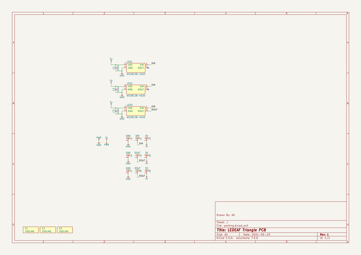

# ledeaf
 
## summary 
* id: adamgreig_ledeaf_triangle
* user: adamgreig
* name: ledeaf
* board: triangle
* repo: https://github.com/adamgreig/ledeaf
* src_file_repo_kicad_pcb: triangle/triangle.kicad_pcb
* src_file_repo_kicad_pcb_link: https://github.com/adamgreig/ledeaf/tree/master/triangle/triangle.kicad_pcb
* src_file_repo_kicad_sch: triangle/triangle.kicad_sch
* src_file_repo_kicad_sch_link: https://github.com/adamgreig/ledeaf/tree/master/triangle/triangle.kicad_sch

* src_file_repo_sch: 
* src_file_repo_sch_link: https://github.com/adamgreig/ledeaf/tree/master/
* full details link: https://github.com/oomlout/oomlout_oomp_project_bot_v_2/tree/main/projects/adamgreig_ledeaf_triangle/current_version/working  

## schematic  
  
[schematic (pdf)](working_schematic.pdf)  

## pcb  
 
  
  
  
[board (pdf)](working.pdf)  

## working_bom
| Id | Designator | Footprint | Quantity | Designation | Supplier and ref |  | None | 
| --- | --- | --- | --- | --- | --- | --- | --- | 
| 1 | X3,X2,X1 | M2.5_HOLE | 3 | TOOLING |  |  | [''] | 
| 2 | C3,C2,C1 | 0402 | 3 | 100n |  |  | [''] | 
| 3 | J2 | M2_PTH | 1 | DIN |  |  | [''] | 
| 4 | J6,J3,J9 | M2_PTH | 3 | 5V |  |  | [''] | 
| 5 | LED1,LED2,LED3 | WS2812B-4020 | 3 | WS2812B-4020 |  |  | [''] | 
| 6 | J1,J7,J4 | M2_PTH | 3 | GND |  |  | [''] | 
| 7 | J5,J8 | M2_PTH | 2 | DOUT |  |  | [''] | 

## bom_schematic
| Ref | Qnty | Value | Cmp name | Footprint | Description | Vendor | DNP | 
| --- | --- | --- | --- | --- | --- | --- | --- | 
| C1, C2, C3 | 3 | 100n | C | agg:0402 |  |  |  | 
| J1, J4, J7 | 3 | GND | CONN_01x01 | agg:M2_PTH |  |  |  | 
| J2 | 1 | DIN | CONN_01x01 | agg:M2_PTH |  |  |  | 
| J3, J6, J9 | 3 | 5V | CONN_01x01 | agg:M2_PTH |  |  |  | 
| J5, J8 | 2 | DOUT | CONN_01x01 | agg:M2_PTH |  |  |  | 
| LED1, LED2, LED3 | 3 | WS2812B-4020 | WS2812B-4020 | agg:WS2812B-4020 | Side-view RGB LED |  |  | 
| X1, X2, X3 | 3 | TOOLING | PART | agg:M2.5_HOLE | Generic placeholder part |  |  | 

