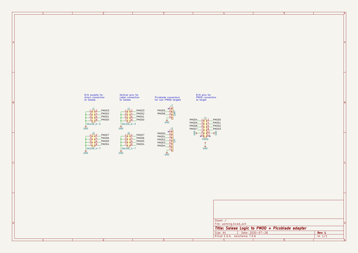
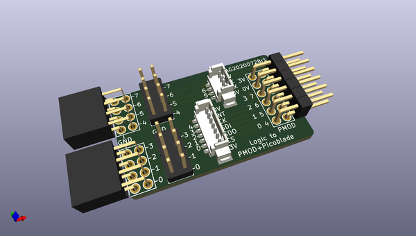
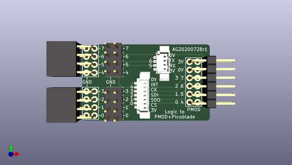
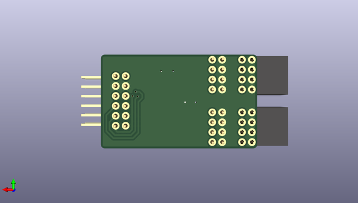

# logic_adapters
 
## summary 
* id: adamgreig_logic_adapters_pmod_picoblade
* user: adamgreig
* name: logic_adapters
* board: pmod_picoblade
* repo: https://github.com/adamgreig/logic_adapters
* src_file_repo_kicad_pcb: pmod_picoblade/pmod_picoblade.kicad_pcb
* src_file_repo_kicad_pcb_link: https://github.com/adamgreig/logic_adapters/tree/master/pmod_picoblade/pmod_picoblade.kicad_pcb

* src_file_repo_sch: pmod_picoblade/pmod_picoblade.sch
* src_file_repo_sch_link: https://github.com/adamgreig/logic_adapters/tree/master/pmod_picoblade/pmod_picoblade.sch
* full details link: https://github.com/oomlout/oomlout_oomp_project_bot_v_2/tree/main/projects/adamgreig_logic_adapters_pmod_picoblade/current_version/working  

## schematic  
  
[schematic (pdf)](working_schematic.pdf)  

## pcb  
 
  
  
  
[board (pdf)](working.pdf)  

## working_bom
| Id | Designator | Footprint | Quantity | Designation | Supplier and ref |  | None | 
| --- | --- | --- | --- | --- | --- | --- | --- | 
| 1 | J1,J2 | DIL-254P-08 | 2 | SALEAE_0-3 |  |  | [''] | 
| 2 | J4 | DIL-254P-12 | 1 | PMOD |  |  | [''] | 
| 3 | J5,J6 | DIL-254P-08 | 2 | SALEAE_4-7 |  |  | [''] | 
| 4 | J3 | MOLEX-PICOBLADE-53398-0771 | 1 | SPI |  |  | [''] | 
| 5 | J7 | MOLEX-PICOBLADE-53398-0471 | 1 | UART |  |  | [''] | 

## bom_schematic
| Ref | Qnty | Value | Cmp name | Footprint | Description | Vendor | DNP | 
| --- | --- | --- | --- | --- | --- | --- | --- | 
| J1, J2 | 2 | SALEAE_0-3 | CONN_02x04-agg | agg:DIL-254P-08 |  |  |  | 
| J3 | 1 | SPI | CONN_01x07-agg | agg:MOLEX-PICOBLADE-53398-0771 |  |  |  | 
| J4 | 1 | PMOD | CONN_02x06-agg | agg:DIL-254P-12 |  |  |  | 
| J5, J6 | 2 | SALEAE_4-7 | CONN_02x04-agg | agg:DIL-254P-08 |  |  |  | 
| J7 | 1 | UART | CONN_01x04-agg | agg:MOLEX-PICOBLADE-53398-0471 |  |  |  | 

