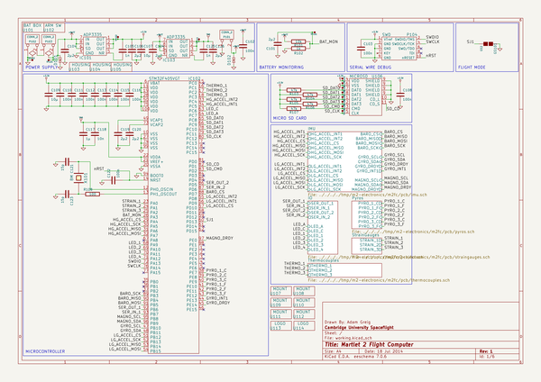
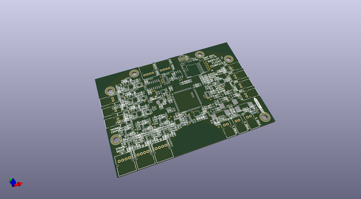
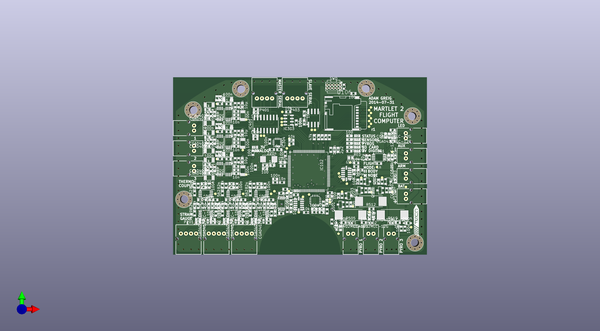
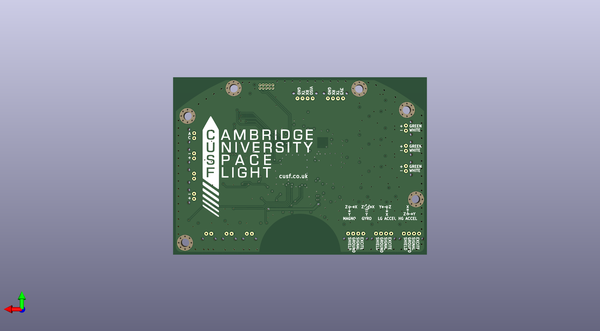

# m2_electronics
 
## summary 
* id: adamgreig_m2_electronics_m2fc
* user: adamgreig
* name: m2_electronics
* board: m2fc
* repo: https://github.com/adamgreig/m2-electronics
* src_file_repo_kicad_pcb: m2fc/pcb/m2fc.kicad_pcb
* src_file_repo_kicad_pcb_link: https://github.com/adamgreig/m2-electronics/tree/master/m2fc/pcb/m2fc.kicad_pcb

* src_file_repo_sch: 
* src_file_repo_sch_link: https://github.com/adamgreig/m2-electronics/tree/master/
* full details link: https://github.com/oomlout/oomlout_oomp_project_bot_v_2/tree/main/projects/adamgreig_m2_electronics_m2fc/current_version/working  

## schematic  
  
[schematic (pdf)](working_schematic.pdf)  

## pcb  
 
  
  
  
[board (pdf)](working.pdf)  

## working_bom
| Id | Designator | Footprint | Quantity | Designation | Supplier and ref |  | None | 
| --- | --- | --- | --- | --- | --- | --- | --- | 
| 1 | C101,C104,C106,C120,C124,C126,C119 | C0603 | 7 | 2µ2 |  |  | [''] | 
| 2 | C102,C103,C108,C110,C111,C112,C113,C115,C116,C209,C210,C211,C212,C222,C223,C224,C225,C235,C236,C237,C238,C301,C302,C307,C308,C310,C403,C404,C405,C406,C407,C408,C501,C502,C503,C601,C604,C612,C615,C623,C626,C114,C305,C304,C122 | C0603 | 45 | 100n |  |  | [''] | 
| 3 | C105,C125 | C0603 | 2 | 1n |  |  | [''] | 
| 4 | C107,C109,C204,C205,C206,C213,C217,C219,C226,C230,C231,C232,C239,C303,C309,C401,C402,C602,C605,C616,C624,C627,C218,C613,C306 | C0603 | 25 | 10µ |  |  | [''] | 
| 5 | C117,C608,C619,C630 | C0603 | 4 | 1µ |  |  | [''] | 
| 6 | C118,C201,C214,C227,C311,C609,C610,C620,C621,C631,C632 | C0603 | 11 | 10n |  |  | [''] | 
| 7 | C121,C123 | C0603 | 2 | 15p |  |  | [''] | 
| 8 | C202,C203,C215,C216,C228,C229 | C0603 | 6 | 82n |  |  | [''] | 
| 9 | C207,C208,C220,C221,C233,C234 | C0603 | 6 | 8.2n |  |  | [''] | 
| 10 | C312 | C0603 | 1 | 220n |  |  | [''] | 
| 11 | C313 | C0603 | 1 | 470n |  |  | [''] | 
| 12 | C314 | C0603 | 1 | 4µ7 |  |  | [''] | 
| 13 | C603,C606,C607,C611,C614,C617,C618,C622,C625,C628,C629,C633 | C1206 | 12 | 100n |  |  | [''] | 
| 14 | D101,D102,D201,D202,D203,D204,D205,D206,D406,D407,D504,D506,D603,D604,D605,D606,D601,D602,D502 | R0402 | 19 | CGA0402MLC-12G |  |  | [''] | 
| 15 | D402,D403,D404,D405 | LED0603 | 4 | YELLOW |  |  | [''] | 
| 16 | D501,D503,D505 | SOD323 | 3 | DIODESCH |  |  | [''] | 
| 17 | IC101,IC103 | MSOP8 | 2 | ADP3335 |  |  | [''] | 
| 18 | IC102 | LQFP100 | 1 | STM32F405VGT |  |  | [''] | 
| 19 | IC201,IC204,IC207 | MSOP8 | 3 | AD8226 |  |  | [''] | 
| 20 | IC202,IC208,IC602,IC604,IC606,IC205 | MSOP8 | 6 | AD8656 |  |  | [''] | 
| 21 | IC203,IC206,IC209 | SC-70-5 | 3 | AD8541 |  |  | [''] | 
| 22 | IC301 | ADXL3x5 | 1 | ADXL375 |  |  | [''] | 
| 23 | IC303 | MS5611-01BA | 1 | MS5611-01BA03 |  |  | [''] | 
| 24 | IC304 | HMC5883L | 1 | HMC5883L |  |  | [''] | 
| 25 | IC305 | L3G4200D | 1 | L3G4200D |  |  | [''] | 
| 26 | IC401 | SOIC16 | 1 | ADuM5201 |  |  | [''] | 
| 27 | IC402 | SOIC8 | 1 | ADuM1201 |  |  | [''] | 
| 28 | IC601,IC603,IC605 | MSOP8 | 3 | AD8495 |  |  | [''] | 
| 29 | P101,P402,P503,P601,P602,P603,P502,P501,P102,P103 | S02B-PASK-2 | 10 | CONN_2 |  |  | [''] | 
| 30 | P104 | FTSH-105-01-F-D-K | 1 | SWD |  |  | [''] | 
| 31 | P201,P202,P203,P403,P401 | S04B-PASK-2 | 5 | CONN_4 |  |  | [''] | 
| 32 | R101,R301,R304,R306,R307,R308,R501,R504,R506,R507,R508,R511,R513,R514,R515,R518,R520,R521,R303,R305,R302 | R0603 | 21 | 10k |  |  | [''] | 
| 33 | R102,R201,R209,R217,R601,R606,R608,R613,R615,R620 | R0603 | 10 | 1k |  |  | [''] | 
| 34 | R105,R106,R107,R104,R103 | R0603 | 5 | 47k |  |  | [''] | 
| 35 | R108,R401,R402,R403,R404,R405,R406,R407,R502,R503,R509,R510,R516,R517,R408 | R0603 | 15 | 100 |  |  | [''] | 
| 36 | R202,R208,R210,R218,R216,R224 | R0603 | 6 | 10k 0.05% |  |  | [''] | 
| 37 | R203,R211,R219 | R0603 | 3 | 330 |  |  | [''] | 
| 38 | R204,R212,R220 | R0603 | 3 | 1.69k |  |  | [''] | 
| 39 | R205,R213,R221 | R0603 | 3 | 6.04k |  |  | [''] | 
| 40 | R206,R214,R222 | R0603 | 3 | 562 |  |  | [''] | 
| 41 | R207,R215,R223 | R0603 | 3 | 17.8k |  |  | [''] | 
| 42 | R505,R512,R519 | PWR4318 | 3 | 5 |  |  | [''] | 
| 43 | R602,R609,R616 | R0603 | 3 | 8.87k |  |  | [''] | 
| 44 | R603,R610,R617 | R0603 | 3 | 31.6k |  |  | [''] | 
| 45 | R604,R611,R618 | R0603 | 3 | 2.94k |  |  | [''] | 
| 46 | R605,R612,R619 | R0603 | 3 | 95.3k |  |  | [''] | 
| 47 | R607,R621,R614 | R0603 | 3 | 1M |  |  | [''] | 
| 48 | TP101,TP102,TP103,TP104,TP105,TP106,TP107,TP108,TP109,TP110,TP201,TP202,TP203,TP301,TP304,TP305,TP306,TP308,TP309,TP310,TP312,TP313,TP314,TP315,TP316,TP317,TP318,TP319,TP320,TP321,TP401,TP402,TP403,TP404,TP501,TP502,TP503,TP504,TP505,TP506,TP507,TP508,TP509,TP602,TP603,TP604,TP605,TP606,TP111,TP113,TP114,TP601 | TESTPAD | 52 | TESTPAD |  |  | [''] | 
| 49 | U106 | MICROSD | 1 | MICROSD |  |  | [''] | 
| 50 | Q501,Q503,Q505 | SOT-23-MOSFET | 3 | MOSFET_P |  |  | [''] | 
| 51 | Q502,Q504,Q506 | SOT-23-MOSFET | 3 | MOSFET_N |  |  | [''] | 
| 52 | U108,U109,U110,U111,U112,U107 | M3_MOUNT | 6 | MOUNT |  |  | [''] | 
| 53 | X101 | XTAL50x32 | 1 | 8M |  |  | [''] | 
| 54 | D401,D408 | LED0603 | 2 | RED |  |  | [''] | 
| 55 | IC302 | ADXL3x5 | 1 | ADXL345 |  |  | [''] | 
| 56 | U114 | cusf_logo_small | 1 | LOGO |  |  | [''] | 
| 57 | U113 | cusf_logo_full | 1 | LOGO |  |  | [''] | 

## bom_schematic
| Ref | Qnty | Value | Cmp name | Footprint | Description | Vendor | DNP | 
| --- | --- | --- | --- | --- | --- | --- | --- | 
| C101, C104, C106, C119, C120, C124, C126 | 7 | 2µ2 | C-RESCUE-m2fc | m2fc:C0603 |  |  |  | 
| C102, C103, C108, C110, C111, C112, C113, C114, C115, C116, C122 | 11 | 100n | C-RESCUE-m2fc | m2fc:C0603 |  |  |  | 
| C105, C125 | 2 | 1n | C-RESCUE-m2fc | m2fc:C0603 |  |  |  | 
| C107, C109 | 2 | 10µ | C-RESCUE-m2fc | m2fc:C0603 |  |  |  | 
| C117 | 1 | 1µ | C-RESCUE-m2fc | m2fc:C0603 |  |  |  | 
| C118 | 1 | 10n | C-RESCUE-m2fc | m2fc:C0603 |  |  |  | 
| C121, C123 | 2 | 15p | C-RESCUE-m2fc | m2fc:C0603 |  |  |  | 
| D101, D102 | 2 | CGA0402MLC-12G | CGA0402MLC-12G | m2fc:R0402 |  |  |  | 
| GS101 | 1 | GS2 | GS2 | Connect:GS2 |  |  |  | 
| IC101, IC103 | 2 | ADP3335 | ADP3335 | m2fc:MSOP8 |  |  |  | 
| IC102 | 1 | STM32F405VGT | STM32F405VGT | m2fc:LQFP100 |  |  |  | 
| P101, P102, P103 | 3 | CONN_2 | CONN_2 | m2fc:S02B-PASK-2 |  |  |  | 
| P104 | 1 | SWD | SWD | m2fc:FTSH-105-01-F-D-K |  |  |  | 
| R101 | 1 | 10k | R-RESCUE-m2fc | m2fc:R0603 |  |  |  | 
| R102 | 1 | 1k | R-RESCUE-m2fc | m2fc:R0603 |  |  |  | 
| R103, R104, R105, R106, R107 | 5 | 47k | R-RESCUE-m2fc | m2fc:R0603 |  |  |  | 
| R108 | 1 | 100 | R-RESCUE-m2fc | m2fc:R0603 |  |  |  | 
| TP101, TP102, TP103, TP104, TP105, TP106, TP107, TP108, TP109, TP110, TP111, TP113, TP114 | 13 | TESTPAD | TESTPAD | m2fc:TESTPAD |  |  |  | 
| U101 | 1 | BAT BOX | PART |  |  |  |  | 
| U102 | 1 | ARM SW | PART |  |  |  |  | 
| U103, U104, U105 | 3 | HOUSING | PART |  |  |  |  | 
| U106 | 1 | MICROSD | MICROSD | m2fc:MICROSD |  |  |  | 
| U107, U108, U109, U110, U111, U112 | 6 | MOUNT | PART | m2fc:M3_MOUNT |  |  |  | 
| U113 | 1 | LOGO | PART | m2fc:cusf_logo_full |  |  |  | 
| U114 | 1 | LOGO | PART | m2fc:cusf_logo_small |  |  |  | 
| X101 | 1 | 8M | CRYSTAL | m2fc:XTAL50x32 |  |  |  | 

