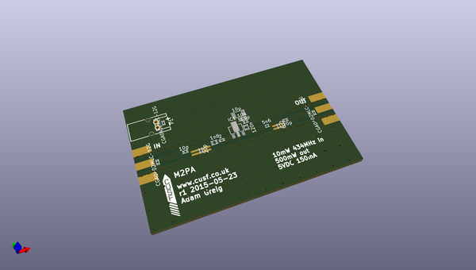
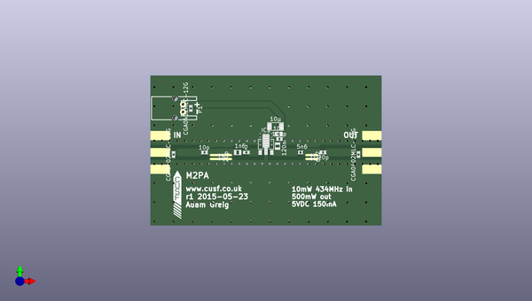

# m2_electronics
 
## summary 
* id: adamgreig_m2_electronics_m2pa_instrument
* user: adamgreig
* name: m2_electronics
* board: m2pa_instrument
* repo: https://github.com/adamgreig/m2-electronics
* src_file_repo_kicad_pcb: m2pa/m2pa-instrument.kicad_pcb
* src_file_repo_kicad_pcb_link: https://github.com/adamgreig/m2-electronics/tree/master/m2pa/m2pa-instrument.kicad_pcb

* src_file_repo_sch: 
* src_file_repo_sch_link: https://github.com/adamgreig/m2-electronics/tree/master/
* full details link: https://github.com/oomlout/oomlout_oomp_project_bot_v_2/tree/main/projects/adamgreig_m2_electronics_m2pa_instrument/current_version/working  

## pcb  
 
  
  
  
[board (pdf)](working.pdf)  

## working_bom
| Id | Designator | Footprint | Quantity | Designation | Supplier and ref |  | None | 
| --- | --- | --- | --- | --- | --- | --- | --- | 
| 1 | C1 | C0402 | 1 | 10p |  |  | [''] | 
| 2 | C2,C7 | C0402 | 2 | 20p |  |  | [''] | 
| 3 | C3 | C0402 | 1 | 100p |  |  | [''] | 
| 4 | C4 | C0603 | 1 | 10n |  |  | [''] | 
| 5 | C5 | C0402 | 1 | 6p2 |  |  | [''] | 
| 6 | C6 | C1206 | 1 | 10µ |  |  | [''] | 
| 7 | D1,D2,D3 | R0402 | 3 | CGA0402MLC-12G |  |  | [''] | 
| 8 | IC1 | SOT89-3 | 1 | ADL5324 |  |  | [''] | 
| 9 | L1 | L0603 | 1 | 1n6 |  |  | [''] | 
| 10 | L2 | L0603 | 1 | 120n |  |  | [''] | 
| 11 | L3 | L0402 | 1 | 5n6 |  |  | [''] | 
| 12 | P1 | S02B-PASK-2 | 1 | CONN_01X02 |  |  | [''] | 
| 13 | P2,P3 | SMA-142-0701-801 | 2 | SMA |  |  | [''] | 
| 14 | R1 | R0402 | 1 | 2 |  |  | [''] | 
| 15 | G*** | cusf_logo_small | 1 | LOGO |  |  | [''] | 
| 16 | G*** | cusf_logo_full | 1 | LOGO |  |  | [''] | 

