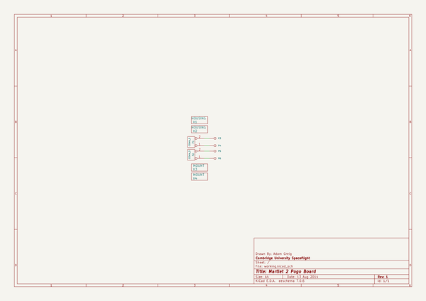
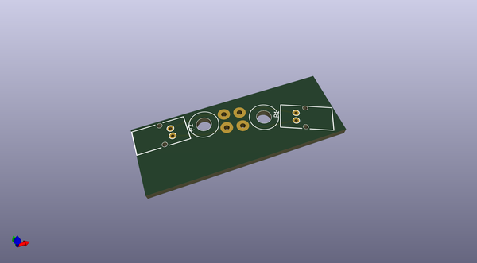
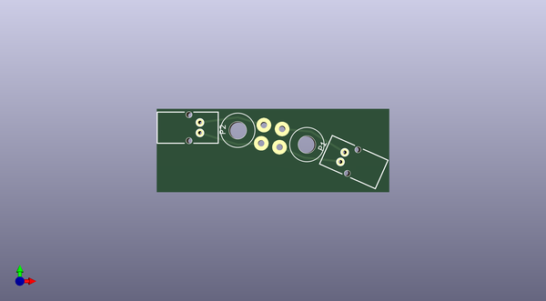
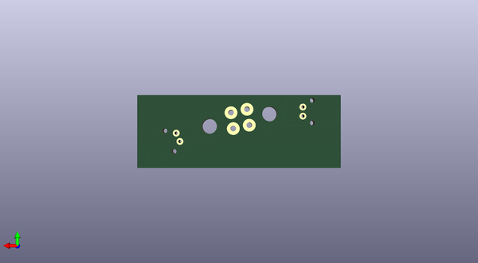

# m2_electronics
 
## summary 
* id: adamgreig_m2_electronics_m2pogo
* user: adamgreig
* name: m2_electronics
* board: m2pogo
* repo: https://github.com/adamgreig/m2-electronics
* src_file_repo_kicad_pcb: m2pogo/m2pogo.kicad_pcb
* src_file_repo_kicad_pcb_link: https://github.com/adamgreig/m2-electronics/tree/master/m2pogo/m2pogo.kicad_pcb

* src_file_repo_sch: m2pogo/m2pogo.sch
* src_file_repo_sch_link: https://github.com/adamgreig/m2-electronics/tree/master/m2pogo/m2pogo.sch
* full details link: https://github.com/oomlout/oomlout_oomp_project_bot_v_2/tree/main/projects/adamgreig_m2_electronics_m2pogo/current_version/working  

## schematic  
  
[schematic (pdf)](working_schematic.pdf) 

## pcb  
 
  
  
  
[board (pdf)](working.pdf)  

## working_bom
| Id | Designator | Footprint | Quantity | Designation | Supplier and ref |  | None | 
| --- | --- | --- | --- | --- | --- | --- | --- | 
| 1 | P3,P4,P5,P6 | POGO | 4 | CONN_1 |  |  | [''] | 
| 2 | P1,P2 | S02B-PASK-2 | 2 | CONN_2 |  |  | [''] | 
| 3 | X4,X3 | M3_MOUNT | 2 | MOUNT |  |  | [''] | 

## bom_schematic
| Ref | Qnty | Value | Cmp name | Footprint | Description | Vendor | DNP | 
| --- | --- | --- | --- | --- | --- | --- | --- | 
| P1, P2 | 2 | CONN_2 | CONN_2 | m2pogo:S02B-PASK-2 |  |  |  | 
| P3, P4, P5, P6 | 4 | CONN_1 | CONN_1 | m2pogo:POGO |  |  |  | 
| X1, X2 | 2 | HOUSING | PART |  |  |  |  | 
| X3, X4 | 2 | MOUNT | PART | m2pogo:M3_MOUNT |  |  |  | 

