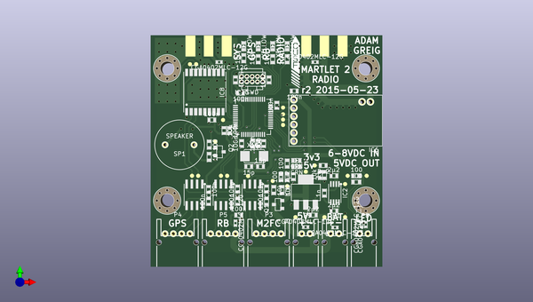

# m2_electronics
 
## summary 
* id: adamgreig_m2_electronics_m2r
* user: adamgreig
* name: m2_electronics
* board: m2r
* repo: https://github.com/adamgreig/m2-electronics
* src_file_repo_kicad_pcb: m2r/pcb_r2/m2r.kicad_pcb
* src_file_repo_kicad_pcb_link: https://github.com/adamgreig/m2-electronics/tree/master/m2r/pcb_r2/m2r.kicad_pcb

* src_file_repo_sch: m2r/pcb_r2/m2r.sch
* src_file_repo_sch_link: https://github.com/adamgreig/m2-electronics/tree/master/m2r/pcb_r2/m2r.sch
* full details link: https://github.com/oomlout/oomlout_oomp_project_bot_v_2/tree/main/projects/adamgreig_m2_electronics_m2r/current_version/working  

## pcb  
 
  
  
  
[board (pdf)](working.pdf)  

## working_bom
| Id | Designator | Footprint | Quantity | Designation | Supplier and ref |  | None | 
| --- | --- | --- | --- | --- | --- | --- | --- | 
| 1 | C1,C2,C3,C4,C5,C6,C11,C14,C15,C24,C25,C26,C27,C29,C30,C34 | C0603 | 16 | 100n |  |  | [''] | 
| 2 | C7,C8,C9,C10,C13 | C0603 | 5 | 2µ2 |  |  | [''] | 
| 3 | C12 | C0603 | 1 | 1n |  |  | [''] | 
| 4 | C23 | C0603 | 1 | 10µ |  |  | [''] | 
| 5 | C28 | C0603 | 1 | 1µ |  |  | [''] | 
| 6 | C35,C36 | C0603 | 2 | 15p |  |  | [''] | 
| 7 | D1,D2 | LED0603 | 2 | GRN |  |  | [''] | 
| 8 | D3,D4,D5,D6 | LED0603 | 4 | YELLOW |  |  | [''] | 
| 9 | D7,D8,D9,D10,D11,D12,D13 | R0402 | 7 | CGA0402MLC-12G |  |  | [''] | 
| 10 | IC1 | SOT223 | 1 | ADP3338 |  |  | [''] | 
| 11 | IC2 | MSOP8 | 1 | ADP3335 |  |  | [''] | 
| 12 | IC3,IC4,IC5 | SOIC8 | 3 | ADuM1201 |  |  | [''] | 
| 13 | IC6 | MTX2 | 1 | MTX2 |  |  | [''] | 
| 14 | IC8 | MAX-7Q | 1 | MAX-7Q |  |  | [''] | 
| 15 | IC10 | LQFP48 | 1 | STM32F303C |  |  | [''] | 
| 16 | P1,P8,P9 | S02B-PASK-2 | 3 | CONN_2 |  |  | [''] | 
| 17 | P2,P7 | SMA-142-0701-801 | 2 | SMA |  |  | [''] | 
| 18 | P3,P4,P5 | S04B-PASK-2 | 3 | CONN_4 |  |  | [''] | 
| 19 | P6 | FTSH-105-01-F-D-K | 1 | SWD |  |  | [''] | 
| 20 | Q1 | SOT-23 | 1 | Q_PMOS_GSD_PSV |  |  | [''] | 
| 21 | Q2 | SOT-23 | 1 | Q_NMOS_GSD_PSV |  |  | [''] | 
| 22 | R1,R3 | R0603 | 2 | 10k |  |  | [''] | 
| 23 | R2 | R0603 | 1 | 1k |  |  | [''] | 
| 24 | R4,R5,R7,R8,R9,R10,R11,R12,R13,R14,R15,R16 | R0603 | 12 | 100 |  |  | [''] | 
| 25 | R6 | R0603 | 1 | 10 |  |  | [''] | 
| 26 | SP1 | ABI-042-RC | 1 | SPEAKER |  |  | [''] | 
| 27 | TP1,TP2,TP4,TP7,TP11,TP12,TP13,TP14,TP15,TP16,TP17,TP18,TP19,TP20,TP21,TP22,TP23,TP24,TP25,TP26,TP27,TP28,TP29 | TESTPAD | 23 | TESTPAD |  |  | [''] | 
| 28 | X10 | XTAL50x32 | 1 | 8M |  |  | [''] | 
| 29 | X11,X12,X13,X14 | M3_MOUNT | 4 | M3 MOUNT |  |  | [''] | 
| 30 | G*** | cusf_logo_small | 1 | LOGO |  |  | [''] | 
| 31 | G*** | cusf_logo_full | 1 | LOGO |  |  | [''] | 

