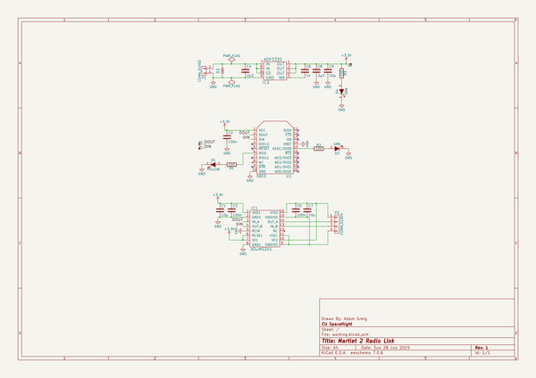
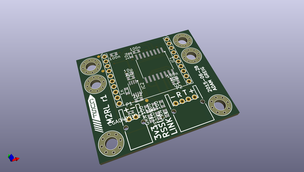
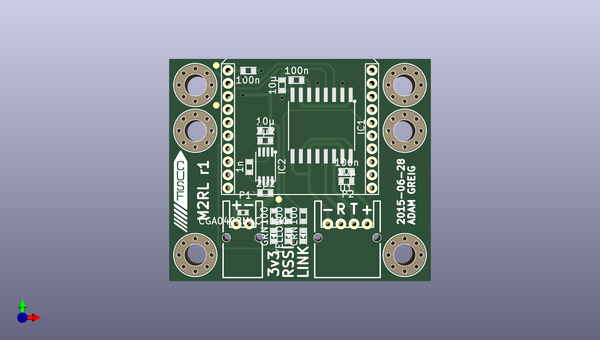
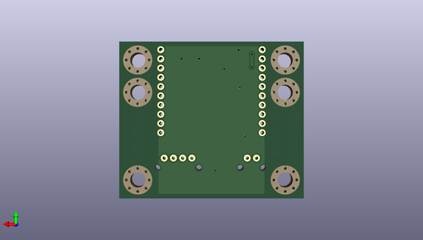

# m2_electronics
 
## summary 
* id: adamgreig_m2_electronics_m2rl
* user: adamgreig
* name: m2_electronics
* board: m2rl
* repo: https://github.com/adamgreig/m2-electronics
* src_file_repo_kicad_pcb: m2rl/pcb/m2rl.kicad_pcb
* src_file_repo_kicad_pcb_link: https://github.com/adamgreig/m2-electronics/tree/master/m2rl/pcb/m2rl.kicad_pcb

* src_file_repo_sch: m2rl/pcb/m2rl.sch
* src_file_repo_sch_link: https://github.com/adamgreig/m2-electronics/tree/master/m2rl/pcb/m2rl.sch
* full details link: https://github.com/oomlout/oomlout_oomp_project_bot_v_2/tree/main/projects/adamgreig_m2_electronics_m2rl/current_version/working  

## schematic  
  
[schematic (pdf)](working_schematic.pdf) 

## pcb  
 
  
  
  
[board (pdf)](working.pdf)  

## working_bom
| Id | Designator | Footprint | Quantity | Designation | Supplier and ref |  | None | 
| --- | --- | --- | --- | --- | --- | --- | --- | 
| 1 | C1,C7,C9 | C0603 | 3 | 10µ |  |  | [''] | 
| 2 | C2,C3,C5 | C0603 | 3 | 100n |  |  | [''] | 
| 3 | C4,C8 | C0603 | 2 | 2µ2 |  |  | [''] | 
| 4 | C6 | C0603 | 1 | 1n |  |  | [''] | 
| 5 | D1 | LED0603 | 1 | YELLOW |  |  | [''] | 
| 6 | D2 | R0402 | 1 | CGA0402MLC-12G |  |  | [''] | 
| 7 | D3,D4 | LED0603 | 2 | GRN |  |  | [''] | 
| 8 | IC1 | SOIC16W | 1 | ADuM5201 |  |  | [''] | 
| 9 | IC2 | MSOP8 | 1 | ADP3335 |  |  | [''] | 
| 10 | P1 | S02B-PASK-2 | 1 | CONN_01X02 |  |  | [''] | 
| 11 | P2 | S04B-PASK-2 | 1 | CONN_01X04 |  |  | [''] | 
| 12 | R1,R2,R3 | R0603 | 3 | 100 |  |  | [''] | 
| 13 | U1 | XBEE | 1 | XBEE |  |  | [''] | 
| 14 | M3_MOUNT,M3_MOUNT,M3_MOUNT,M3_MOUNT,M3_MOUNT,M3_MOUNT | M3_MOUNT | 6 | VAL** |  |  | [''] | 
| 15 | TP3,TP4,TP5 | TESTPAD | 3 | TESTPAD |  |  | [''] | 
| 16 | G*** | cusf_logo_small | 1 | LOGO |  |  | [''] | 

## bom_schematic
| Ref | Qnty | Value | Cmp name | Footprint | Description | Vendor | DNP | 
| --- | --- | --- | --- | --- | --- | --- | --- | 
| C1, C7, C9 | 3 | 10µ | C | m2rl:C0603 |  |  |  | 
| C2, C3, C5 | 3 | 100n | C | m2rl:C0603 |  |  |  | 
| C4, C8 | 2 | 2µ2 | C | m2rl:C0603 |  |  |  | 
| C6 | 1 | 1n | C | m2rl:C0603 |  |  |  | 
| D1 | 1 | YELLOW | LED | m2rl:LED0603 |  |  |  | 
| D2 | 1 | CGA0402MLC-12G | CGA0402MLC-12G | m2rl:R0402 |  |  |  | 
| D3, D4 | 2 | GRN | LED | m2rl:LED0603 |  |  |  | 
| IC1 | 1 | ADuM5201 | ADuM5201 | m2rl:SOIC16W |  |  |  | 
| IC2 | 1 | ADP3335 | ADP3335 | m2rl:MSOP8 |  |  |  | 
| P1 | 1 | CONN_01X02 | CONN_01X02 | m2rl:S02B-PASK-2 |  |  |  | 
| P2 | 1 | CONN_01X04 | CONN_01X04 | m2rl:S04B-PASK-2 |  |  |  | 
| R1, R2, R3 | 3 | 100 | R | m2rl:R0603 |  |  |  | 
| TP3, TP4, TP5 | 3 | TESTPAD | TESTPAD | m2rl:TESTPAD |  |  |  | 
| U1 | 1 | XBEE | XBEE | m2rl:XBEE |  |  |  | 

