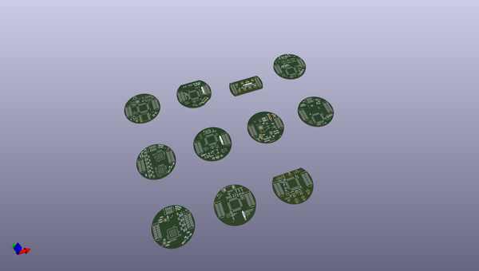
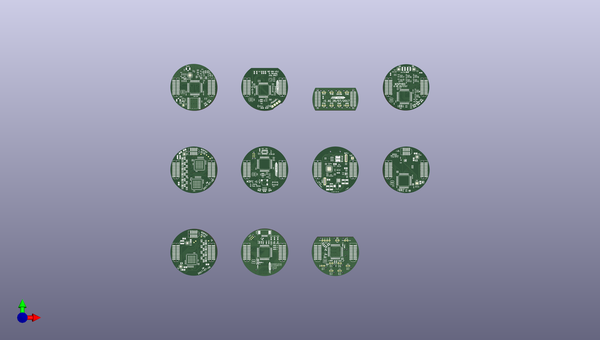
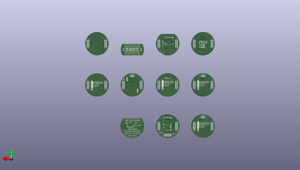

# m3_avionics
 
## summary 
* id: adamgreig_m3_avionics_b2_stencils
* user: adamgreig
* name: m3_avionics
* board: b2_stencils
* repo: https://github.com/adamgreig/m3-avionics
* src_file_repo_kicad_pcb: artifacts/b2_stencils/b2_stencils.kicad_pcb
* src_file_repo_kicad_pcb_link: https://github.com/adamgreig/m3-avionics/tree/master/artifacts/b2_stencils/b2_stencils.kicad_pcb

* src_file_repo_sch: 
* src_file_repo_sch_link: https://github.com/adamgreig/m3-avionics/tree/master/
* full details link: https://github.com/oomlout/oomlout_oomp_project_bot_v_2/tree/main/projects/adamgreig_m3_avionics_b2_stencils/current_version/working  

## pcb  
 
  
  
  
[board (pdf)](working.pdf)  

## working_bom
| Id | Designator | Footprint | Quantity | Designation | Supplier and ref |  | None | 
| --- | --- | --- | --- | --- | --- | --- | --- | 
| 1 | C15,C14,C16,C17,C3,C4,C7,C8,C9,C104,C105,C107,C108,C109,C112,C113,C202,C4,C5,C7,C8,C9,C12,C13,C15,C16,C4,C5,C7,C8,C9,C16,C1,C4,C19,C20,C1,C2,C8,C10,C11,C14,C15,C16,C17,C6,C10,C1,C3,C4,C9,C12,C9,C10,C4,C15,C14,C13,C9,C8,C7,C3,C17,C11,C1,C3,C6,C4 | 0402 | 68 | 100n |  |  | [''] | 
| 2 | C13,C12,C17 | 0603 | 3 | 10µ |  |  | [''] | 
| 3 | D1,D101,D1,D1 | 0603-LED | 4 | RED |  |  | [''] | 
| 4 | D2,D2 | 0603-LED | 2 | YLW |  |  | [''] | 
| 5 | D3,D102,D3,D3 | 0603-LED | 4 | GRN |  |  | [''] | 
| 6 | IC3,IC2,IC102,IC2,IC2,IC3,IC3 | DFN-8-EP-MICROCHIP | 7 | MCP2562 |  |  | [''] | 
| 7 | IC4 | ADXL3x5 | 1 | ADXL345 |  |  | [''] | 
| 8 | IC2,IC3 | MS5611 | 2 | MS5611-01BA03 |  |  | [''] | 
| 9 | P1,P1,P1 | TC2030-NL | 3 | SWD_TC |  |  | [''] | 
| 10 | Q1 | SOT-23 | 1 | NFET |  |  | [''] | 
| 11 | R1,R2,R3,R4,R5,R102,R103,R1,R2,R4,R3,R2,R3,R4,R5 | 0402 | 15 | 100 |  |  | [''] | 
| 12 | J3,J2,J103,J2,J4,J4,J4,J3,J5,J4 | TFML-110-02-L-D | 10 | EAST TOP |  |  | [''] | 
| 13 | C1,C6,C1,C2,C1,C2,C1,C6 | 0402 | 8 | 10p |  |  | [''] | 
| 14 | C5,C6,C6,C3,C13,C5 | 0402 | 6 | 1µ |  |  | [''] | 
| 15 | IC1,IC1,IC101,IC1,IC1,IC1,IC1 | LQFP-64 | 7 | STM32F405RxTx |  |  | [''] | 
| 16 | J1,J1,J101,J1,J1,J1,J1,J1,J3,J1 | TFML-110-02-L-D | 10 | WEST TOP |  |  | [''] | 
| 17 | Y1,Y1,Y1,Y1 | XTAL-20x16 | 4 | 26M |  |  | [''] | 
| 18 | LS1 | KSSG13J12-N | 1 | SOUNDER |  |  | [''] | 
| 19 | C2,C3,C3,C2 | 0402 | 4 | 4µ7 |  |  | [''] | 
| 20 | C10,C11,C10,C11,C10,C11,C11,C10 | 0402 | 8 | 2µ2 |  |  | [''] | 
| 21 | D4 | SOD-323 | 1 | D |  |  | [''] | 
| 22 | C1,C6,C12,C13,C7,C8,C11,C12,C13,C16,C7,C8,C9,C14,C16,C1 | 0603-L | 16 | 100n |  |  | [''] | 
| 23 | C2,C3,C2,C3 | 0603-L | 4 | 10p |  |  | [''] | 
| 24 | C4,C5,C4,C5 | 0603-L | 4 | 2u2 |  |  | [''] | 
| 25 | C10,C15 | 0603-L | 2 | 4u7 |  |  | [''] | 
| 26 | R1,R4,R5,R6,R7 | 0603-L | 5 | 47K |  |  | [''] | 
| 27 | R2,R1 | 0603-L | 2 | 100R |  |  | [''] | 
| 28 | Y1,Y1 | XTAL-20x16 | 2 | 26MHz |  |  | [''] | 
| 29 | R3,R9,R10,R8 | 0603-L | 4 | 1k |  |  | [''] | 
| 30 | C103 | 0402 | 1 | 4u7 |  |  | [''] | 
| 31 | C106,C2,C3,C7,C8 | 0402 | 5 | 1u |  |  | [''] | 
| 32 | C110,C111 | 0402 | 2 | 2u2 |  |  | [''] | 
| 33 | IC201 | QFN-20-EP-SI | 1 | Si4461 |  |  | [''] | 
| 34 | C6,C15 | 0603-L | 2 | 1u |  |  | [''] | 
| 35 | R2 | 0603-L | 1 | 4K7 |  |  | [''] | 
| 36 | R3 | 0603-L | 1 | 10K |  |  | [''] | 
| 37 | R5 | 0603-L | 1 | 120R |  |  | [''] | 
| 38 | C201,C12 | 0402 | 2 | 100p |  |  | [''] | 
| 39 | C203 | 0402 | 1 | 3p |  |  | [''] | 
| 40 | C204,C20 | 0402 | 2 | 22p |  |  | [''] | 
| 41 | C205 | 0402 | 1 | 1p |  |  | [''] | 
| 42 | C206,C207 | 0402 | 2 | 5.6p |  |  | [''] | 
| 43 | L201 | 0603-L | 1 | 120nH |  |  | [''] | 
| 44 | L204 | 0603-L | 1 | 8.2nH |  |  | [''] | 
| 45 | J6 | Connector_Molex_PicoBlade_53261-0471 | 1 | USB |  |  | [''] | 
| 46 | C14,C2,C2,C10 | 0402 | 4 | 10n |  |  | [''] | 
| 47 | IC4 | QFN-24-MPU9250 | 1 | MPU-9250 |  |  | [''] | 
| 48 | G*** | cusf_logo_full | 1 | LOGO |  |  | [''] | 
| 49 | X1 | cusf_logo_small | 1 | PART |  |  | [''] | 
| 50 | C12,C14 | 0805 | 2 | 22µ |  |  | [''] | 
| 51 | C13,C7,C11,C7 | 0402 | 4 | 3n3 |  |  | [''] | 
| 52 | IC2,IC3 | QFN-16-EP-TI | 2 | TPS62152 |  |  | [''] | 
| 53 | IC5 | DFN-10-EP-LT | 1 | LTC4151 |  |  | [''] | 
| 54 | J3,J3,J3 | TFML-105-02-L-D | 3 | NORTH TOP |  |  | [''] | 
| 55 | L1 | VLS201610HBX-1 | 1 | 3µ3 |  |  | [''] | 
| 56 | Q9,Q2,Q2 | SOT-883-B | 3 | NFET |  |  | [''] | 
| 57 | R7,R8,R10 | 0402 | 3 | 4k7 |  |  | [''] | 
| 58 | R15 | 0805 | 1 | 10m |  |  | [''] | 
| 59 | R16,R23,R4,R5,R9,R10,R11,R12,R13,R14,R15,R16,R29,R30,R32,R33,R12,R14,R11,R9,R13,R15,R16,R10 | 0402 | 24 | 33k |  |  | [''] | 
| 60 | J1 | MICROUSB_MOLEX_47589-0001 | 1 | MICROUSB |  |  | [''] | 
| 61 | G***,G*** | cusf_logo_small | 2 | LOGO |  |  | [''] | 
| 62 | D2 | SOT-666 | 1 | USBLC6-2P6 |  |  | [''] | 
| 63 | D1,D2,D3,D4,D5,D6,D7,D8,D9,D10,D11,D12,D1,D2,D1,D2,D3,D4,D5,D9,D8,D7,D6 | 0402 | 23 | ESD_DIODE |  |  | [''] | 
| 64 | D1,D2,D3 | 0603-LED | 3 | LED |  |  | [''] | 
| 65 | C5,C11 | 0402 | 2 | 1n |  |  | [''] | 
| 66 | IC1 | DFN-6-EP-ONSEMI | 1 | NCP380 |  |  | [''] | 
| 67 | L1,L2,L3 | 0402-L | 3 | 91nH |  |  | [''] | 
| 68 | R1 | 0603 | 1 | 10 |  |  | [''] | 
| 69 | R2 | 0402 | 1 | 110k |  |  | [''] | 
| 70 | P101,P201 | U.FL-R-SMT-1 | 2 | COAX |  |  | [''] | 
| 71 | U1 | SC-70-5 | 1 | NCP4620 |  |  | [''] | 
| 72 | J3 | SIL-254P-01 | 1 | TAP |  |  | [''] | 
| 73 | J7 | SIL-254P-01 | 1 | BAT+ |  |  | [''] | 
| 74 | J8 | SIL-254P-01 | 1 | BAT- |  |  | [''] | 
| 75 | Q8,Q1 | SON2x2 | 2 | PFET |  |  | [''] | 
| 76 | R3,R6,R7,R8,R9 | 0603 | 5 | 47K |  |  | [''] | 
| 77 | C4,C7 | 0805 | 2 | 2µ2 |  |  | [''] | 
| 78 | C5,C6,C18,C19 | 1210 | 4 | 10µ |  |  | [''] | 
| 79 | C9 | 0603 | 1 | 1µ5 |  |  | [''] | 
| 80 | D3,D4 | SOD-323 | 2 | SCHOTTKY |  |  | [''] | 
| 81 | IC1 | QFN-32-EP-TI | 1 | BQ40Z60 |  |  | [''] | 
| 82 | L1 | SRP5030T | 1 | 2µ2 |  |  | [''] | 
| 83 | Q1 | PowerFLAT-5x6 | 1 | NFET2 |  |  | [''] | 
| 84 | Q4 | PowerPair-3x3 | 1 | SiZ340DT |  |  | [''] | 
| 85 | R1 | 0402 | 1 | 10K |  |  | [''] | 
| 86 | R2,R7,R9 | 0402 | 3 | 10M |  |  | [''] | 
| 87 | R3,R4,R8 | 0402 | 3 | 5K1 |  |  | [''] | 
| 88 | R10,R11,R15,R16 | 0402 | 4 | 100R |  |  | [''] | 
| 89 | R12 | 0402 | 1 | 100K |  |  | [''] | 
| 90 | R13 | 0402 | 1 | 2R |  |  | [''] | 
| 91 | R14,R19 | 0402 | 2 | 10R |  |  | [''] | 
| 92 | R17 | 0805 | 1 | 5m |  |  | [''] | 
| 93 | R18,R17,R18,R19,R20,R31,R34,R20,R17,R19,R18 | 0603 | 11 | 10m |  |  | [''] | 
| 94 | R20 | 0402 | 1 | 330K |  |  | [''] | 
| 95 | R21 | 0402 | 1 | 56K2 |  |  | [''] | 
| 96 | Q3 | SON2x2N | 1 | NFET_GDS |  |  | [''] | 
| 97 | R1,R2 | 0402 | 2 | 100k |  |  | [''] | 
| 98 | C5,C5 | 0805 | 2 | 10u |  |  | [''] | 
| 99 | C8,C9,C12,C13,C13,C8 | 0805 | 6 | 22u |  |  | [''] | 
| 100 | IC2 | QFN-16-EP-TI | 1 | TPS62133 |  |  | [''] | 
| 101 | L2 | VLS201610HBX-1 | 1 | 3u3 |  |  | [''] | 
| 102 | IC1,IC3,IC1 | QFN-64-EP-LTC-UP | 3 | LTC2975 |  |  | [''] | 
| 103 | R2,R3,R4,R5,R6,R7,R8,R21,R22,R23,R24,R25,R27,R28,R7,R18,R9,R11,R12,R13,R14,R15,R16,R17,R28,R21,R22,R23,R24,R25,R26,R27,R4,R5,R4,R8,R6,R2,R7,R5,R3 | 0402 | 41 | 10k |  |  | [''] | 
| 104 | Q5,Q6,Q7,Q8,Q10,Q12,Q8,Q6,Q5,Q7 | SON2x2 | 10 | PFET_GDS |  |  | [''] | 
| 105 | R1,R26,R1 | 0402 | 3 | 5k49 |  |  | [''] | 
| 106 | Q1,Q2,Q3,Q4,Q9,Q11,Q1,Q2,Q3,Q4 | PowerPAK-SC-75-6L-Single | 10 | NFET_GDS |  |  | [''] | 
| 107 | L1,L1 | XFL4020 | 2 | 2u2 |  |  | [''] | 
| 108 | IC2 | SOT-23-5 | 1 | NC7SZ04 |  |  | [''] | 
| 109 | IC3 | MSOP-10 | 1 | CS2100-CP |  |  | [''] | 
| 110 | IC4 | DFN-10-SL18860DC | 1 | SL18860DC |  |  | [''] | 
| 111 | IC5 | MAX-M8Q | 1 | MAX_M8Q |  |  | [''] | 
| 112 | IC6 | SC-70-6 | 1 | SN74LVC1G0832 |  |  | [''] | 
| 113 | R3,R35,R36,R37,R38,R39,R40,R21,R22,R23,R24 | 0402 | 11 | 1M |  |  | [''] | 
| 114 | Y1 | TG-5006CG | 1 | TCXO |  |  | [''] | 
| 115 | L1,L2 | XFL4020 | 2 | 2µ2 |  |  | [''] | 
| 116 | D5,D4 | SOD-323 | 2 | PMEG2005AEA |  |  | [''] | 
| 117 | IC2 | QFN-16-EP-TI | 1 | TPS62130 |  |  | [''] | 
| 118 | IC4 | QFN-16-EP-TI | 1 | TPS62150 |  |  | [''] | 
| 119 | Q3,Q8,Q1,Q2,Q4,Q5,Q6,Q7 | ChipFET-1206-8 | 8 | Si5515CDC |  |  | [''] | 
| 120 | C16 | 0603 | 1 | 22µ |  |  | [''] | 
| 121 | R8,R10,R19,R20 | 0402 | 4 | 3k3 |  |  | [''] | 
| 122 | C12 | 0402 | 1 | 220p |  |  | [''] | 
| 123 | L202 | 0402 | 1 | 20nH |  |  | [''] | 
| 124 | L203 | 0402 | 1 | 24nH |  |  | [''] | 
| 125 | L205 | 0402 | 1 | 6.8nH |  |  | [''] | 
| 126 | C13 | 0402 | 1 | 2.2u |  |  | [''] | 
| 127 | TP1,TP2,TP3,TP4,TP1,TP2,TP3,TP4 | TESTPAD | 8 | TESTPAD |  |  | [''] | 
| 128 | J2,J2,J3,J102,J2,J2,J2,J2,J2,J2 | SFML-110-02-L-D-LC | 10 | WEST BOT |  |  | [''] | 
| 129 | J4,J4,J4,J104,J5,J5,J4,J5,J4,J5 | SFML-110-02-L-D-LC | 10 | EAST BOT |  |  | [''] | 
| 130 | R1 | 0603 | 1 | 120 |  |  | [''] | 
| 131 | IC2 | QFN-16-EP-TI | 1 | TPS62132 |  |  | [''] | 
| 132 | J7 | SFML-110-02-L-D-LC | 1 | SOUTH BOT |  |  | [''] | 
| 133 | U1 | MICROSD_MOLEX_503398-1892 | 1 | MICROSD |  |  | [''] | 
| 134 | J5 | B02B-PASK | 1 | PYRO1 |  |  | [''] | 
| 135 | J6 | B02B-PASK | 1 | PYRO3 |  |  | [''] | 
| 136 | J7,J8 | B02B-PASK | 2 | ARM |  |  | [''] | 
| 137 | J8 | B02B-PASK | 1 | PYRO2 |  |  | [''] | 
| 138 | J9 | B02B-PASK | 1 | PYRO4 |  |  | [''] | 
| 139 | J10,J9 | B02B-PASK | 2 | PWR |  |  | [''] | 
| 140 | J11 | B02B-PASK | 1 | CHG |  |  | [''] | 
| 141 | J12 | B02B-PASK | 1 | CAM |  |  | [''] | 
| 142 | J13 | B04B-PASK | 1 | USB |  |  | [''] | 
| 143 | R4 | 0603-L | 1 | 1K |  |  | [''] | 
| 144 | J6,J6,J6 | SFML-105-02-L-D-LC | 3 | NORTH BOT |  |  | [''] | 
| 145 | G*** | cusf_logo_full | 1 | LOGO |  |  | [''] | 
| 146 | G***,G***,G*** | cusf_logo_full | 3 | LOGO |  |  | [''] | 
| 147 | U2 | MICROSD_MOLEX_503398-1892 | 1 | MICROSD-RESCUE-main |  |  | [''] | 
| 148 | J1 | B02B-PASK | 1 | PYRO5 |  |  | [''] | 
| 149 | J3 | B02B-PASK | 1 | PYRO6 |  |  | [''] | 
| 150 | J5 | B02B-PASK | 1 | PYRO7 |  |  | [''] | 
| 151 | J6 | B02B-PASK | 1 | PYRO8 |  |  | [''] | 
| 152 | J7 | B02B-PASK | 1 | 5v_CAM |  |  | [''] | 
| 153 | J10 | B02B-PASK | 1 | CHARGE |  |  | [''] | 

