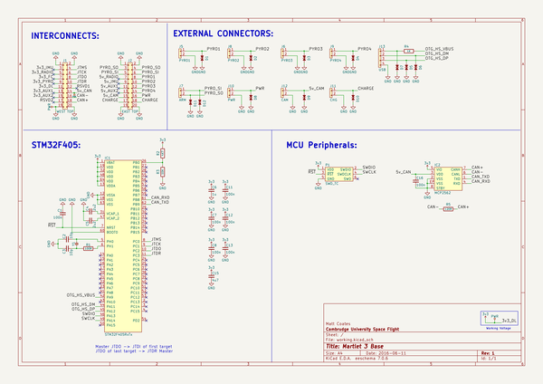
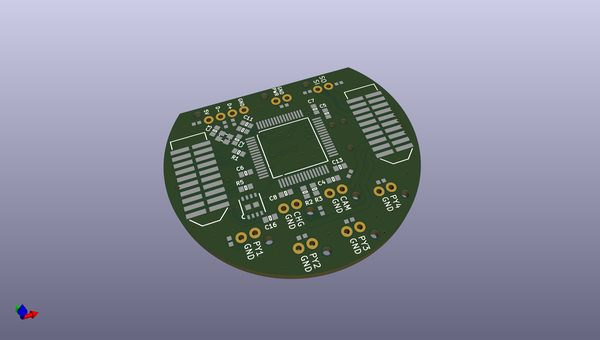
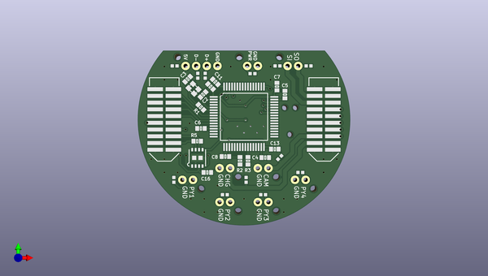
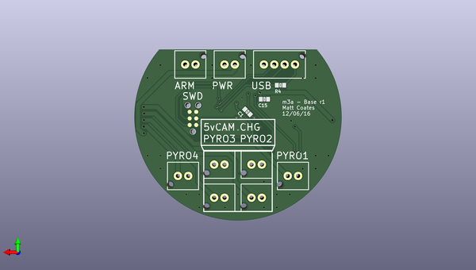

# m3_avionics
 
## summary 
* id: adamgreig_m3_avionics_base
* user: adamgreig
* name: m3_avionics
* board: base
* repo: https://github.com/adamgreig/m3-avionics
* src_file_repo_kicad_pcb: m3base/base.kicad_pcb
* src_file_repo_kicad_pcb_link: https://github.com/adamgreig/m3-avionics/tree/master/m3base/base.kicad_pcb

* src_file_repo_sch: m3base/base.sch
* src_file_repo_sch_link: https://github.com/adamgreig/m3-avionics/tree/master/m3base/base.sch
* full details link: https://github.com/oomlout/oomlout_oomp_project_bot_v_2/tree/main/projects/adamgreig_m3_avionics_base/current_version/working  

## schematic  
  
[schematic (pdf)](working_schematic.pdf) 

## pcb  
 
  
  
  
[board (pdf)](working.pdf)  

## working_bom
| Id | Designator | Footprint | Quantity | Designation | Supplier and ref |  | None | 
| --- | --- | --- | --- | --- | --- | --- | --- | 
| 1 | C4,C5 | 0603-L | 2 | 2u2 |  |  | [''] | 
| 2 | C6 | 0603-L | 1 | 1u |  |  | [''] | 
| 3 | C7,C8,C11,C12,C13,C16,C1 | 0603-L | 7 | 100n |  |  | [''] | 
| 4 | R2 | 0603-L | 1 | 4K7 |  |  | [''] | 
| 5 | R3 | 0603-L | 1 | 10K |  |  | [''] | 
| 6 | C2,C3 | 0603-L | 2 | 10p |  |  | [''] | 
| 7 | IC1 | LQFP-64 | 1 | STM32F405RxTx |  |  | [''] | 
| 8 | IC2 | DFN-8-EP-MICROCHIP | 1 | MCP2562 |  |  | [''] | 
| 9 | J1 | TFML-110-02-L-D | 1 | WEST TOP |  |  | [''] | 
| 10 | J2 | TFML-110-02-L-D | 1 | EAST TOP |  |  | [''] | 
| 11 | R1 | 0603-L | 1 | 100R |  |  | [''] | 
| 12 | R5 | 0603-L | 1 | 120R |  |  | [''] | 
| 13 | Y1 | XTAL-20x16 | 1 | 26MHz |  |  | [''] | 
| 14 | D1,D2,D3,D4,D5,D6,D7,D8,D9,D10,D11,D12 | 0402 | 12 | ESD_DIODE |  |  | [''] | 
| 15 | C15 | 0603-L | 1 | 4u7 |  |  | [''] | 
| 16 | J5 | B02B-PASK | 1 | PYRO1 |  |  | [''] | 
| 17 | J6 | B02B-PASK | 1 | PYRO3 |  |  | [''] | 
| 18 | J7 | B02B-PASK | 1 | ARM |  |  | [''] | 
| 19 | J8 | B02B-PASK | 1 | PYRO2 |  |  | [''] | 
| 20 | J9 | B02B-PASK | 1 | PYRO4 |  |  | [''] | 
| 21 | J10 | B02B-PASK | 1 | PWR |  |  | [''] | 
| 22 | J11 | B02B-PASK | 1 | CHG |  |  | [''] | 
| 23 | J12 | B02B-PASK | 1 | CAM |  |  | [''] | 
| 24 | J13 | B04B-PASK | 1 | USB |  |  | [''] | 
| 25 | P1 | TC2030-NL | 1 | SWD_TC |  |  | [''] | 
| 26 | R4 | 0603-L | 1 | 1K |  |  | [''] | 

## bom_schematic
| Ref | Qnty | Value | Cmp name | Footprint | Description | Vendor | DNP | 
| --- | --- | --- | --- | --- | --- | --- | --- | 
| C1, C7, C8, C11, C12, C13, C16 | 7 | 100n | C_Small | Capacitors_SMD:C_0603 |  |  |  | 
| C2, C3 | 2 | 10p | C_Small | Capacitors_SMD:C_0603 |  |  |  | 
| C4, C5 | 2 | 2u2 | C_Small | Capacitors_SMD:C_0603 |  |  |  | 
| C6 | 1 | 1u | C_Small | Capacitors_SMD:C_0603 |  |  |  | 
| C15 | 1 | 4u7 | C_Small | Capacitors_SMD:C_0603 |  |  |  | 
| D1, D2, D3, D4, D5, D6, D7, D8, D9, D10, D11, D12 | 12 | ESD_DIODE | ESD_DIODE | agg:0402 |  |  |  | 
| IC1 | 1 | STM32F405RxTx | STM32F405RxTx | agg:LQFP-64 |  |  |  | 
| IC2 | 1 | MCP2562 | MCP2562 | agg:DFN-8-EP-MICROCHIP |  |  |  | 
| J1 | 1 | WEST TOP | CONN_02x10 | agg:TFML-110-02-L-D |  |  |  | 
| J2 | 1 | EAST TOP | CONN_02x10 | agg:TFML-110-02-L-D |  |  |  | 
| J5 | 1 | PYRO1 | CONN_01x02 | agg:B02B-PASK |  |  |  | 
| J6 | 1 | PYRO3 | CONN_01x02 | agg:B02B-PASK |  |  |  | 
| J7 | 1 | ARM | CONN_01x02 | agg:B02B-PASK |  |  |  | 
| J8 | 1 | PYRO2 | CONN_01x02 | agg:B02B-PASK |  |  |  | 
| J9 | 1 | PYRO4 | CONN_01x02 | agg:B02B-PASK |  |  |  | 
| J10 | 1 | PWR | CONN_01x02 | agg:B02B-PASK |  |  |  | 
| J11 | 1 | CHG | CONN_01x02 | agg:B02B-PASK |  |  |  | 
| J12 | 1 | CAM | CONN_01x02 | agg:B02B-PASK |  |  |  | 
| J13 | 1 | USB | CONN_01x04 | agg:B04B-PASK |  |  |  | 
| P1 | 1 | SWD_TC | SWD_TC | agg:TC2030-NL |  |  |  | 
| R1 | 1 | 100R | R | Resistors_SMD:R_0603 |  |  |  | 
| R2 | 1 | 4K7 | R | Resistors_SMD:R_0603 |  |  |  | 
| R3 | 1 | 10K | R | Resistors_SMD:R_0603 |  |  |  | 
| R4 | 1 | 1K | R | Resistors_SMD:R_0603 |  |  |  | 
| R5 | 1 | 120R | R | Resistors_SMD:R_0603 |  |  |  | 
| Y1 | 1 | 26MHz | XTAL | agg:XTAL-20x16 |  |  |  | 

