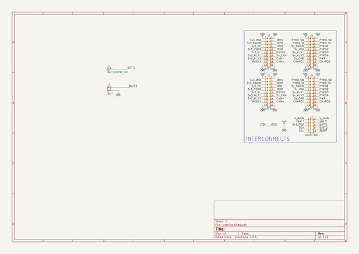

# m3_avionics
 
## summary 
* id: adamgreig_m3_avionics_battery_bottom
* user: adamgreig
* name: m3_avionics
* board: battery_bottom
* repo: https://github.com/adamgreig/m3-avionics
* src_file_repo_kicad_pcb: m3psu/pcb/Battery-Bottom/Battery-Bottom.kicad_pcb
* src_file_repo_kicad_pcb_link: https://github.com/adamgreig/m3-avionics/tree/master/m3psu/pcb/Battery-Bottom/Battery-Bottom.kicad_pcb

* src_file_repo_sch: m3psu/pcb/Battery-Bottom/Battery-Bottom.sch
* src_file_repo_sch_link: https://github.com/adamgreig/m3-avionics/tree/master/m3psu/pcb/Battery-Bottom/Battery-Bottom.sch
* full details link: https://github.com/oomlout/oomlout_oomp_project_bot_v_2/tree/main/projects/adamgreig_m3_avionics_battery_bottom/current_version/working  

## schematic  
  
[schematic (pdf)](working_schematic.pdf)  

## pcb  
 
  
  
  
[board (pdf)](working.pdf)  

## working_bom
| Id | Designator | Footprint | Quantity | Designation | Supplier and ref |  | None | 
| --- | --- | --- | --- | --- | --- | --- | --- | 
| 1 | J1 | Socket_Strip_Straight_1x01 | 1 | BATT_CENTRE_TAP |  |  | [''] | 
| 2 | J3 | TFML-110-02-L-D | 1 | WEST TOP |  |  | [''] | 
| 3 | J5 | TFML-110-02-L-D | 1 | EAST TOP |  |  | [''] | 
| 4 | J2 | Socket_Strip_Straight_1x02 | 1 | BATT |  |  | [''] | 
| 5 | J4 | SFML-110-02-L-D-LC | 1 | WEST BOT |  |  | [''] | 
| 6 | J6 | SFML-110-02-L-D-LC | 1 | EAST BOT |  |  | [''] | 
| 7 | J7 | SFML-105-02-L-D-LC | 1 | NORTH BOT |  |  | [''] | 

## bom_schematic
| Ref | Qnty | Value | Cmp name | Footprint | Description | Vendor | DNP | 
| --- | --- | --- | --- | --- | --- | --- | --- | 
| J1 | 1 | BATT_CENTRE_TAP | CONN_01x01 | Socket_Strips:Socket_Strip_Straight_1x01 |  |  |  | 
| J2 | 1 | BATT | CONN_01x02 | Socket_Strips:Socket_Strip_Straight_1x02 |  |  |  | 
| J3 | 1 | WEST TOP | CONN_02x10 | agg:TFML-110-02-L-D |  |  |  | 
| J4 | 1 | WEST BOT | CONN_02x10 | agg:SFML-110-02-L-D-LC |  |  |  | 
| J5 | 1 | EAST TOP | CONN_02x10 | agg:TFML-110-02-L-D |  |  |  | 
| J6 | 1 | EAST BOT | CONN_02x10 | agg:SFML-110-02-L-D-LC |  |  |  | 
| J7 | 1 | NORTH BOT | CONN_02x05 | agg:SFML-105-02-L-D-LC |  |  |  | 

