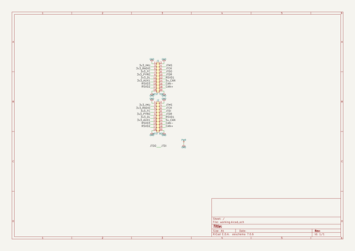

# m3_avionics
 
## summary 
* id: adamgreig_m3_avionics_battery_riser_west
* user: adamgreig
* name: m3_avionics
* board: battery_riser_west
* repo: https://github.com/adamgreig/m3-avionics
* src_file_repo_kicad_pcb: m3psu/pcb/Battery-Riser-West/Battery-Riser-West.kicad_pcb
* src_file_repo_kicad_pcb_link: https://github.com/adamgreig/m3-avionics/tree/master/m3psu/pcb/Battery-Riser-West/Battery-Riser-West.kicad_pcb

* src_file_repo_sch: m3psu/pcb/Battery-Riser-West/Battery-Riser-West.sch
* src_file_repo_sch_link: https://github.com/adamgreig/m3-avionics/tree/master/m3psu/pcb/Battery-Riser-West/Battery-Riser-West.sch
* full details link: https://github.com/oomlout/oomlout_oomp_project_bot_v_2/tree/main/projects/adamgreig_m3_avionics_battery_riser_west/current_version/working  

## schematic  
  
[schematic (pdf)](working_schematic.pdf) 

## pcb  
 
  
  
  
[board (pdf)](working.pdf)  

## working_bom
| Id | Designator | Footprint | Quantity | Designation | Supplier and ref |  | None | 
| --- | --- | --- | --- | --- | --- | --- | --- | 
| 1 | J1 | TFML-110-01-L-D-RA | 1 | WEST TOP |  |  | [''] | 
| 2 | J2 | SFM-110-02-L-DH | 1 | WEST BOT |  |  | [''] | 
| 3 | G*** | cusf_logo_large | 1 | LOGO |  |  | [''] | 

## bom_schematic
| Ref | Qnty | Value | Cmp name | Footprint | Description | Vendor | DNP | 
| --- | --- | --- | --- | --- | --- | --- | --- | 
| J1 | 1 | WEST TOP | CONN_02x10 | agg:TFML-110-01-L-D-RA |  |  |  | 
| J2 | 1 | WEST BOT | CONN_02x10 | agg:SFM-110-02-L-DH |  |  |  | 

