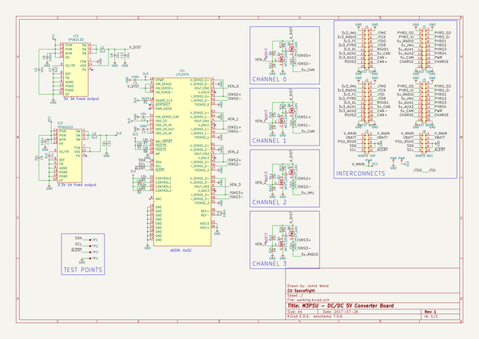
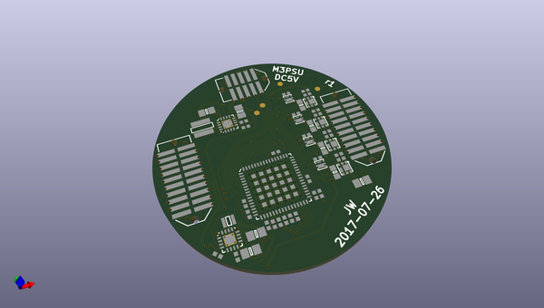
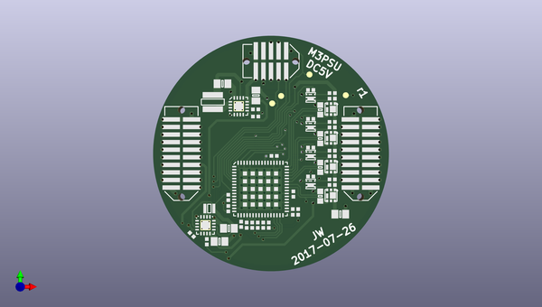
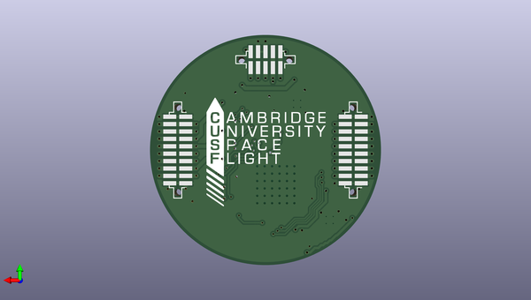

# m3_avionics
 
## summary 
* id: adamgreig_m3_avionics_dcdc_5v
* user: adamgreig
* name: m3_avionics
* board: dcdc_5v
* repo: https://github.com/adamgreig/m3-avionics
* src_file_repo_kicad_pcb: m3psu/pcb/DCDC-5V/DCDC-5V.kicad_pcb
* src_file_repo_kicad_pcb_link: https://github.com/adamgreig/m3-avionics/tree/master/m3psu/pcb/DCDC-5V/DCDC-5V.kicad_pcb

* src_file_repo_sch: m3psu/pcb/DCDC-5V/DCDC-5V.sch
* src_file_repo_sch_link: https://github.com/adamgreig/m3-avionics/tree/master/m3psu/pcb/DCDC-5V/DCDC-5V.sch
* full details link: https://github.com/oomlout/oomlout_oomp_project_bot_v_2/tree/main/projects/adamgreig_m3_avionics_dcdc_5v/current_version/working  

## schematic  
  
[schematic (pdf)](working_schematic.pdf) 

## pcb  
 
  
  
  
[board (pdf)](working.pdf)  

## working_bom
| Id | Designator | Footprint | Quantity | Designation | Supplier and ref |  | None | 
| --- | --- | --- | --- | --- | --- | --- | --- | 
| 1 | J1 | TFML-110-02-L-D | 1 | WEST TOP |  |  | [''] | 
| 2 | J4 | TFML-110-02-L-D | 1 | EAST TOP |  |  | [''] | 
| 3 | J3 | TFML-105-02-L-D | 1 | NORTH TOP |  |  | [''] | 
| 4 | C5 | 0805 | 1 | 10u |  |  | [''] | 
| 5 | C6,C10,C1,C3,C4 | 0402 | 5 | 100n |  |  | [''] | 
| 6 | C7,C11 | 0402 | 2 | 3n3 |  |  | [''] | 
| 7 | C8,C9,C12,C13 | 0805 | 4 | 22u |  |  | [''] | 
| 8 | IC2 | QFN-16-EP-TI | 1 | TPS62133 |  |  | [''] | 
| 9 | IC3 | QFN-16-EP-TI | 1 | TPS62152 |  |  | [''] | 
| 10 | L2 | VLS201610HBX-1 | 1 | 3u3 |  |  | [''] | 
| 11 | IC1 | QFN-64-EP-LTC-UP | 1 | LTC2975 |  |  | [''] | 
| 12 | C2 | 0402 | 1 | 10n |  |  | [''] | 
| 13 | R2,R3,R4,R5,R6,R7,R8 | 0402 | 7 | 10k |  |  | [''] | 
| 14 | R9,R10,R11,R12,R13,R14,R15,R16 | 0402 | 8 | 33k |  |  | [''] | 
| 15 | Q5,Q6,Q7,Q8 | SON2x2 | 4 | PFET_GDS |  |  | [''] | 
| 16 | R17,R18,R19,R20 | 0603 | 4 | 10m |  |  | [''] | 
| 17 | R1 | 0402 | 1 | 5k49 |  |  | [''] | 
| 18 | L1 | XFL4020 | 1 | 2u2 |  |  | [''] | 
| 19 | Q1,Q2,Q3,Q4 | PowerPAK-SC-75-6L-Single | 4 | NFET_GDS |  |  | [''] | 
| 20 | R21,R22,R23,R24 | 0402 | 4 | 1M |  |  | [''] | 
| 21 | TP1,TP2,TP3,TP4 | TESTPAD | 4 | TESTPAD |  |  | [''] | 
| 22 | J2 | SFML-110-02-L-D-LC | 1 | WEST BOT |  |  | [''] | 
| 23 | J5 | SFML-110-02-L-D-LC | 1 | EAST BOT |  |  | [''] | 
| 24 | J6 | SFML-105-02-L-D-LC | 1 | NORTH BOT |  |  | [''] | 
| 25 | G*** | cusf_logo_full | 1 | LOGO |  |  | [''] | 

## bom_schematic
| Ref | Qnty | Value | Cmp name | Footprint | Description | Vendor | DNP | 
| --- | --- | --- | --- | --- | --- | --- | --- | 
| C1, C3, C4, C6, C10 | 5 | 100n | C | agg:0402 |  |  |  | 
| C2 | 1 | 10n | C | agg:0402 |  |  |  | 
| C5 | 1 | 10u | C | agg:0805 |  |  |  | 
| C7, C11 | 2 | 3n3 | C | agg:0402 |  |  |  | 
| C8, C9, C12, C13 | 4 | 22u | C | agg:0805 |  |  |  | 
| IC1 | 1 | LTC2975 | LTC2975 | agg:QFN-64-EP-LTC-UP |  |  |  | 
| IC2 | 1 | TPS62133 | TPS62133 | agg:QFN-16-EP-TI |  |  |  | 
| IC3 | 1 | TPS62152 | TPS62152 | agg:QFN-16-EP-TI |  |  |  | 
| J1 | 1 | WEST TOP | CONN_02x10 | agg:TFML-110-02-L-D |  |  |  | 
| J2 | 1 | WEST BOT | CONN_02x10 | agg:SFML-110-02-L-D-LC |  |  |  | 
| J3 | 1 | NORTH TOP | CONN_02x05 | agg:TFML-105-02-L-D |  |  |  | 
| J4 | 1 | EAST TOP | CONN_02x10 | agg:TFML-110-02-L-D |  |  |  | 
| J5 | 1 | EAST BOT | CONN_02x10 | agg:SFML-110-02-L-D-LC |  |  |  | 
| J6 | 1 | NORTH BOT | CONN_02x05 | agg:SFML-105-02-L-D-LC |  |  |  | 
| L1 | 1 | 2u2 | L | agg:XFL4020 |  |  |  | 
| L2 | 1 | 3u3 | L | agg:VLS201610HBX-1 |  |  |  | 
| Q1, Q2, Q3, Q4 | 4 | NFET_GDS | NFET_GDS | agg:PowerPAK-SC-75-6L-Single |  |  |  | 
| Q5, Q6, Q7, Q8 | 4 | PFET_GDS | PFET_GDS | agg:SON2x2 |  |  |  | 
| R1 | 1 | 5k49 | R | agg:0402 |  |  |  | 
| R2, R3, R4, R5, R6, R7, R8 | 7 | 10k | R | agg:0402 |  |  |  | 
| R9, R10, R11, R12, R13, R14, R15, R16 | 8 | 33k | R | agg:0402 |  |  |  | 
| R17, R18, R19, R20 | 4 | 10m | R | agg:0603 |  |  |  | 
| R21, R22, R23, R24 | 4 | 1M | R | agg:0402 |  |  |  | 
| TP1, TP2, TP3, TP4 | 4 | TESTPAD | TESTPAD | agg:TESTPAD |  |  |  | 

