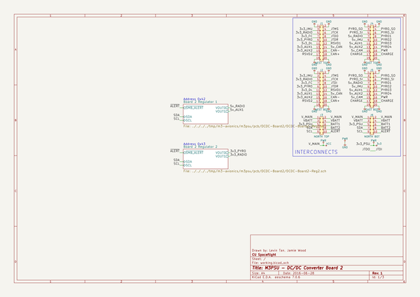
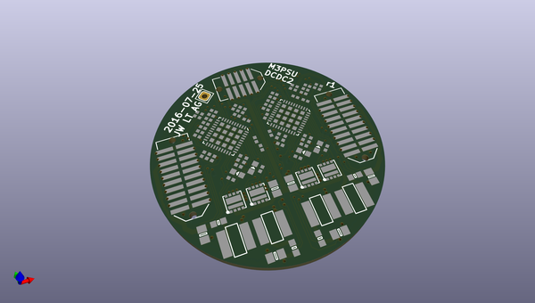
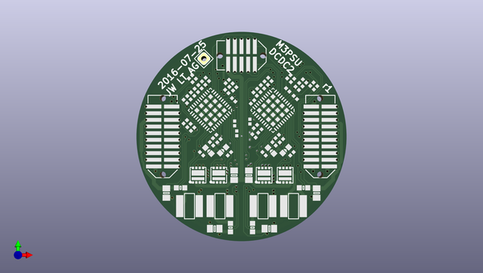
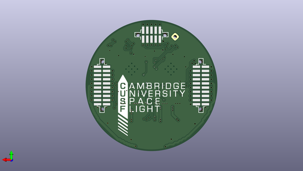

# m3_avionics
 
## summary 
* id: adamgreig_m3_avionics_dcdc_board2
* user: adamgreig
* name: m3_avionics
* board: dcdc_board2
* repo: https://github.com/adamgreig/m3-avionics
* src_file_repo_kicad_pcb: m3psu/pcb/DCDC-Board2/DCDC-Board2.kicad_pcb
* src_file_repo_kicad_pcb_link: https://github.com/adamgreig/m3-avionics/tree/master/m3psu/pcb/DCDC-Board2/DCDC-Board2.kicad_pcb

* src_file_repo_sch: m3psu/pcb/DCDC-5V/DCDC-5V.sch
* src_file_repo_sch_link: https://github.com/adamgreig/m3-avionics/tree/master/m3psu/pcb/DCDC-5V/DCDC-5V.sch
* full details link: https://github.com/oomlout/oomlout_oomp_project_bot_v_2/tree/main/projects/adamgreig_m3_avionics_dcdc_board2/current_version/working  

## schematic  
  
[schematic (pdf)](working_schematic.pdf)  

## pcb  
 
  
  
  
[board (pdf)](working.pdf)  

## working_bom
| Id | Designator | Footprint | Quantity | Designation | Supplier and ref |  | None | 
| --- | --- | --- | --- | --- | --- | --- | --- | 
| 1 | C1,C7,C15,C16,C22,C30 | 0805 | 6 | 22µ |  |  | [''] | 
| 2 | C2,C11,C13,C17,C26,C28,C31,C32 | 0402 | 8 | 100n |  |  | [''] | 
| 3 | C3,C12,C18,C27 | 0402 | 4 | 4n7 |  |  | [''] | 
| 4 | C5,C9,C20,C24 | 0402 | 4 | 220p |  |  | [''] | 
| 5 | C6,C8,C21,C23 | 0402 | 4 | 47p |  |  | [''] | 
| 6 | C10,C14,C25,C29 | 0402 | 4 | 1µ |  |  | [''] | 
| 7 | D1,D2,D3,D4 | 0603-LED | 4 | SCHOTTKY |  |  | [''] | 
| 8 | IC1,IC2 | QFN-40-EP-LTC-UJ | 2 | LTC3887 |  |  | [''] | 
| 9 | J1 | TFML-110-02-L-D | 1 | WEST TOP |  |  | [''] | 
| 10 | J4 | TFML-110-02-L-D | 1 | EAST TOP |  |  | [''] | 
| 11 | L1,L2,L3,L4 | TYS5040 | 4 | 10µ |  |  | [''] | 
| 12 | Q1,Q2,Q3,Q4 | PowerPair3x3 | 4 | SiZ340DT |  |  | [''] | 
| 13 | R1,R13,R14,R26 | 0603 | 4 | 50m |  |  | [''] | 
| 14 | R2,R15,R18,R20 | 0402 | 4 | 10k |  |  | [''] | 
| 15 | R3,R6,R9,R11,R16,R19,R22,R24 | 0402 | 8 | 100 |  |  | [''] | 
| 16 | R4,R12,R17,R25,R7,R5 | 0402 | 6 | 4k99 |  |  | [''] | 
| 17 | R8 | 0402 | 1 | 30k1 |  |  | [''] | 
| 18 | R10 | 0402 | 1 | 3k57 |  |  | [''] | 
| 19 | R21 | 0402 | 1 | 24k9 |  |  | [''] | 
| 20 | R23 | 0402 | 1 | 4k32 |  |  | [''] | 
| 21 | J3 | TFML-105-02-L-D | 1 | NORTH TOP |  |  | [''] | 
| 22 | C19,C4 | 0402 | 2 | 4µ7 |  |  | [''] | 
| 23 | REF** | SIL-254P-01 | 1 | SIL-254P-01 |  |  | [''] | 
| 24 | J2 | SFML-110-02-L-D-LC | 1 | WEST BOT |  |  | [''] | 
| 25 | J5 | SFML-110-02-L-D-LC | 1 | EAST BOT |  |  | [''] | 
| 26 | J6 | SFML-105-02-L-D-LC | 1 | NORTH BOT |  |  | [''] | 
| 27 | G*** | cusf_logo_full | 1 | LOGO |  |  | [''] | 

## bom_schematic
| Ref | Qnty | Value | Cmp name | Footprint | Description | Vendor | DNP | 
| --- | --- | --- | --- | --- | --- | --- | --- | 
| J1 | 1 | WEST TOP | CONN_02x10 | agg:TFML-110-02-L-D |  |  |  | 
| J2 | 1 | WEST BOT | CONN_02x10 | agg:SFML-110-02-L-D-LC |  |  |  | 
| J3 | 1 | NORTH TOP | CONN_02x05 | agg:TFML-105-02-L-D |  |  |  | 
| J4 | 1 | EAST TOP | CONN_02x10 | agg:TFML-110-02-L-D |  |  |  | 
| J5 | 1 | EAST BOT | CONN_02x10 | agg:SFML-110-02-L-D-LC |  |  |  | 
| J6 | 1 | NORTH BOT | CONN_02x05 | agg:SFML-105-02-L-D-LC |  |  |  | 

