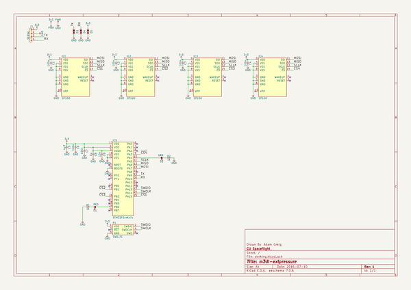
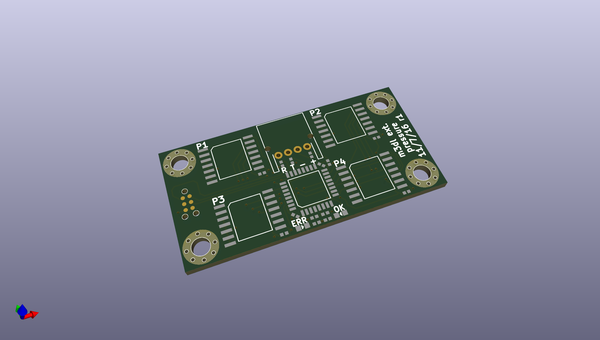
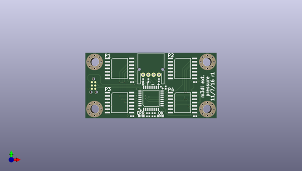
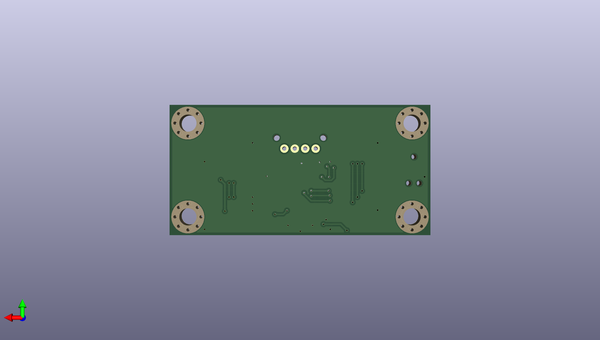

# m3_avionics
 
## summary 
* id: adamgreig_m3_avionics_extpressure
* user: adamgreig
* name: m3_avionics
* board: extpressure
* repo: https://github.com/adamgreig/m3-avionics
* src_file_repo_kicad_pcb: m3dl/extpressure/extpressure.kicad_pcb
* src_file_repo_kicad_pcb_link: https://github.com/adamgreig/m3-avionics/tree/master/m3dl/extpressure/extpressure.kicad_pcb

* src_file_repo_sch: m3dl/extpressure/extpressure.sch
* src_file_repo_sch_link: https://github.com/adamgreig/m3-avionics/tree/master/m3dl/extpressure/extpressure.sch
* full details link: https://github.com/oomlout/oomlout_oomp_project_bot_v_2/tree/main/projects/adamgreig_m3_avionics_extpressure/current_version/working  

## schematic  
  
[schematic (pdf)](working_schematic.pdf)  

## pcb  
 
  
  
  
[board (pdf)](working.pdf)  

## working_bom
| Id | Designator | Footprint | Quantity | Designation | Supplier and ref |  | None | 
| --- | --- | --- | --- | --- | --- | --- | --- | 
| 1 | P1 | TC2030-NL | 1 | SWD_TC |  |  | [''] | 
| 2 | IC1,IC4,IC3,IC2 | SP100 | 4 | SP100 |  |  | [''] | 
| 3 | J1 | S04B-PASK-2 | 1 | SERIAL |  |  | [''] | 
| 4 | IC5 | LQFP-32 | 1 | STM32F0xxKxTx |  |  | [''] | 
| 5 | D1 | 0603-LED | 1 | RED |  |  | [''] | 
| 6 | C3,C4,C1,C6,C7,C2 | 0402 | 6 | 100n |  |  | [''] | 
| 7 | C5 | 0402 | 1 | 4µ7 |  |  | [''] | 
| 8 | C8 | 0402 | 1 | 1µ |  |  | [''] | 
| 9 | C9 | 0402 | 1 | 10n |  |  | [''] | 
| 10 | R1,R2 | 0402 | 2 | 1k |  |  | [''] | 
| 11 | D2 | 0603-LED | 1 | GRN |  |  | [''] | 
| 12 | REF**,REF**,REF**,REF** | M3_MOUNT | 4 | M3_MOUNT |  |  | [''] | 
| 13 | D4,D5,D3 | 0402 | 3 | ESD_DIODE |  |  | [''] | 

## bom_schematic
| Ref | Qnty | Value | Cmp name | Footprint | Description | Vendor | DNP | 
| --- | --- | --- | --- | --- | --- | --- | --- | 
| C1, C2, C3, C4, C6, C7 | 6 | 100n | C | agg:0402 |  |  |  | 
| C5 | 1 | 4µ7 | C | agg:0402 |  |  |  | 
| C8 | 1 | 1µ | C | agg:0402 |  |  |  | 
| C9 | 1 | 10n | C | agg:0402 |  |  |  | 
| D1 | 1 | RED | LED | agg:0603-LED |  |  |  | 
| D2 | 1 | GRN | LED | agg:0603-LED |  |  |  | 
| D3, D4, D5 | 3 | ESD_DIODE | ESD_DIODE | agg:0402 |  |  |  | 
| IC1, IC2, IC3, IC4 | 4 | SP100 | SP100 | agg:SP100 |  |  |  | 
| IC5 | 1 | STM32F0xxKxTx | STM32F0xxKxTx | agg:LQFP-32 |  |  |  | 
| J1 | 1 | SERIAL | CONN_01x04 | agg:S04B-PASK-2 |  |  |  | 
| P1 | 1 | SWD_TC | SWD_TC | agg:TC2030-NL |  |  |  | 
| R1, R2 | 2 | 1k | R | agg:0402 |  |  |  | 

